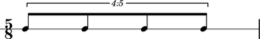
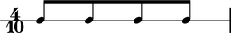
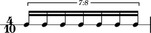

Prolation
=========

Abjad uses **prolation** as a cover term for rhythmic augmentation and diminution.
Augmentation increases the duration of notes, rests and chords.
Diminution does the opposite.
Western notation employs tuplet brackets and special types of time signature to effect prolation.

Tuplet prolation
----------------

Tuplets prolate their contents:

::

	>>> tuplet = Tuplet(Fraction(5, 4), 4 * Note("c'8"))
	>>> staff = stafftools.RhythmicStaff([Measure((5, 8), [tuplet])])
	>>> beamtools.BeamSpanner(tuplet)

::

	>>> show(staff, docs=True)

::

	>>> note = tuplet[0]
	>>> note.written_duration
	Duration(1, 8)

::

	>>> note.prolation
	Fraction(5, 4)

::

	>>> note.prolated_duration
	Duration(5, 32)

Notes here with written duration ``1/8`` carry prolation factor ``5/4``
and prolated duration ``5/32``.

Meter prolation
---------------

Time signatures in western notation usually carry a denominator equal
to a nonnegative integer power of ``2``.
Abjad calls these conventional meters **binary meters**.
Denominators equal to integers other than integer powers of ``2`` are also possible.
Such **nonbinary meters** rhythmically diminish the contents of the measures they govern:

::

	>>> measure = Measure((4, 10), Note(0, (1, 8)) * 4)
	>>> beamtools.BeamSpanner(measure)
	>>> staff = stafftools.RhythmicStaff([measure])

::

	>>> show(staff, docs=True)

::

	>>> note = staff.leaves[0]
	>>> note.prolation
	Fraction(4, 5)

::

	>>> note.prolated_duration
	Duration(1, 8)

::

	>>> note.prolation
	Fraction(4, 5)

::

	>>> note.prolated_duration
	Duration(1, 10)

Notes here with written duration ``1/8`` carry prolation factor ``4/5``
and prolated duration ``1/10``.

The prolation chain
-------------------

Tuplets nest and combine freely with different types of meter.
When two or more **prolation donors** conspire, the prolation factor they
collectively bestow on leaf-level music equals the cumulative product of all
prolation factors in the **prolation chain**.
All durated components carry a prolation chain:

::

	>>> tuplet = tuplettools.FixedDurationTuplet(Duration(4, 8), Note(0, (1, 16)) * 7)
	>>> beamtools.BeamSpanner(tuplet)
	>>> measure = Measure((4, 10), [tuplet])
	>>> staff = stafftools.RhythmicStaff([measure])

::

	>>> show(staff, docs=True)

::

	>>> measure.multiplier
	Fraction(4, 5)

::

	>>> note = measure.leaves[0]
	>>> note.prolation
	Fraction(32, 35)

::

	>>> note.prolated_duration
	Duration(2, 35)

Notes here with written duration ``1/16`` carry prolated duration ``2/35``.

.. note::

    Western notation does not recognize tuplet brackets carrying one-to-one ratios.  Such **trivial tuplets** may, however, be useful during different stages of composition, and Abjad allows them for that reason.  Trivial tuplets carry **zero prolation**. Zero-prolated tuplets neither augment nor diminish the music they contain.

.. note::

    Abjad implements one of two competing nonbinary **meter-interpretation schemes**.  The first, **implicit meter-interpretation** given here, follows, for example, Ferneyhough, in that nonbinary meters prolate the contents of the measures they govern implicitly, ie, without recourse to tuplet brackets.  The second, **explicit meter-interpretation**, which we find in, for example, Sciarrino, insists instead on the presence of some tuplet bracket, usually engraved in some broken or incomplete way.  The implicit meter-interpretation that Abjad implements differs from the explicit meter-interpretation native to LilyPond.  Abjad will eventually implement both implicit and explicit meter-interpretation, settable on a container-by-container basis.

.. note::

    Nonbinary meter ``n/d`` rhythmically diminishes the contents of the measure it governs
    by a factor ``j/k``, with ``k=d``, and with ``j`` equal to the greatest integer power
    of ``2`` less than ``d``.  That is, ``j=2**int(log2(d))``.
