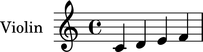
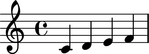
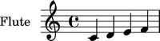

Instrument marks
================

Instrument marks appear as markup in the left margin of your score.

Creating instrument marks
-------------------------

Use ``contexttools`` to create instrument marks:

::

	abjad> instrument_mark = contexttools.InstrumentMark('Violin ', 'Vn. ')

::

	abjad> instrument_mark
	InstrumentMark('Violin ', 'Vn. ')

Attaching instrument marks to a component
-----------------------------------------

Use :py:meth:`~abjad.tools.marktools.Mark.attach` to attach any mark to a
component:

::

	abjad> staff = Staff("c'4 d'4 e'4 f'4")

::

	abjad> instrument_mark.attach(staff)

::

	abjad> show(staff)

Getting the instrument mark attached to a component
---------------------------------------------------

Use ``contexttools`` to get the instrument mark attached to a component:

::

	abjad> contexttools.get_instrument_mark_attached_to_component(staff)
	InstrumentMark('Violin ', 'Vn. ')(Staff{4})

Getting the instrument in effect for a component
------------------------------------------------

Or to get the instrument currently in effect for a component:

::

	abjad> contexttools.get_effective_instrument(staff[1])
	InstrumentMark('Violin ', 'Vn. ')(Staff{4})

Detaching instrument marks from a component one at a time
---------------------------------------------------------

Use :py:meth:`~abjad.tools.marktools.Mark.detach` to detach
instrument marks from a component one at a time:

::

	abjad> instrument_mark.detach()

::

	abjad> instrument_mark
	InstrumentMark('Violin ', 'Vn. ')

::

	abjad> show(staff)

Detaching all instrument marks attached to a component at once
--------------------------------------------------------------

Or use ``contexttools`` to detach instrument marks all at once:

::

	abjad> instrument_mark = contexttools.InstrumentMark('Violin ', 'Vn. ')
	abjad> instrument_mark.attach(staff)

::

	abjad> instrument_mark
	InstrumentMark('Violin ', 'Vn. ')(Staff{4})

::

	abjad> show(staff)

::

	abjad> contexttools.detach_instrument_marks_attached_to_component(staff)

::

	abjad> instrument_mark
	InstrumentMark('Violin ', 'Vn. ')

::

	abjad> show(staff)

Inspecting the component to which an instrument mark is attached
----------------------------------------------------------------

Use :py:attr:`~abjad.tools.marktools.Mark.start_component`
to inspect the component to which an instrument mark is attached:

::

	abjad> instrument_mark = contexttools.InstrumentMark('Flute ', 'Fl. ')
	abjad> instrument_mark.attach(staff)

::

	abjad> show(staff)

::

	abjad> instrument_mark.start_component
	Staff{4}

Inspecting the instrument name of an instrument mark
----------------------------------------------------

Use :py:attr:`~abjad.tools.contexttools.InstrumentMark.instrument_name_markup` to
get the instrument name of any instrument mark:

::

	abjad> instrument_mark.instrument_name_markup
	Markup('Flute ')

Inspecting the short instrument name of an instrument mark
----------------------------------------------------------

And use :py:attr:`~abjad.tools.contexttools.InstrumentMark.short_instrument_name_markup`
to get the short instrument name of any instrument mark:

::

	abjad> instrument_mark.short_instrument_name_markup
	Markup('Fl. ')
