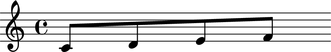

LilyPond comments
=================

LilyPond comments begin with the ``%`` sign.
Abjad models LilyPond comments as marks.

Creating LilyPond comments
--------------------------

Use ``marktools`` to create LilyPond comments:

::

	abjad> comment_1 = marktools.Comment('This is a LilyPond comment before a note.', 'before')

::

	abjad> comment_1
	Comment('This is a LilyPond comment before a note.')

Attaching LilyPond comments to leaves
-------------------------------------

Attach LilyPond comments to a note, rest or chord with ``attach_mark()``:

::

	abjad> note = Note("cs''4")
	abjad> show(note)

::

	abjad> comment_1.attach_mark(note)

::

	abjad> f(note)
	% This is a LilyPond comment before a note.
	cs''4

You can add LilyPond comments before, after or to the right of any leaf.

Attaching LilyPond comments to containers
-----------------------------------------

Use ``attach_mark()`` to attach LilyPond comments to a container:

::

	abjad> staff = Staff("c'8 d'8 e'8 f'8")
	abjad> show(staff)

::

	abjad> staff_comment_1 = marktools.Comment('Here is a LilyPond comment before the staff.', 'before')
	abjad> staff_comment_2 = marktools.Comment('Here is a LilyPond comment in the staff opening.', 'opening')
	abjad> staff_comment_3 = marktools.Comment('Here is another LilyPond comment in the staff opening.', 'opening')
	abjad> staff_comment_4 = marktools.Comment('LilyPond comment in the staff closing.', 'closing')
	abjad> staff_comment_5 = marktools.Comment('LilyPond comment after the staff.', 'after')

::

	abjad> staff_comment_1.attach_mark(staff)
	abjad> staff_comment_2.attach_mark(staff)
	abjad> staff_comment_3.attach_mark(staff)
	abjad> staff_comment_4.attach_mark(staff)
	abjad> staff_comment_5.attach_mark(staff)

::

	abjad> f(staff)
	% Here is a LilyPond comment before the staff.
	\new Staff {
		% Here is a LilyPond comment in the staff opening.
		% Here is another LilyPond comment in the staff opening.
		c'8
		d'8
		e'8
		f'8
		% LilyPond comment in the staff closing.
	}
	% LilyPond comment after the staff.

You can add LilyPond comments before, after, in the opening or in the closing of any container.

Getting the LilyPond comments attached to a component
-----------------------------------------------------

Use ``marktools`` to get all the LilyPond comments attached to a component:

::

	abjad> marktools.get_comments_attached_to_component(note)
	(Comment('This is a LilyPond comment before a note.')(cs''4),)

Abjad returns a tuple of zero or more LilyPond comments.

Detaching LilyPond comments from a component one at a time
----------------------------------------------------------

Use ``detach_mark()`` to detach LilyPond comments from a component one at a time:

::

	abjad> comment_1 = marktools.get_comments_attached_to_component(note)[0]

::

	abjad> comment_1.detach_mark()
	Comment('This is a LilyPond comment before a note.')

::

	abjad> f(note)
	cs''4

Detaching all LilyPond comments attached to a component at once
---------------------------------------------------------------

Or use ``marktools`` to detach all LilyPond comments attached to a component at once:

::

	abjad> for comment in marktools.get_comments_attached_to_component(staff): print comment
	Comment('Here is a LilyPond comment before the staff.')(Staff{4})
	Comment('Here is a LilyPond comment in the staff opening.')(Staff{4})
	Comment('Here is another LilyPond comment in the staff opening.')(Staff{4})
	Comment('LilyPond comment in the staff closing.')(Staff{4})
	Comment('LilyPond comment after the staff.')(Staff{4})

::

	abjad> marktools.detach_comments_attached_to_component(staff)

::

	abjad> f(staff)
	\new Staff {
		c'8
		d'8
		e'8
		f'8
	}

Inspecting the component to which a LilyPond comment is attached
----------------------------------------------------------------

Use ``start_component`` to inspect the component to which a LilyPond comment is attached:

::

	abjad> comment_1.attach_mark(note)

::

	abjad> comment_1.start_component
	Note("cs''4")

Inspecting contents string of a LilyPond comment
------------------------------------------------

Use ``contents_string`` to inspect the written contents of a LiliyPond comment:

::

	abjad> comment_1.contents_string
	'This is a LilyPond comment before a note.'

