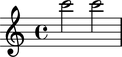
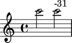
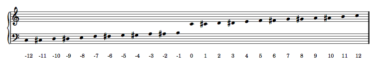
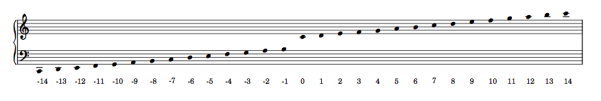
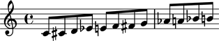
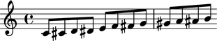
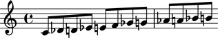

Pitches
=======

Named chromatic pitches are the everyday pitches attached to notes and chords:

::

	abjad> note = Note("cs''8")

::

	abjad> note.written_pitch
	NamedChromaticPitch("cs''")

Creating pitches
----------------

Use pitch tools to create named chromatic pitches:

::

	abjad> named_chromatic_pitch = pitchtools.NamedChromaticPitch("cs''")

::

	abjad> named_chromatic_pitch
	NamedChromaticPitch("cs''")

Inspecting the name of a pitch
------------------------------

Use ``str()`` to get the name of named chromatic pitches:

::

	abjad> str(named_chromatic_pitch)
	cs''

Inspecting the octave of a pitch
--------------------------------

Get the octave number of named chromatic pitches with ``octave_number``:

::

	abjad> named_chromatic_pitch.octave_number
	5

Working with pitch deviation
----------------------------

Use deviation to model the fact that two pitches differ by a fraction of a semitone:

::

	abjad> note_1 = Note(24, (1, 2))
	abjad> note_2 = Note(24, (1, 2))
	abjad> staff = Staff([note_1, note_2])

::

	abjad> show(staff)

::

	abjad> note_2.written_pitch = pitchtools.NamedChromaticPitch(24, deviation = -31)

The pitch of the the first note is greater than the pitch of the second:

::

	abjad> note_1.written_pitch > note_2.written_pitch
	True

Use markup to include indications of pitch deviation in your score:

::

	abjad> markuptools.Markup(note_2.written_pitch.deviation_in_cents, 'up')(note_2)

Sorting pitches
---------------

Named chromatic pitches sort by octave, diatonic pitch-class and accidental,
in that order:

::

	abjad> pitchtools.NamedChromaticPitch('es') < pitchtools.NamedChromaticPitch('ff')
	True

Comparing pitches
-----------------

Compare named chromatic pitches to each other:

::

	abjad> named_chromatic_pitch_1 = pitchtools.NamedChromaticPitch("c''")
	abjad> named_chromatic_pitch_2 = pitchtools.NamedChromaticPitch("d''")

::

	abjad> named_chromatic_pitch_1 == named_chromatic_pitch_2
	False

::

	abjad> named_chromatic_pitch_1 != named_chromatic_pitch_2
	True

::

	abjad> named_chromatic_pitch_1 > named_chromatic_pitch_2
	False

::

	abjad> named_chromatic_pitch_1 < named_chromatic_pitch_2
	True

::

	abjad> named_chromatic_pitch_1 >= named_chromatic_pitch_2
	False

::

	abjad> named_chromatic_pitch_1 <= named_chromatic_pitch_2
	True

Converting one type of pitch to another
---------------------------------------

Convert any named chromatic pitch to a named diatonic pitch:

::

	abjad> named_chromatic_pitch.named_diatonic_pitch
	NamedDiatonicPitch("c''")

To a numbered chromatic pitch:

::

	abjad> named_chromatic_pitch.numbered_chromatic_pitch
	NumberedChromaticPitch(13)

Or to a numbered diatonic pitch:

::

	abjad> named_chromatic_pitch.numbered_diatonic_pitch
	NumberedDiatonicPitch(7)

Converting pitches to pitch-classes
-----------------------------------

Convert any named chromatic pitch to a named chromatic pitch-class:

::

	abjad> named_chromatic_pitch.named_chromatic_pitch_class
	NamedChromaticPitchClass('cs')

To a named diatonic pitch-class:

::

	abjad> named_chromatic_pitch.named_diatonic_pitch_class
	NamedDiatonicPitchClass('c')

To a numbered chromatic pitch-class:

::

	abjad> named_chromatic_pitch.numbered_chromatic_pitch_class
	NumberedChromaticPitchClass(1)

Or to a numbered diatonic pitch-class:

::

	abjad> named_chromatic_pitch.numbered_diatonic_pitch_class
	NumberedDiatonicPitchClass(0)

Copying pitches
---------------

Use ``copy.copy()`` to copy named chromatic pitches:

::

	abjad> import copy

::

	abjad> copy.copy(named_chromatic_pitch)
	NamedChromaticPitch("cs''")

Or use ``copy.deepcopy()`` to do the same thing.

Accidental abbreviations
------------------------

Abjad abbreviates accidentals according to the LilyPond ``english.ly`` module:

    ======================         ============================
    accidental name                  abbreviation
    ======================         ============================
    quarter sharp                      'qs'
    quarter flat                        'qf'
    sharp                                 's'
    flat                                  'f'
    three-quarters sharp             'tqs'
    three-quarters flat              'tqf'
    double sharp                        'ss'
    double flat                         'ff'
    ======================         ============================

Chromatic pitch numbers
-----------------------

Abjad numbers chromatic pitches by semitone with middle C set equal to 0:

The code to generate this table is as follows::

    score, treble_staff, bass_staff = scoretools.make_empty_piano_score()
    duration = Fraction(1, 32)

    treble = measuretools.AnonymousMeasure([])
    bass = measuretools.AnonymousMeasure([])

    treble_staff.append(treble)
    bass_staff.append(bass)

    pitches = range(-12, 12 + 1)

    configurationtools.set_default_accidental_spelling('sharps')

    for i in pitches:
        note = Note(i, duration)
        rest = Rest(duration)
        clef = pitchtools.suggest_clef_for_named_chromatic_pitches([note.pitch])
        if clef == contexttools.ClefMark('treble'):
            treble.append(note)
            bass.append(rest)
        else:
            treble.append(rest)
            bass.append(note)
        diatonic_pitch_number = str(note.pitch.numbered_chromatic_pitch)
        markuptools.Markup(diatonic_pitch_number, 'down')(bass[-1])

    score.override.rest.transparent = True
    score.override.stem.stencil = False

    show(score, 'paris.ly')

Diatonic pitch numbers
----------------------

Abjad numbers diatonic pitches by staff space with middle C set equal to 0:

The code to generate this table is as follows::

    score, treble_staff, bass_staff = scoretools.make_empty_piano_score()
    duration = Fraction(1, 32)

    treble = measuretools.AnonymousMeasure([])
    bass = measuretools.AnonymousMeasure([])

    treble_staff.append(treble)
    bass_staff.append(bass)

    pitches = []
    diatonic_pitches = [0, 2, 4, 5, 7, 9, 11]

    pitches.extend([-24 + x for x in diatonic_pitches])
    pitches.extend([-12 + x for x in diatonic_pitches])
    pitches.extend([0 + x for x in diatonic_pitches])
    pitches.extend([12 + x for x in diatonic_pitches])
    pitches.append(24)
    configurationtools.set_default_accidental_spelling('sharps')

    for i in pitches:
        note = Note(i, duration)
        rest = Rest(duration)
        clef = pitchtools.suggest_clef_for_named_chromatic_pitches([note.pitch])
        if clef == contexttools.ClefMark('treble'):
            treble.append(note)
            bass.append(rest)
        else:
            treble.append(rest)
            bass.append(note)
        diatonic_pitch_number = abs(note.pitch.numbered_diatonic_pitch)
        markuptools.Markup(diatonic_pitch_number, 'down')(bass[-1])

    score.override.rest.transparent = True
    score.override.stem.stencil = False

    show(score, 'paris.ly')

Octave designation
------------------

Abjad designates octaves with both numbers and ticks:

    ===============        =============
    Octave notation        Tick notation
    ===============        =============
            C7                         c''''
            C6                         c'''
            C5                         c''
            C4                         c'
            C3                         c
            C2                         c,
            C1                         c,,
    ===============        =============

Accidental spelling
-------------------

Abjad chooses between enharmonic spellings at pitch-initialization
according to the following table:

    ============================        ====================================
    Chromatic pitch-class number        Chromatic pitch-class name (default)
    ============================        ====================================
        0                                        C
        1                                        C#
        2                                        D
        3                                        Eb
        4                                        E
        5                                        F
        6                                        F#
        7                                        G
        8                                        Gb
        9                                        A
        10                                     Bb
        11                                     B
    ============================        ====================================

::

	abjad> staff = Staff([Note(n, (1, 8)) for n in range(12)])
	abjad> show(staff)

Use pitch tools to respell with sharps:

::

	abjad> pitchtools.respell_named_chromatic_pitches_in_expr_with_sharps(staff)
	abjad> show(staff)

Or flats:

::

	abjad> pitchtools.respell_named_chromatic_pitches_in_expr_with_flats(staff)
	abjad> show(staff)

