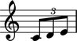
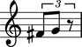
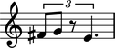
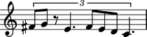
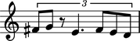
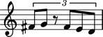
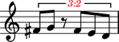
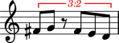

Tuplets
=======

Making a tuplet from a LilyPond input string
--------------------------------------------

You can make an Abjad tuplet from a multiplier and a LilyPond input string:

::

	abjad> tuplet = Tuplet(Fraction(2, 3), "c'8 d'8 e'8")

::

	abjad> show(tuplet)

Making a tuplet from a list of other Abjad components
-----------------------------------------------------

You can also make a tuplet from a multiplier and a list of other Abjad components:

::

	abjad> leaves = [Note("fs'8"), Note("g'8"), Rest('r8')]

::

	abjad> tuplet = Tuplet(Fraction(2, 3), leaves)

::

	abjad> show(tuplet)

Understanding the interpreter display of a tuplet
-------------------------------------------------

The interprer display of an Abjad tuplet contains three parts:

::

	abjad> tuplet
	Tuplet(2/3, [fs'8, g'8, r8])

``Tuplet`` tells you the tuplet's class.

``2/3`` tells you the tuplet's multiplier.

The list ``[fs'8, g'8, r8]`` shows the top-level components the tuplet contains.

Understanding the string representation of a tuplet
---------------------------------------------------

The string representation of a tuplet contains four parts:

::

	abjad> print tuplet
	{* 3:2 fs'8, g'8, r8 *}

Curly braces ``{`` and ``}`` indicate that the tuplet's music is interpreted sequentially
instead of in parallel.

The asterisks ``*`` denote a fixed-multiplier tuplet.

``3:2`` tells you the tuplet's ratio.

The remaining arguments show the top-level components of tuplet.

Inspecting the LilyPond format of a tuplet
------------------------------------------

Get the LilyPond input format of any Abjad object with ``format``:

::

	abjad> tuplet.format
	"\\times 2/3 {\n\tfs'8\n\tg'8\n\tr8\n}"

Use ``f()`` as a short-cut to print the LilyPond format of any Abjad object:

::

	abjad> f(tuplet)
	\times 2/3 {
		fs'8
		g'8
		r8
	}

Inspecting the music in a tuplet
--------------------------------

Get the music in any Abjad container with ``music``:

::

	abjad> tuplet.music
	(Note("fs'8"), Note("g'8"), Rest('r8'))

Abjad returns a read-only tuple of components.

Inspecting a tuplet's leaves
----------------------------

Get the leaves in any Abjad container with ``leaves``:

::

	abjad> tuplet.leaves
	(Note("fs'8"), Note("g'8"), Rest('r8'))

Abjad returns a read-only tuple of leaves.

Getting the length of a tuplet
------------------------------

Get the length of any Abjad container with ``len()``:

::

	abjad> len(tuplet)
	3

The length of every Abjad container is defined equal to the number of
top-level components present in the container.

Getting the duration attributes of a tuplet
-------------------------------------------

You set the multiplier of a tuplet at initialization:

::

	abjad> tuplet.multiplier
	Fraction(2, 3)

The contents durations of a tuplet equals the sum of written durations of the components in the tuplet:

::

	abjad> tuplet.contents_duration
	Duration(3, 8)

The multiplied duration of a tuplet equals the product of the tuplet's multiplier
and the tuplet's contents duration:

::

	abjad> tuplet.multiplied_duration
	Duration(1, 4)

Understanding rhythmic augmentation and diminution
--------------------------------------------------

A tuplet with a multiplier less than ``1`` constitutes a type of rhythmic diminution:

::

	abjad> tuplet.multiplier
	Fraction(2, 3)

::

	abjad> tuplet.is_diminution
	True

A tuplet with a multiplier greater than ``1`` is a type of rhythmic augmentation:

::

	abjad> tuplet.is_augmentation
	False

Understanding binary and nonbinary tuplets
------------------------------------------

A tuplet is considered binary if the numerator of the tuplet multiplier is an integer power of ``2``:

::

	abjad> tuplet.multiplier
	Fraction(2, 3)

::

	abjad> tuplet.is_binary
	True

Other tuplets are nonbinary:

::

	abjad> tuplet.is_nonbinary
	False

Adding one component to the end of a tuplet
--------------------------------------------

Add one component to the end of a tuplet with ``append``:

::

	abjad> tuplet.append(Note("e'4."))

::

	abjad> show(tuplet)

Adding many components to the end of a tuplet
---------------------------------------------

Add many components to the end of a tuplet with ``extend``:

::

	abjad> notes = [Note("fs'8"), Note("e'8"), Note("d'8"), Note("c'4.")]
	abjad> tuplet.extend(notes)

::

	abjad> show(tuplet)

Finding the index of a component in a tuplet
--------------------------------------------

Find the index of a component in a tuplet with ``index()``:

::

	abjad> notes[1]
	Note("e'8")

::

	abjad> tuplet.index(notes[1])
	5

Removing a tuplet component by index
------------------------------------

Use ``pop()`` to remove a tuplet component by index:

::

	abjad> tuplet[7]
	Note("c'4.")

::

	abjad> tuplet.pop(7)

::

	abjad> show(tuplet)

Removing a tuplet component by reference
----------------------------------------

Remove tuplet components by reference with ``remove()``:

::

	abjad> tuplet.remove(tuplet[3])

::

	abjad> show(tuplet)

Overriding attributes of the LilyPond tuplet number grob
--------------------------------------------------------

Override attributes of the LilyPond tuplet number grob like this:

::

	abjad> tuplet.override.tuplet_number.text = schemetools.SchemeFunction('tuplet-number::calc-fraction-text')
	abjad> tuplet.override.tuplet_number.color = 'red'

::

	abjad> f(tuplet)
	\override TupletNumber #'color = #red
	\override TupletNumber #'text = #tuplet-number::calc-fraction-text
	\times 2/3 {
		fs'8
		g'8
		r8
		fs'8 [
		e'8
		d'8 ]
	}
	\revert TupletNumber #'color
	\revert TupletNumber #'text

::

	abjad> show(tuplet)

See the LilyPond docs for lists of grob attributes available.

Overriding attributes of the LilyPond tuplet bracket grob
---------------------------------------------------------

Override attributes of the LilyPond tuplet bracket grob like this:

::

	abjad> tuplet.override.tuplet_bracket.color = 'red'

::

	abjad> f(tuplet)
	\override TupletBracket #'color = #red
	\override TupletNumber #'color = #red
	\override TupletNumber #'text = #tuplet-number::calc-fraction-text
	\times 2/3 {
		fs'8
		g'8
		r8
		fs'8 [
		e'8
		d'8 ]
	}
	\revert TupletBracket #'color
	\revert TupletNumber #'color
	\revert TupletNumber #'text

::

	abjad> show(tuplet)

See the LilyPond docs for lists of grob attributes available.
