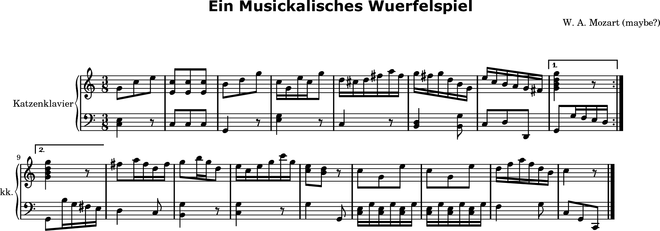

Version history
===============

Abjad 2.7
---------

Released 2012-02-27. Built from r5100. 
Implements 221 public classes and 1029 public functions totalling 168,000 lines of code.

- Added ``lilypondparsertools.LilyPondParser`` class, which arses a subset of LilyPond input syntax::

    abjad> from abjad.tools.lilypondparsertools import LilyPondParser
    abjad> parser = LilyPondParser( )
    abjad> input = r"\new Staff { c'4 ( d'8 e' fs'2) \fermata }"
    abjad> result = parser(input)
    abjad> f(result)
    \new Staff {
        c'4 (
        d'8
        e'8
        fs'2 -\fermata )
    }

  LilyPondParser defaults to English note names, but any of the other
  languages supported by LilyPond may be used::

    abjad> parser = LilyPondParser('nederlands')
    abjad> input = '{ c des e fis }'
    abjad> result = parser(input)
    abjad> f(result)
    {
        c4
        df4
        e4
        fs4
    }

  Briefly, LilyPondParser understands theses aspects of LilyPond syntax:

  - Notes, chords, rests, skips and multi-measure rests
  - Durations, dots, and multipliers
  - All pitchnames, and octave ticks
  - Simple markup (i.e. ``c'4 ^ "hello!"``)
  - Most articulations
  - Most spanners, including beams, slurs, phrasing slurs, ties, and glissandi
  - Most context types via ``\new`` and ``\context``, as well as context ids (i.e. ``\new Staff = "foo" { }``)
  - Variable assignment (i.e. ``global = { \time 3/4 } \new Staff { \global }``)
  - Many music functions:
    - ``\acciaccatura``
    - ``\appoggiatura``
    - ``\bar``
    - ``\breathe``
    - ``\clef``
    - ``\grace``
    - ``\key``
    - ``\transpose``
    - ``\language``
    - ``\makeClusters``
    - ``\mark``
    - ``\oneVoice``
    - ``\relative``
    - ``\skip``
    - ``\slashedGrace``
    - ``\time``
    - ``\times``
    - ``\transpose``
    - ``\voiceOne``, ``\voiceTwo``, ``\voiceThree``, ``\voiceFour``

  LilyPondParser currently **DOES NOT** understand many other aspects of LilyPond syntax:

  - ``\markup``
  - ``\book``, ``\bookpart``, ``\header``, ``\layout``, ``\midi`` and ``\paper``
  - ``\repeat`` and ``\alternative``
  - Lyrics
  - ``\chordmode``, ``\drummode`` or ``\figuremode``
  - Property operations, such as ``\override``, ``\revert``, ``\set``, ``\unset``, and ``\once``
  - Music functions which generate or extensively mutate musical structures
  - Embedded Scheme statements (anything beginning with ``#``)

- Added ``iotools.p( )``, for conveniently parsing LilyPond syntax::

    abjad> result = p(r"\new Staff { c'4 d e f }")
    abjad> f(result)
    \new Staff {
        c'4
        d4
        e4
        f4
    }

- Added ``schemetools.Scheme``, as a more robust replacement for nearly all other ``schemetools``
  classes::

    abjad> from abjad.tools.schemetools import Scheme
    abjad> print Scheme(True).format
    ##t
    abjad> print Scheme('a', 'list', 'of', 'strings').format
    #(a list of strings)
    abjad> print Scheme(('simulate', 'a', 'vector'), quoting="'#").format
    #'#(simulate a vector)
    abjad> print Scheme('a', ('nested', ('data', 'structure'))).format
    #(a (nested (data structure))

- Removed deprecated ``schemetools`` classes:

  * ``SchemeBoolean``
  * ``SchemeFunction``
  * ``SchemeNumber``
  * ``SchemeString``
  * ``SchemeVariable``

  In all cases, simply use ``schemetools.Scheme`` instead.

- Reimplemented MarkupCommand.

  The new implementation is initialized from a command-name, and a variable-size
  list of arguments.  Arguments which are lists or tuples will be enclosed in
  curly-braces::

    abjad> from abjad.tools.markuptools import MarkupCommand
    abjad> bold = MarkupCommand('bold', ['two', 'words'])
    abjad> rotate = MarkupCommand('rotate', 60, bold)
    abjad> triangle = MarkupCommand('triangle', False)
    abjad> concat = MarkupCommand('concat', ['one word', rotate, triangle])
    abjad> print concat.format
    \concat { #"one word" \rotate #60 \bold { two words } \triangle ##f }

- Added ``contexttools.TempoMarkInventory``, which models an ordered list of tempo marks::

    abjad> contexttools.TempoMarkInventory([('Andante', Duration(1, 8), 72), ('Allegro', Duration(1, 8), 84)])
    TempoMarkInventory([TempoMark('Andante', Duration(1, 8), 72), TempoMark('Allegro', Duration(1, 8), 84)])

  Inherits from list. Allows initialization, append and extent on tempo mark tokens.

- Added new ``pitchtools.PitchRangeInventory`` class.

  The class acts as an ordered list of PitchRange objects.

  The purpose of the class is to model something like palettes of different pitches
  available in all part of a score::

    abjad> pitchtools.PitchRangeInventory(['[C3, C6]', '[C4, C6]'])
    PitchRangeInventory([PitchRange('[C3, C6]'), PitchRange('[C4, C6]')])

  The class inherits from list.

- Added ``sequencetools.all_are_pairs()`` predicate::

    abjad> from abjad.tools.sequencetools import all_are_pairs
    abjad> all_are_pairs([(1, 2), (3, 4), (5, 6)])
    True

- Added ``sequencetools.all_are_pairs_of_types()`` predicate::

    abjad> from abjad.tools.sequencetools import all_are_pairs_of_types
    abjad> all_are_pairs_of_types([('a', 1.4), ('b', 2.3), ('c', 1.5)], str, float)
    True

- Added ``iotools.is_underscore_delimited_lowercase_file_name_with_extension()`` string predicate::

    abjad> iotools.is_underscore_delimited_lowercase_file_name_with_extension('foo_bar.blah')
    True

- Added ``iotools.is_underscore_delimited_file_name()`` string predicate.

  Returns true on any underscore-delimited lowercase string.

  Also returns trun on an underscore-delimtied lowercase string terminated with an extension.

  ::

    abjad> iotools.is_underscore_delimited_lowercase_file_name('foo_bar.py')
    True

    abjad> iotools.is_underscore_delimited_lowercase_file_name('foo_bar')
    True

- Added ``ImpreciseTempoError`` to exceptions.

- Added ``LilyPondParserError`` to exceptions.

- Added ``scr/devel/fix-test-cases``.  The script is a two-line wrapper around the following other two scripts:

  * ``scr/devel/fix-test-case-names``
  * ``scr/devel/fix-test-case-numbers``

- Extended ``Container`` to use ``LilyPondParser`` to parse input strings.

- Extended ``contexttools.InstrumentMark``, ``scoretools.Performer`` and 
  ``markuptools.Markup`` with ``__hash__`` equality.

  Now, if two instances compare equally (via ==), their hashes also compare equally,
  allowing for more intuitive use of these classes as dictionary keys.

- Extended ``contexttools.TempoMark`` with textual indications and tempo ranges
  You may instantiate as normal, or in some new combinations::

    abjad> from abjad.tools.contexttools import TempoMark
    abjad> t = TempoMark('Langsam', Duration(1, 4), (52, 57))
    abjad> t = TempoMark('Langsam')
    abjad> t = TempoMark((1, 4), (52, 57))

  In addition to its new read/write "textual_indication" attribute, TempoMark
  now also exposes a read-only "is_imprecise" property, which returns True if
  the mark cannot be expressed simply as duration=units_per_minute.  Arithmetic
  operations on TempoMarks will now raise ImpreciseTempoErrors if any mark
  involved is imprecise.

- Extended tempo marks to be able to initialize from 'tempo mark tokens'.
  A tempo mark token is a length-2 or length-3 tuple of tempo mark arguments.

- Extended tempo mark with ``is_tempo_mark_token()`` method::

    abjad> tempo_mark = contexttools.TempoMark(Duration(1, 4), 72)
    abjad> tempo_mark.is_tempo_mark_token((Duration(1, 4), 84))
    True

- Extended case-testing ``iotools`` string predicates to allow digits.

  Functions changed:

  * ``iotools.is_space_delimited_lowercase_string``
  * ``iotools.is_underscore_delimited_lowercase_file_name``
  * ``iotools.is_lowercamelcase_string``
  * ``iotools.is_uppercamelcase_string``
  * ``iotools.is_underscore_delimited_lowercase_string``
  * ``iotools.is_underscore_delimited_lowercase_file_name_with_extension``

- Extended ``lilypondfiletools._NonattributedBlock`` with ``is_formatted_when_empty`` read-write property.
  ``lilypondfiletools.ScoreBlock`` no longer formats when empty, by default.

- Extended ``marktools.BarLine`` with ``format_slot`` keyword.

- Extended ``pitchtools.PitchRange`` class with read-only ``pitch_range_name`` and ``pitch_range_name_markup`` attributes.

- Extended ``scoretools.InstrumentationSpecifier`` with read-only ``performer_name_string`` attribute.

- Extended all ``spannertools.Beam-``, ``Slur-`` and ``Hairpin-``related spanner classes, as well as
  ``tietools.TieSpanner` with an optional ``direction`` keyword::

    abjad> c = Container("c'4 d'4 e'4 f'4")
    abjad> spanner = spannertools.SlurSpanner(c[:], 'up')
    abjad> f(c)
    {
        c'4 ^ (
        d'4
        e'4
        f'4 )
    }

  The direction options are exactly the same as for ``Articulation`` and ``Markup``: 
  ``'up'``, ``'^'``, ``'down'``, ``'_'``, ``'neutral'``, ``'-'`` and ``None``.

- Extended ``tonalitytools.Scale`` with ``create_named_chromatic_pitch_set_in_pitch_range()`` method.

- Changed ``tuplettools.FixedDurationTuplet.multiplier`` to return fraction instead of duration.

- Renamed attributes, methods and functions throughout ``intervaltreetools``:

  * ``centroid`` => ``center`` (except where a weighted mean is actually used)
  * ``high`` => stop``
  * ``high_min`` => earliest_stop``
  * ``high_max`` => latest_stop``
  * ``low`` => ``start``
  * ``low_min`` => ``earliest_start``
  * ``low_max`` => ``latest_start``
  * ``magnitude`` => ``duration``

  This both clarifies the API, and prevents shadowing of Python's builtin ``min()`` and ``max()``.

- Renamed ``marktools.Articulation.direction_string`` => ``marktools.Articulation.direction``.

- Renamed ``markuptools.Markup.direction_string` => ``markuptools.Markup.direction``.

- Renamed ``tuplettools.Tuplet.ratio`` to ``tuplettools.Tuplet.ratio_string``.

- Renamed ``scr/devel/find-nonalphabetized-method-names`` to ``scr/devel/find-nonalphabetized-class-attributes``.

- Improved ``scr/devel/find-nonalphabetzied-methods``.

- Updated literature examples to match API changes.

- Removed ancient ``stafftools.make_invisible_staff()``.

- Added ``text_editor`` key to user config dictionary (in ``~/.abjad/config.py``).

- Improved ``__repr__`` strings of ``tonalitytools.Mode`` and ``tonalitytools.Scale``.

- ``contexttools.TempoMark`` ``__repr__`` now shows ``__repr__`` version of duration
  instead of string version of duration.

- ``scr/devel/abj-grp`` no longer excludes lines of code that include the string ``'svn'``.

Abjad 2.6
---------

Released 2012-01-29. Built from r4979. 
Implements 197 public classes and 941 public functions totalling 153,000 lines of code.

* Added top-level ``decorators`` directory with ``requires`` decorator.
  The ``requires`` decorator renders the following two function definitions equivalent::

    from abjad.decorators import requires

  ::

    @requires(int)
    def foo(x):
        return x ** 2

  ::

    def foo(x):
        assert isinstance(x, int)
        return x ** 2

* Added new classes to ``scoretools``::

    scoretools.InstrumentationSpecifier
    scoretools.Performer

* Added ``scoretools.list_performer_names()``::

    abjad> for name in scoretools.list_performer_names()[:10]:
    ...     name
    ... 
    'accordionist'
    'bassist'
    'bassoonist'
    'cellist'
    'clarinetist'
    'flutist'
    'guitarist'
    'harpist'
    'harpsichordist'
    'hornist'

* Added ``scoretools.list_primary_performer_names()``.

* Added ``measuretools.measure_to_one_line_input_string()``::

    abjad> measure = Measure((3, 4), "c4 d4 e4")

  ::

    abjad> measure
    Measure(3/4, [c4, d4, e4])

  ::

    abjad> measuretools.measure_to_one_line_input_string(measure)
    "Measure((3, 4), 'c4 d4 e4')"

* Added new classes to ``instrumenttools``::

    SopraninoSaxophone
    SopranoSaxophone
    AltoSaxophone
    TenorSaxophone
    BaritoneSaxophone
    BassSaxophone
    ContrabassSaxophone

  ::

    ClarinetInA

  ::

        AltoTrombone
        BassTrombone

  ::

        Harpsichord

* Added known untuned percussion::

    abjad> for name in instrumenttools.UntunedPercussion.known_untuned_percussion[:10]:
    ...     print name
    ... 
    agogô
    anvil
    bass drum
    bongo drums
    cabasa
    cajón
    castanets
    caxixi
    claves
    conga drums

* Added ``_Instrument.get_default_performer_name()``::

    abjad> bassoon = instrumenttools.Bassoon()

  ::

    abjad> bassoon.get_default_performer_name()
    'bassoonist'

* Added ``_Instrument.get_performer_names()``::

    abjad> bassoon.get_performer_names()
    ['instrumentalist', 'reed player', 'double reed player', 'bassoonist']

* Added read / write ``_Instrument.pitch_range``::

    abjad> marimba.pitch_range = (-24, 36)
    abjad> marimba.pitch_range
    PitchRange('[C2, C7]')

* Added read-only ``_Instrument.traditional_pitch_range``::

    abjad> marimba = instrumenttools = instrumenttools.Marimba()
    abjad> marimba.traditional_pitch_range
    PitchRange('[F2, C7]')

* Added ``instrumenttools.list_instruments()``::

    abjad> for instrument_name in instrumenttools.list_instrument_names()[:10]:
    ...     instrument_name
    ... 
    'accordion'
    'alto flute'
    'alto saxophone'
    'alto trombone'
    'clarinet in B-flat'
    'baritone saxophone'
    'bass clarinet'
    'bass flute'
    'bass saxophone'
    'bass trombone'

* Added other functions to ``instrumenttools``::

    instrumenttools.list_primary_instrument_names()
    instrumenttools.list_secondary_instrument_names()

* Added new class to ``lilypondfiletools``::

    ContextBlock

* Added ``pitchtools.is_symbolic_pitch_range_string()``::

    abjad> pitchtools.is_symbolic_pitch_range_string('[A0, C8]')
    True

* Added ``pitchtools.pitch_class_octave_number_string_to_chromatic_pitch_name()``::

    abjad> pitchtools.pitch_class_octave_number_string_to_chromatic_pitch_name('A#4')
    "as'"

* Added ``pitchtools.symbolic_accidental_string_to_alphabetic_accidental_string_abbreviation()``::

    abjad> pitchtools.alphabetic_accidental_abbreviation_to_symbolic_accidental_string('tqs')
    '#+'

* Added other new functions to ``pitchtools``::

    pitchtools.alphabetic_accidental_abbreviation_to_symbolic_accidental_string()
    pitchtools.is_smbolic_accidental_string()
    pitchtools.is_pitch_class_octave_number_string()

* Added ``iotools.string_to_strict_directory_name()``::

    abjad> iotools.string_to_strict_directory_name('Déja vu')
    'deja_vu'

* Added ``iotools.strip_diacritics_from_binary_string()``::

    abjad> binary_string = 'Dvořák'
    abjad> iotools.strip_diacritics_from_binary_string(binary_string)
    'Dvorak'

* Added other new functions to ``iotools``::

    iotools.capitalize_string_start()
    iotools.is_space_delimited_lowercamelcase_string()
    iotools.is_underscore_delimited_lowercamelcase_package_name()
    iotools.is_underscore_delimited_lowercamelcase_string()
    iotools.is_lowercamelcase_string()
    iotools.is_uppercamelcase_string()
    iotools.space_delimited_lowercase_to_uppercamelcase()
    iotools.uppercamelcase_to_space_delimited_lowercase()
    iotools.uppercamelcase_to_underscore_delimited_lowercase()

* Added new functions to ``mathtools``::

    mathtools.is_positive_integer_power_of_two()
    mathtools.is_integer_equivalent_expr()

* Added sequence type-checking predicates::

    chordtools.all_are_chords()
    containertools.all_are_containers()
    durationtools.all_are_duration_tokens()
    durationtools.all_are_durations()
    gracetools.all_are_grace_containers()
    leaftools.all_are_leaves()
    markuptools.all_are_markup()
    measuretools.all_are_measures()
    notetools.all_are_notes()
    pitcharraytools.all_are_pitch_arrays()
    pitchtools.all_are_named_chromatic_pitch_tokens()
    resttools.all_are_rests()
    scoretools.all_are_scores()
    sievetools.all_are_residue_class_expressions()
    skiptools.all_are_skips()
    spannertools.all_are_spanners()
    stafftools.all_are_staves()
    tuplettools.all_are_tuplets()

* Extended ``NamedChromaticPitch`` to allow initialization from pitch-class / octave number strings::

    abjad> pitchtools.NamedChromaticPitch('C#2')
    NamedChromaticPitch('cs,')

* Extended ``PitchRange`` to allow initialization from symbolic pitch range strings::

    abjad> pitchtools.PitchRange('[A0, C8]')
    PitchRange('[A0, C8]')

* Extended ``PitchRange`` to allow initialization from pitch-class / octave number strings::

    abjad> pitchtools.PitchRange('A0', 'C8')
    PitchRange('[A0, C8]')

* Extended ``leaftools.is_bar_line_crossing_leaf()`` to work when no explicit time signature mark is found.
* Extended ``Markup`` to be able to function as a top-level ``LilyPondFile`` element.
* Extended instruments with ``is_primary`` and ``is_secondary`` attributes.
* Extended instruments with ``instrument_name`` and ``instrument_name_markup`` attributes.
* Extended instruments with ``short_instrument_name`` and ``short_instrument_name_markup`` attributes.
* Extended ``iotools.write_expr_to_ly()`` and ``iotools.write_expr_to_pdf()`` with ``'tagline'`` keyword.
* Extended ``replace-in-files`` script to skip ``.text``, ``.ly`` and ``.txt`` files.

* Renamed ``Accidental.symbolic_string`` to ``Accidental.symbolic_accidental_string``.
* Renamed ``Accidental.alphabetic_string`` to ``Accidental.alphabetic_accidental_abbreviation``.

* Fixed bug in ``iotools.play()``.
* Fixed bug in ``quantizationtools`` regarding quantizing a stream of ``QEvents`` directly.

Abjad 2.5
---------

Released 2011-09-22. Built from r4803.

* Added ``get_leaf_in_expr_with_minimum_prolated_duration()`` function to ``leaftools``.
* Added ``get_leaf_in_expr_with_maximum_prolated_duration()`` function to ``leaftools``.
* Added ``are_relatively_prime()`` function to ``mathtools``.
* Added ``CyclicTree`` class to ``sequencetools``.
* Added ``get_next_n_nodes_at_leve(n, level)`` method to ``sequencetools.Tree``.
* Extended spanners to sort by repr.
* Renamed ``lilyfiletools`` to ``lilypondfiletools``.
* Renamed ``lilyfiletools.LilyFile`` to ``lilypondfiletools.LilyPondFile``.
* Renamed ``lilyfiletools.make_basic_lily_file()`` to ``lilypondfiletools.make_basic_lilypond_file()``.

Note that the three renames change user syntax.
Composers working with the ``lilypondfiletools`` module should update their score code.

Abjad 2.4
---------

Released 2011-09-12. Built from r4769.

* Added Mozart Musikalisches Wuerfelspiel.

* Added new ``Tree`` class to ``sequencetools`` to work with sequences whose elements have been grouped into arbitrarily many levels of containment.

* Added new ``BarLine`` class to ``marktools`` package.
* Added new ``HorizontalBracketSpanner`` to ``spannertools`` package.
* Improved ``schemetools.SchemePair`` handling.
* Extended ``LilyPondFile`` blocks with double underscore-delimited attributes.

Abjad 2.3
---------

Released 2011-09-04. Built from r4747.

Filled out the API for working with marks::

    marktools.attach_articulations_to_components_in_expr()
    marktools.detach_articulations_attached_to_component()
    marktools.get_articulations_attached_to_component()
    marktools.get_articulation_attached_to_component()
    marktools.is_component_with_articulation_attached()

These five type of functions are now implemented for the following marks::

    marktools.Annotation
    marktools.Articulation
    marktools.LilyPondCommandMark
    marktools.LilyPondComment
    marktools.StemTremolo

The same type of functions are likewise implemented for the following context marks::

    contexttools.ClefMark
    contexttools.DynamicMark
    contexttools.InstrumentMark
    contexttools.KeySignatureMark
    contexttools.StaffChangeMark
    contexttools.TempoMark
    contexttools.TimeSignatureMark

* Extended ``Container.extend()`` to allow for LilyPond input strings. You can now say ``container.extend("c'4 d'4 e'4 f'4")``.

* Added public ``parent`` attribute to all components. You can now say ``note.parent``. The attribute is read-only.
* Added ``cfgtools.list_package_dependency_version()``.
* Added ``py.test`` and ``Sphinx`` dependencies to the Abjad package.
* Added LilyPond command mark chapter to reference manual

* Renamed ``cfgtools`` to ``configurationtools``.
* Renamed ``durtools`` to ``durationtools``.
* Renamed ``metertools`` to ``timesignaturetools``.
* Renamed ``seqtools`` to ``sequencetools``.
* Renamed ``Mark.attach_mark()`` to ``Mark.attach()``.
* Renamed ``Mark.detach_mark()`` to ``Mark.detach()``.
* Renamed ``marktools.Comment`` to ``marktools.LilyPondComment``. This matches ``marktools.LilyPondCommandMark``.
* Removed ``contexttools.TimeSignatureMark(3, 8)`` initialization. You must now say ``contexttools.TimeSignatureMark((3, 8))`` instead. This parallels the initialization syntax for rests, skips and measures.

Abjad 2.2
---------

Released 2011-08-30. Built from r4677. 

* Added articulations chapter to reference manual.
* Reordered the way in which Abjad determines the value of the ``HOME`` environment variable.
* Updated ``scr/devel/replace-in-files`` to avoid image files.
* Updated ``iotools.log()`` to call operating-specific text editor.

Abjad 2.1
---------

Released 2011-08-21. Built from r4655. 

* Updated instrument mark ``repr`` to display target context when instrument mark is attached.
* Extended ``scr/abj`` and ``scr/abjad`` to display Abjad version and revision numbers on startup.

Abjad 2.0
---------

Released 2011-08-17. Built from r4638.

Abjad 2.0 is the first public release of Abjad in more than two years. The new release of the system more than doubles the number of classes, functions and packages available in Abjad.

* The API has been cleaned up and completely reorganized. Features have been organized into a collection of 39 different libraries::

    cfgtools/          instrumenttools/   mathtools/         resttools/         tempotools/
    chordtools/        intervaltreetools/ measuretools/      schemetools/       threadtools/
    componenttools/    iotools/           metertools/        scoretools/        tietools/
    containertools/    layouttools/       musicxmltools/     seqtools/          tonalitytools/
    contexttools/      leaftools/         notetools/         sievetools/        tuplettools/
    durtools/          lilyfiletools/     pitcharraytools/   skiptools/         verticalitytools/
    gracetools/        marktools/         pitchtools/        spannertools/      voicetools/
    importtools/       markuptools/       quantizationtools/ stafftools/

* The name of almost every function in the public API has been changed to better indication what the function does. While this has the effect of making Abjad 2.0 largely non-backwards compatible with code written in Abjad 1.x, the longer and much more explicit function names in Abjad 2.0 make code used to structure complex scores dramatically easier to maintain and understand.

* The ``contexttools``, ``instrumenttools``, ``intervaltreetools``, ``lilyfiletools``, ``marktools``, ``pitcharraytools``, ``quantizationtools``, ``sievetools``, ``tonalitytools`` and ``verticalitytools`` packages are completely new.

* The classes implemented in the ``contexttools`` and ``marktools`` packages provide an object-oriented interfaces to clefs, time signatures, key signatures, articulations, tempo marks and other symbols stuck to the outside of the hierarchical score tree. The classes implemented in ``contexttools`` and ``marktools`` model information outside the score tree much the way that the classes implemented in ``spannertools`` implement object-oriented interfaces to beams, brackets, hairpins, glissandi and other line-like symbols.

* The ``instrumenttools`` package provides an object-oriented model of most of the conventional instruments of the orchestra.

* The ``intervaltreetools`` package implements a custom way of working with chunks of score during composition.

* The ``lilyfiletools`` package implements an object-oriented interface to arbitrarily structured LilyPond input files.

* The ``pitcharraytools`` package implements an object-oriented way of composing with pitches, pitch-classes and other pitch-related objects independent of rhythmic context.

* The experimental ``quantizationtools`` package implements classes and functions for quantizing rhythmic events.

* The ``sievetools`` package implements an object-oriented interface to the basics of Xenakis's system of sieves.

* The ``tonalitytools`` package implements classes and methods to model the basics of functional harmonic analysis.

* The ``verticalitytools`` package provides vertical-moment-based iteration and analysis of any score. 

* The ``pitchtools`` package has grown considerably in size and functionality. Classes now exist to model named and numbered chromatic pitches (and pitch-classes), named and numbered diatonic pitches (and pitch-classes), melodic and harmonic diatonic intervals (and interval-classes), melodic and harmonic chromatic intervals (and interval-classes), as well as ordered segments and unordered sets of these and related objects. The package contains dozens of functions to create, inspect, iterate, analyze and transpose these classes and their collections.

* The old ``listtools`` package has been renamed seqtools.

* Dozens of new functions for cutting, pasting, partitioning, breaking, arranging and reordering score components have been added to the system. See the new functions in ``componenttools``, ``containertools``, ``leaftools``, ``measuretools`` and ``scoretools`` for details.

* The core component classes modeling notes, rests, chords, tuplets, measures, voices, staves and scores have been reimplemented to consume dramatically less memory, making it much easier to work with arrays of hundreds and thousands of components.

* Abjad core formatting logic has been optimized to make the formatting of scores with hundreds or thousands of events take much less time than before. 

* The component duration interfaces have been replaced by more straightforward read-only component attributes.

* Added Ferneyhough Unsichbare Farben example.

.. image:: ../../examples/ferneyhough/images/ferneyhough-1.png

Abjad 1.1.1
-----------

*   More complete documentation.

*   The configuration file ``config`` changed to pure Python ``config.py``. 
    The file now supports more settings previously read as environment 
    variables. All user setings are now found in this file. 
    Users no longer need to set environment variables. 

*   Some new classes

    *   ``_HistoryInterface``. Use the _HistoryInterface to apply attributes to 
        any component in score that will be completely ignored by Abjad. 
        Think of the _HistoryInterface as a private user namespace.
    *   ``_NoteColumnInterface`` to handle the LilyPond NoteColumn grob. 
    *   ``_SpanBarInterface``. See API for details.
    *   ``InvisibleStaff()`` staff.
    *   ``Moment`` utility class to model the Abjad representation of the LilyPond moment.

*   New Spanners

    *   ``TempoProportional`` spanner.

*   More than a dozen new tools added. 

Abjad 1.1.0
-----------

*   Many structure transform tools added. See the `abjad.tools.*`
    in the :doc:`Abjad API </chapters/api/index>` package.

*   Construction, transformation, manipulation and all other tools
    now grouped cleanly into packages.

*   New ``abjad-book`` application available. 
    Use ``abjad-book`` to interpret Abjad code blocks embedded in 
    HTML, LaTex and reST documents. 

Abjad 1.0.1055
----------------

Changes to the public interface:

*   Abjad now models ties exclusively with the Tie spanner. 
    The old ``_TieInterface._set`` attribute is now deprecated.

*   You can no longer say ``t.tie = True`` or ``t.tie = False``, 
    for leaf ``t``. You must structurally span ``t`` as ``Tie(t)`` 
    instead.

*   New public properties in ``_SpannerReceptor``: ``chain, parented, count``.

*   New public helpers: 

    *  ``construct.notes_curve()``
    *  ``durationtools.rationalize()``
    *  ``iterate.tie_chains()``
    *  ``list_helpers()``
    *  ``mathtools.interpolate_divide()``
    *  ``measuretools.concentrate()``
    *  ``measuretools.scale_and_remeter()``
    *  ``measuretools.spin()`` 
    *  ``play()``

*   Grace note ``append()`` and ``extend()`` no longer throw errors.

Abjad 1.0.1022
----------------

*   First public release of Abjad.
