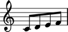
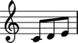

Three types of measure
======================

Rigid measures
--------------

The easiest way to build a measure full of music is with
:class:`~abjad.RigidMeasure`.  
To use a rigid measure, you need to know the duration of the 
measure you want to make before you make it.

::

	abjad> measure = RigidMeasure((3, 8), construct.scale(3))
	abjad> print measure.format
	{
		\time 3/8
		c'8
		d'8
		e'8
	}
	abjad> show(measure)

.. image:: images/1.png

Dynamic measures
----------------

If you want a measure that grows and shinks as you add  and remove music,
you can use a :class:`~abjad.DynamicMeasure`.

::

	abjad> measure = DynamicMeasure(construct.scale(4))
	abjad> print measure.format
	{
		\time 1/2
		c'8
		d'8
		e'8
		f'8
	}
	abjad> show(measure)

::

	abjad> measure.pop(-1)
	abjad> print measure.format
	{
		\time 3/8
		c'8
		d'8
		e'8
	}
	abjad> show(measure)

Anonymous measures
------------------

If you want this same dynamic behavior in a measure that hides 
its time signature, use an
:class:`~abjad.AnonymousMeasure`.

::

	abjad> measure = AnonymousMeasure(construct.scale(4))
	abjad> print measure.format
	{
		\override Staff.TimeSignature #'stencil = ##f
		\time 1/2
		c'8
		d'8
		e'8
		f'8
		\revert Staff.TimeSignature #'stencil
	}
	abjad> show(measure)

::

	abjad> measure.pop(-1)
	abjad> print measure.format
	{
		\override Staff.TimeSignature #'stencil = ##f
		\time 3/8
		c'8
		d'8
		e'8
		\revert Staff.TimeSignature #'stencil
	}
	abjad> show(measure)

