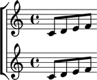

Naming containers
=================

You can name Abjad containers:

::

	abjad> flute_staff = Staff(macros.scale(4))
	abjad> flute_staff.name = 'Flute'
	abjad> violin_staff = Staff(macros.scale(4))
	abjad> violin_staff.name = 'Violin'
	abjad> staff_group = scoretools.StaffGroup([flute_staff, violin_staff])
	abjad> score = Score([staff_group])

Container names appear in LilyPond input:

::

	abjad> f(score)
	\new Score <<
		\new StaffGroup <<
			\context Staff = "Flute" {
				c'8
				d'8
				e'8
				f'8
			}
			\context Staff = "Violin" {
				c'8
				d'8
				e'8
				f'8
			}
		>>
	>>

And make it easy to retrieve containers later:

::

	abjad> componenttools.get_first_component_in_expr_with_name(score, 'Flute')
	Staff-"Flute"{4}

But container names do not appear in notational output:

::

	abjad> show(score)

