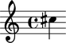

Make one note
=============

Type the following and hit return.

.. sourcecode:: python
    
    abjad> Note(13, (1, 4))
    Note(c'', 4)

Abjad responds with the Abjad representation of the note you created.

Now name the note and call :func:`~abjad.tools.io.show.show`.

::

	abjad> note = Note(13, (1, 4))
	abjad> show(note)

Abjad does some behind-the-scenes work to format the note as LilyPond
input, call LilyPond, and then display the resulting PDF that LilyPond 
creates.

And now that we see the note we've created, we can look over
our work and decide what comes next: perhaps staccato or marcato 
articulations, or maybe more notes.

.. note:: The Abjad workcycle

   We've so far made only one note. But we've now traversed the 
   **Abjad workcycle** for the very first time. No matter what type of work
   you're doing in Abjad, and no matter how complex or involved a piece
   of notation you're in the process of building up, the Abjad workcycle
   stays basically the same and goes something like this.

   #. **Describe** some gesture, texture or other score element as Abjad code.
   #. **Inspect** the notation that Abjad produces as a result.
   #. **Repeat**, going back to step 1 to describe your material
      in greater, or different, detail.

   This describe - inspect - repeat workcycle is both iterative
   and incremental, and we'll meet it over and over again as we explore
   Abjad in greater detail.
