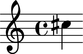

Making one note
===============

Type the following and hit return:

::

	abjad> Note("cs''4")

Now name the note and show:

::

	abjad> note = Note("cs''4")
	abjad> show(note)

Abjad calls LilyPond and shows the PDF of the note you created.

Now you can look over your work and decide what comes next.
