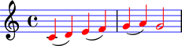

Understanding LilyPond grobs
============================

LilyPond models music notation as a collection of graphic objects or grobs.

Grobs control typography
------------------------

LilyPond grobs control the typographic details of the score::

    \new Staff {
        c'4 (
        d'4 )
        e'4 (
        f'4 )
        g'4 (
        a'4 )
        g'2
    }

.. image:: images/grob-tutorial-1.png

In the example above LilyPond creates a grob for every printed glyph.
This includes the clef and time signature as well as the note heads, stems and
slurs. If the example included beams, articulations or an explicit key signature
then LilyPond would create grobs for those as well.

Grobs can be overridden
-----------------------

You can change the appearance of LilyPond grobs with grob overrides::

    \new Staff \with {
        \override NoteHead #'color = #red
        \override StaffSymbol #'color = #blue
        \override Stem #'color = #red
    } {
        c'4 (
        d'4 )
        e'4 (
        f'4 )
        g'4 (
        a'4 )
        g'2
    }

Check the LilyPond docs
-----------------------

New grobs are added to LilyPond from time to time.

For a complete list of LilyPond grobs see the `LilyPond documentation
<http://lilypond.org/doc/v2.13/Documentation/internals/all-layout-objects>`__.
