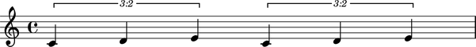

Working with component parentage
================================

Many score objects contain other score objects.

::

	abjad> tuplet = Tuplet(Fraction(2, 3), "c'4 d'4 e'4")
	abjad> staff = Staff(2 * tuplet)
	abjad> score = Score([staff])
	abjad> show(score)

Abjad uses the idea of parentage to model the way objects contain each other.

Improper parentage
------------------

The improper parentage of the first note in score begins with the note itself:

::

	abjad> note = score.leaves[0]
	Note("c'4")

::

	abjad> componenttools.get_improper_parentage_of_component(note)
	(Note("c'4"), Tuplet(2/3, [c'4, d'4, e'4]), Staff{2}, Score<<1>>)

Proper parentage
----------------

The proper parentage of the note begins with only the immediate parent of the note:

::

	abjad> componenttools.get_proper_parentage_of_component(note)
	(Tuplet(2/3, [c'4, d'4, e'4]), Staff{2}, Score<<1>>)

.. note:: the length of the improper parentage of any component equals
    the length of the proper parentage of the component plus ``1``.

Parentage attributes
--------------------

Use component tools to find score depth:

::

	abjad> componenttools.component_to_score_depth(note)
	3

Or score root:

::

	abjad> componenttools.component_to_score_root(note)
	Score<<1>>

Or to find whether a component has no (proper) parentage at all:

::

	abjad> componenttools.is_orphan_component(note)
	False
