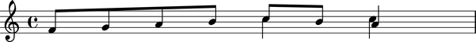
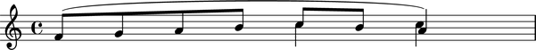
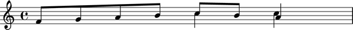

Working with threads
====================

What is a thread?
-----------------

A thread is a structural relationship binding a set of strictly sequential voice-level components.

Threads may be explicitly defined via voice instances:

::

	abjad> v = Voice()

Or they may exist implicitly in certain score constructs in the absence of voice containers:

::

	abjad> staff = Staff("c'8 d'8 e'8 f'8")

Two contiguous voices must have the same name in order to be part of the same thread.

Here a thread does **not** exist between notes in different voices:

::

	abjad> v_one = Voice("c'16 d'16 e'16 f'16")
	abjad> v_two = Voice("c'8 d'8")
	abjad> staff = Staff([v_one, v_two])
	abjad> f(staff)
	\new Staff {
		\new Voice {
			c'16
			d'16
			e'16
			f'16
		}
		\new Voice {
			c'8
			d'8
		}
	}

Here a thread does exist:

::

	abjad> v_one.name = 'flute'
	abjad> v_two.name = 'flute'
	abjad> f(staff)
	\new Staff {
		\context Voice = "flute" {
			c'16
			d'16
			e'16
			f'16
		}
		\context Voice = "flute" {
			c'8
			d'8
		}
	}

What are threads for?
---------------------

Consider the following situation:

Are the two eighth notes in the second half of the measure the continuation
of the ascending line in the first half, or is it the quarter note?
Is the very last *C* the continuation of the top melodic line or is it the *A*?
The stems might suggest an answer, but for Abjad, stem direction is not structural.
What path should Abjad take to traverse this little score from the first note to the last *A*?
This same problem appears when trying to apply spanners to parallel structures.
Thus, threads are important in both score navigation and the application of spanners.
In fact, threads are a requirement for spanner application.

In Abjad, the ambiguity is resolved through the explicit use of named voices.

The musical fragment above is constructed with the following code:

::

	abjad> vA = Voice(notetools.make_notes([5, 7, 9, 11], [(1, 8)] * 4))
	abjad> vB = Voice(notetools.make_notes([12, 11, 9], [(1, 8), (1, 8), (1, 4)]))
	abjad> vC = Voice(Note(12, (1, 4)) * 2)
	abjad> marktools.LilyPondCommandMark('voiceOne')(vA[0])
	abjad> marktools.LilyPondCommandMark('voiceOne')(vB[0])
	abjad> marktools.LilyPondCommandMark('voiceTwo')(vC[0])
	abjad> p = Container([vB, vC])
	abjad> p.is_parallel = True
	abjad> staff = Staff([vA, p])

There's a staff that sequentially contains a voice and a parallel container.
The container in turn holds two voices running simultaneously.

It is now clear from the code that the last *A* belongs with the two descending eighth notes.
But there's still no indication about a relationship of continuity between the first voice
in the sequence (`vA`) and any of the two following voices.
Note that, while the LilyPond voice number commands setting may suggest
that vA and vB belong together, this is not the case.
The LilyPond voice number commands simply set the direction of stems in printed output.

To see this more clearly, suppose we want to add a slur spanner starting on the
first note and ending on one of the last simultaneous notes.
To attach the slur spanner to the voices we could try either:

::

    abjad> spannertools.SlurSpanner([vA, vB])

or

::

    abjad> spannertools.SlurSpanner([vA, vC])

But both raise a contiguity error.
Abjad needs to see an explicit connection between either `vA` and `vB` or between `vA` and `vC`.

Observe the behavior of the
:func:`~abjad.tools.threadtools.iterate_thread_forward_in_expr`
iterator on the `staff`::

::

	abjad> from abjad.tools import threadtools
	abjad> vA_thread_signature = threadtools.component_to_thread_signature(vA)
	abjad> notes = threadtools.iterate_thread_forward_in_expr(staff, Note, vA_thread_signature)
	abjad> print list(notes)
	[Note("f'8"), Note("g'8"), Note("a'8"), Note("b'8")]

::

	abjad> vB_thread_signature = threadtools.component_to_thread_signature(vB)
	abjad> notes = threadtools.iterate_thread_forward_in_expr(staff, Note, vB_thread_signature)
	abjad> print list(notes)
	[Note("c''8"), Note("b'8"), Note("a'4")]

::

	abjad> vC_thread_signature = threadtools.component_to_thread_signature(vC)
	abjad> notes = threadtools.iterate_thread_forward_in_expr(staff, Note, vC_thread_signature)
	abjad> print list(notes)
	[Note("c''4"), Note("c''4")]

In each case we are passing a different **thread signature** to the
:func:`~abjad.tools.threadtools.iterate_thread_forward_in_expr`
iterator, so each case returns a different list of notes.

We can see that the thread signature of each voice is indeed different
by printing it:

::

	abjad> vA_thread_signature = threadtools.component_to_thread_signature(vA)
	abjad> vA_thread_signature
	<        root: Staff-8112592 (8112592) *      score:  * staffgroup:  *      staff: Staff-8112592 *      voice: Voice-8112256 *         self: Voice-8112256 >

::

	abjad> vB_thread_signature = threadtools.component_to_thread_signature(vB)
	abjad> vB_thread_signature
	<        root: Staff-8108496 (8108496) *      score:  * staffgroup:  *      staff: Staff-8108496 *      voice: Voice-8108272 *         self: Voice-8108272 >

::

	abjad> vC_thread_signature = threadtools.component_to_thread_signature(vC)
	abjad> vC_thread_signature
	<        root: Staff-8108496 (8108496) *      score:  * staffgroup:  *      staff: Staff-8108496 *      voice: Voice-8108384 *         self: Voice-8108384 >

And by comparing them with the binary equality operator:

::

	abjad> vA_thread_signature == vB_thread_signature
	False
	abjad> vA_thread_signature == vC_thread_signature
	False
	abjad> vB_thread_signature == vC_thread_signature
	False

To allow Abjad to treat the content of, say, voices `vA` and `vB` as belonging together,
we explicitly define a thread between them.
To do this  all we need to do is give both voices the same name:

::

	abjad> vA.name = 'piccolo'
	abjad> vB.name = 'piccolo'

Now `vA` and `vB` and all their content belong to the same thread:

::

	abjad> vA_thread_signature == vB_thread_signature
	False

Note how the thread signatures have changed:

::

	abjad> vA_thread_signature = threadtools.component_to_thread_signature(vA)
	abjad> print vA_thread_signature
	        root: Staff-8108496 (8108496)
	     score:
	staffgroup:
	     staff: Staff-8108496
	     voice: Voice-piccolo
	        self: Voice-piccolo

::

	abjad> vB_thread_signature = threadtools.component_to_thread_signature(vB)
	abjad> print vB_thread_signature
	        root: Staff-8108496 (8108496)
	     score:
	staffgroup:
	     staff: Staff-8108496
	     voice: Voice-piccolo
	        self: Voice-piccolo

::

	abjad> vC_thread_signature = threadtools.component_to_thread_signature(vC)
	abjad> print vC_thread_signature
	        root: Staff-8108496 (8108496)
	     score:
	staffgroup:
	     staff: Staff-8108496
	     voice: Voice-8108384
	        self: Voice-8108384

And how the ``threadtools.iterate_thread_forward_in_expr()`` function returns
all the notes belonging to both `vA` and `vB` when passing it the full staff
and the thread signature of `vA`:

::

	abjad> notes = threadtools.iterate_thread_forward_in_expr(staff, Note, vA_thread_signature)
	abjad> print list(notes)
	[Note("f'8"), Note("g'8"), Note("a'8"), Note("b'8"), Note("c''8"), Note("b'8"), Note("a'4")]

Now the slur spanner can be applied to voices `vA` and `vB`:

::

    abjad> spannertools.SlurSpanner([vA, vB])

or directly to the notes returned by the
:func:`~abjad.tools.threadtools.iterate_thread_forward_in_expr`
iteration tool, which are the notes belonging to both `vA` and `vB`:

::

	abjad> notes = threadtools.iterate_thread_forward_in_expr(staff, Note, vA_thread_signature)
	abjad> spannertools.SlurSpanner(list(notes))

::

	abjad> show(staff)

Coda
----

We could have constructed this score in a simpler way with only two voices,
one of them starting with a LilyPond skip:

::

	abjad> vX = Voice(notetools.make_notes([5, 7, 9, 11, 12, 11, 9], [(1, 8)] * 6 + [(1, 4)]))
	abjad> vY = Voice([skiptools.Skip((2, 4))] + Note(12, (1, 4)) * 2)
	abjad> marktools.LilyPondCommandMark('voiceOne')(vX[0])
	abjad> marktools.LilyPondCommandMark('voiceTwo')(vY[0])
	abjad> staff = Staff([vX, vY])
	abjad> staff.is_parallel = True

