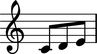
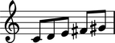
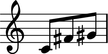

Working with anonymous measures
===============================

Anonymous determine their time signatures on the fly and then hide them at format time.

Creating anonymous measures
---------------------------

Create anonymous measures without a time signature:

::

	abjad> measure = measuretools.AnonymousMeasure("c'8 d'8 e'8")

::

	abjad> show(measure)

Adding music to anonymous measures
----------------------------------

Add music to anonymous measures the same as to other containers:

::

	abjad> measure.extend([Note("fs'8"), Note("gs'8")])

::

	abjad> show(measure)

Removing music from anonymous measures
--------------------------------------

Remove music from anonymous measure the same as from other containers:

::

	abjad> del(measure[1:3])

::

	abjad> show(measure)

