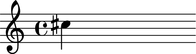
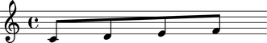

Comments
========

LilyPond comments begin with the ``%`` sign.
Abjad models LilyPond comments as marks.

Adding comments
---------------

You can add comments before, after or to the right of any note, rest or chord:

::

	abjad> note = Note(13, (1, 4))
	abjad> show(note)

::

	abjad> marktools.Comment('This is a comment before the note.', 'before')(note)
	abjad> marktools.Comment('This is a comment to the right of the note.', 'right')(note)

::

	abjad> f(note)
	% This is a comment before the note.
	cs''4 % This is a comment to the right of the note.

You can add comments before, after, in the opening or in the closing of any container:

::

	abjad> staff = Staff("c'8 d'8 e'8 f'8")
	abjad> show(staff)

::

	abjad> marktools.Comment('Here is a comment before the staff.', 'before')(staff)
	abjad> marktools.Comment('Here is a comment in the staff opening.', 'opening')(staff)
	abjad> marktools.Comment('Here is another comment in the staff opening.', 'opening')(staff)
	abjad> marktools.Comment('Comment in the staff closing.', 'closing')(staff)
	abjad> marktools.Comment('Comment after the staff.', 'after')(staff)

::

	abjad> f(staff)
	% Here is a comment before the staff.
	\new Staff {
		% Here is a comment in the staff opening.
		% Here is another comment in the staff opening.
		c'8
		d'8
		e'8
		f'8
		% Comment in the staff closing.
	}
	% Comment after the staff.

Getting comments
----------------

Use mark tools to get comments:

::

	abjad> marktools.get_comments_attached_to_component(note)
	(Comment('This is a comment before the note.')(cs''4), Comment('This is a comment to the right of the note.')(cs''4))

Detaching comments
------------------

Detach comments by hand:

::

	abjad> comment_1, comment_2 = marktools.get_comments_attached_to_component(note)

::

	abjad> comment_1.detach_mark( )
	Comment('This is a comment before the note.')
	abjad> comment_2.detach_mark( )
	Comment('This is a comment to the right of the note.')

::

	abjad> f(note)
	cs''4

::

	abjad> marktools.get_comments_attached_to_component(note)
	()

Or use mark tools to detach comments automatically:

::

	abjad> marktools.detach_comments_attached_to_component(staff)

::

	abjad> f(staff)
	\new Staff {
		c'8
		d'8
		e'8
		f'8
	}

::

	abjad> marktools.get_comments_attached_to_component(staff)
	()

