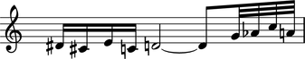
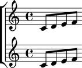

Working with containers
=======================

Creating containers
-------------------

Create a container with components:

::

	abjad> container = Container([Note("ds'16"), Note("cs'16"), Note("e'16"), Note("c'16")])

::

	abjad> show(container)

Or with a note-entry string:

.. Xenakis: Jalons (1986): Contrabass: m58

::

	abjad> container = Container("ds'16 cs'16 e'16 c'16 d'2 ~ d'8")

::

	abjad> show(container)

.. image:: images/example-2.png

Inspecting music
----------------

Return the components in a container with ``music``:

::

	abjad> container.music
	(Note("ds'16"), Note("cs'16"), Note("e'16"), Note("c'16"), Note("d'2"), Note("d'8"))

Or with a special call to ``__getslice__``:

::

	abjad> container[:]
	[Note("ds'16"), Note("cs'16"), Note("e'16"), Note("c'16"), Note("d'2"), Note("d'8")]

Inspecting length
-----------------

Get the length of a container with ``len( )``:

::

	abjad> len(container)
	6

Inspecting duration
-------------------

Contents duration equals the sum of the duration of everything inside the container:

::

	abjad> container.duration.contents
	Fraction(7, 8)

Adding one component to the end of a container
----------------------------------------------

Add one component to the end of a container with ``append``:

::

	abjad> container.append(Note("af'32"))

::

	abjad> show(container)

Adding many components to the end of a container
------------------------------------------------

Add many components to the end of a container with ``extend``:

::

	abjad> container.extend([Note("c''32"), Note("a'32")])

::

	abjad> show(container)

Finding the index of a component
--------------------------------

Find the index of a component with ``index``:

::

	abjad> note = container[7]

::

	abjad> container.index(note)
	7

Inserting a component by index
------------------------------

Insert a component by index with ``insert``:

::

	abjad> container.insert(-3, Note("g'32"))

::

	abjad> show(container)

Removing a component by index
-----------------------------

Remove a component by index with ``pop``:

::

	abjad> container.pop(-1)

::

	abjad> show(container)

Removing a component by reference
---------------------------------

Remove a component by reference with ``remove``:

::

	abjad> container.remove(container[-1])

::

	abjad> show(container)

.. note::

   ``__getslice__``, ``__setslice__`` and ``__delslice__`` remain to be documented.

Naming containers
-----------------

You can name Abjad containers:

::

	abjad> flute_staff = Staff(macros.scale(4))
	abjad> flute_staff.name = 'Flute'
	abjad> violin_staff = Staff(macros.scale(4))
	abjad> violin_staff.name = 'Violin'
	abjad> staff_group = scoretools.StaffGroup([flute_staff, violin_staff])
	abjad> score = Score([staff_group])

Container names appear in LilyPond input:

::

	abjad> f(score)
	\new Score <<
		\new StaffGroup <<
			\context Staff = "Flute" {
				c'8
				d'8
				e'8
				f'8
			}
			\context Staff = "Violin" {
				c'8
				d'8
				e'8
				f'8
			}
		>>
	>>

And make it easy to retrieve containers later:

::

	abjad> componenttools.get_first_component_in_expr_with_name(score, 'Flute')
	Staff-"Flute"{4}

But container names do not appear in notational output:

::

	abjad> show(score)

.. note::

   ``is_parallel`` remains to be documented.
