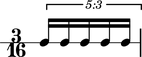

Introduction
============

Abjad publishes information about many durated score objects.

Notes, rests, chords and skips carry some duration attributes:

::

	abjad> note = Note(0, (3, 16))
	abjad> measure = Measure((3, 16), [note])
	abjad> staff = stafftools.RhythmicStaff([measure])
	abjad> note.duration.written
	Fraction(3, 16)

.. image:: images/example1.png

Tuplets, measures, voices, staves and the other containers carry duration attributes, too:

::

	abjad> tuplet = tuplettools.FixedDurationTuplet((3, 16), Note(0, (1, 16)) * 5)
	abjad> measure = Measure((3, 16), [tuplet])
	abjad> staff = stafftools.RhythmicStaff([measure])
	abjad> tuplet.duration.multiplier
	Fraction(3, 5)

The next chapters document core duration concepts in Abjad.
