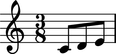
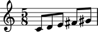
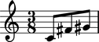
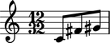

Working with dynamic measures
=============================

Dynamic measures adjust their time signatures on the fly as you add
and remove music.

Creating dynamic measures
-------------------------

Create dynamic measures without a time signature:

::

	abjad> measure = measuretools.DynamicMeasure("c'8 d'8 e'8")

::

	abjad> show(measure)

Adding music to dynamic measures
--------------------------------

Add music to dynamic measures the same as to all containers:

::

	abjad> measure.extend([Note("fs'8"), Note("gs'8")])

::

	abjad> show(measure)

Removing music from dynamic measures
------------------------------------

Remove music from dynamic measures the same as with other containers:

::

	abjad> del(measure[1:3])

::

	abjad> show(measure)

Setting the denominator of dynamic measures
-------------------------------------------

You can set the denominator of dynamic measures to any integer power of ``2``:

::

	abjad> measure.denominator = 32
	abjad> print measure.denominator
	32
	abjad> f(measure)
	{
		\time 12/32
		c'8
		fs'8
		gs'8
	}

::

	abjad> show(measure)

Suppressing the meter of dynamic measures
-----------------------------------------

You can temporarily suppress the meter of dynamic measures:

::

	abjad> measure.suppress_meter = True

::

	abjad> show(measure)

