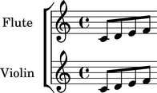

Instrument marks
================

Creating instrument marks
-------------------------

Use context tools to add instrument marks:

::

	abjad> flute_staff = Staff(macros.scale(4))
	abjad> violin_staff = Staff(macros.scale(4))
	abjad> staff_group = scoretools.StaffGroup([flute_staff, violin_staff])
	abjad> score = Score([staff_group])
	abjad> contexttools.InstrumentMark('Flute ', 'Fl. ')(flute_staff)
	abjad> contexttools.InstrumentMark('Violin ', 'Vn. ')(violin_staff)

Instrument marks appear as context settings in LilyPond input:

::

	abjad> f(score)
	\new Score <<
		\new StaffGroup <<
			\new Staff {
				\set Staff.instrumentName = \markup { Flute  }
				\set Staff.shortInstrumentName = \markup { Fl.  }
				c'8
				d'8
				e'8
				f'8
			}
			\new Staff {
				\set Staff.instrumentName = \markup { Violin  }
				\set Staff.shortInstrumentName = \markup { Vn.  }
				c'8
				d'8
				e'8
				f'8
			}
		>>
	>>

Instrument marks appear as instrument names in notational output:

::

	abjad> show(score)

