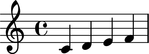

Instrument marks
================

Instrument marks appear as markup in the left margin of your score.

Creating instrument marks
-------------------------

Use context tools to create instrument marks:

::

	abjad> instrument_mark = contexttools.InstrumentMark('Violin ', 'Vn. ')

::

	abjad> instrument_mark
	InstrumentMark('Violin ', 'Vn. ')

Attaching instrument marks
--------------------------

Use ``attach_mark()`` to attach any mark to a component:

::

	abjad> staff = Staff("c'4 d'4 e'4 f'4")

::

	abjad> instrument_mark.attach_mark(staff)

::

	abjad> show(staff)

.. image:: images/instrument-marks-1.png

Getting the instrument mark attached to a component
---------------------------------------------------

Use context tools to get the instrument mark attached to a component:

::

	abjad> contexttools.get_instrument_mark_attached_to_component(staff)
	InstrumentMark('Violin ', 'Vn. ')(Staff{4})

Getting the instrument in effect for a component
------------------------------------------------

Or to get the instrument currently in effect for a component:

::

	abjad> contexttools.get_effective_instrument(staff[1])
	InstrumentMark('Violin ', 'Vn. ')(Staff{4})

Detaching instrument marks by hand
----------------------------------

Detach instrument marks by hand:

::

	abjad> instrument_mark.detach_mark( )

::

	abjad> instrument_mark
	InstrumentMark('Violin ', 'Vn. ')

::

	abjad> show(staff)
	abjad> iotools.write_expr_to_ly(staff, 'instrument-marks-2')

Detaching instrument marks automatically
----------------------------------------

Or use context tools to detach instrument marks all at once:

::

	abjad> instrument_mark = contexttools.InstrumentMark('Violin ', 'Vn. ')
	abjad> instrument_mark.attach_mark(staff)

::

	abjad> instrument_mark
	InstrumentMark('Violin ', 'Vn. ')(Staff{4})

::

	abjad> show(staff)
	abjad> iotools.write_expr_to_ly(staff, 'instrument-marks-3')

.. image:: images/instrument-marks-3.png

::

	abjad> contexttools.detach_instrument_mark_attached_to_component(staff)

::

	abjad> instrument_mark
	InstrumentMark('Violin ', 'Vn. ')

::

	abjad> show(staff)
	abjad> iotools.write_expr_to_ly(staff, 'instrument-marks-4')

Inspecting attachment
---------------------

Use ``start_component`` to inspect attachment:

::

	abjad> instrument_mark = contexttools.InstrumentMark('Flute ', 'Fl. ')
	abjad> instrument_mark.attach_mark(staff)

::

	abjad> show(staff)
	abjad> iotools.write_expr_to_ly(staff, 'instrument-marks-5')

::

	abjad> instrument_mark.start_component
	Staff{4}

Inspecting instrument name
--------------------------

Use ``instrument_name`` to get the instrument name of any instrument mark:

::

	abjad> instrument_mark.instrument_name
	Markup('Flute ')

Inspecting short instrument name
--------------------------------

And use ``short_instrument_name`` to get the short instrument name of any instrument mark:

::

	abjad> instrument_mark.short_instrument_name
	Markup('Fl. ')

