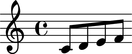

Making many notes
=================

Use the scale macro to create many notes at once:

::

	abjad> macros.scale(4)
	[Note("c'8"), Note("d'8"), Note("e'8"), Note("f'8")]

Show these notes in a staff:

::

	abjad> staff = Staff(macros.scale(4))
	abjad> show(staff)

