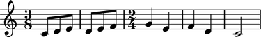

Working with measures
=====================

Measures
--------

Create a measure with a meter and music:

::

	abjad> measure = Measure((3, 8), macros.scale(3))

::

	abjad> f(measure)
	{
		\time 3/8
		c'8
		d'8
		e'8
	}

::

	abjad> show(measure)

