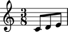
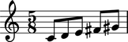
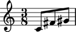

Working with measures
=====================

Measures
--------

Create a measure with a meter and music:

::

	abjad> measure = Measure((3, 8), macros.scale(3))

::

	abjad> f(measure)
	{
		\time 3/8
		c'8
		d'8
		e'8
	}

::

	abjad> show(measure)

Dynamic measures
----------------

Use a dynamic measure if you want a measure that grows and shinks 
as you add and remove music:

::

	abjad> measure = measuretools.DynamicMeasure(macros.scale(4))

::

	abjad> f(measure)
	{
		\time 1/2
		c'8
		d'8
		e'8
		f'8
	}

::

	abjad> show(measure)

::

	abjad> measure.pop(-1)

::

	abjad> f(measure)
	{
		\time 3/8
		c'8
		d'8
		e'8
	}

::

	abjad> show(measure)

.. image:: images/example-3.png

Anonymous measures
------------------

Use an anonymous measure is you want a measure that grows and shrinks
as you add music and that also hides its time signature:

::

	abjad> measure = measuretools.AnonymousMeasure(macros.scale(4))

::

	abjad> f(measure)
	{
		\override Staff.TimeSignature #'stencil = ##f
		\time 1/2
		c'8
		d'8
		e'8
		f'8
		\revert Staff.TimeSignature #'stencil
	}

::

	abjad> show(measure)

::

	abjad> measure.pop(-1)

::

	abjad> f(measure)
	{
		\override Staff.TimeSignature #'stencil = ##f
		\time 3/8
		c'8
		d'8
		e'8
		\revert Staff.TimeSignature #'stencil
	}

::

	abjad> show(measure)

