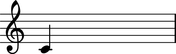
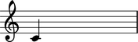
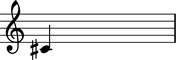
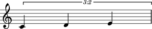

Working with notes
==================

Creating notes
--------------

Create notes with a string:

::

	abjad> note = Note("c'4")

::

	abjad> show(note)

(You can also use ``Note(0, Fraction(1, 4))`` to create notes with numbers.)

Getting pitch
-------------

You can get the pitch of notes:

::

	abjad> note.pitch
	NamedChromaticPitch("c'")

Changing pitch
--------------

And you can change the pitch of notes:

::

	abjad> note.pitch = "cs'"

(You can use ``note.pitch = 1`` to change pitch with numbers, too.)

Duration attributes
-------------------

Get the written duration of notes like this:

::

	abjad> note.duration.written
	Fraction(1, 4)

Which is usually the same as preprolated duration:

::

	abjad> note.duration.preprolated
	Fraction(1, 4)

And prolated duration:

::

	abjad> note.duration.prolated
	Fraction(1, 4)

Except for notes inside a tuplet:

::

	abjad> tuplet = Tuplet((2, 3), [Note("c'4"), Note("d'4"), Note("e'4")])

::

	abjad> show(tuplet)

::

	abjad> note = tuplet[0]

Tupletted notes carry written duration:

::

	abjad> note.duration.written
	Fraction(1, 4)

Prolation:

::

	abjad> note.duration.prolation
	Fraction(2, 3)

And prolated duration that is the product of the two:

::

	abjad> note.duration.prolated
	Fraction(1, 6)

Changing duration
-----------------

You can change the written duration of notes:

::

	abjad> tuplet[0].duration.written = Fraction(1, 8)
	abjad> tuplet[1].duration.written = Fraction(1, 8)
	abjad> tuplet[2].duration.written = Fraction(1, 8)

::

	abjad> show(tuplet)

Other duration attributes are read-only.
