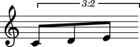

Working with notes
==================

Making notes from a string
--------------------------

You can make notes from string:

::

	abjad> note = Note("c'4")

::

	abjad> show(note)

.. image:: images/example-1.png

Making notes from chromatic pitch number and duration
-----------------------------------------------------

You can also make notes from chromatic pitch number and duration:

::

	abjad> note = Note(0, Duration(1, 4))

::

	abjad> show(note)

.. image:: images/example-2.png

(You even use ``Note(0, (1, 4))`` to create notes with numbers alone.)

Getting the written pitch of notes
----------------------------------

You can get the written pitch of notes:

::

	abjad> note.pitch
	NamedChromaticPitch("c'")

Changing the written pitch of notes
-----------------------------------

And you can change the written pitch of notes:

::

	abjad> note.pitch = "cs'"

.. image:: images/example-3.png

(You can use ``note.pitch = 1`` to change pitch with numbers, too.)

Getting the duration attributes of notes
----------------------------------------

Get the written duration of notes like this:

::

	abjad> note.duration.written
	Duration(1, 4)

Which is usually the same as preprolated duration:

::

	abjad> note.duration.preprolated
	Duration(1, 4)

And prolated duration:

::

	abjad> note.duration.prolated
	Duration(1, 4)

Except for notes inside a tuplet:

::

	abjad> tuplet = Tuplet((2, 3), [Note("c'4"), Note("d'4"), Note("e'4")])

::

	abjad> show(tuplet)

.. image:: images/example-4.png

::

	abjad> note = tuplet[0]

Tupletted notes carry written duration:

::

	abjad> note.duration.written
	Duration(1, 4)

Prolation:

::

	abjad> note.duration.prolation
	Fraction(2, 3)

And prolated duration that is the product of the two:

::

	abjad> note.duration.prolated
	Duration(1, 6)

Changing the written duration of notes
--------------------------------------

You can change the written duration of notes:

::

	abjad> tuplet[0].duration.written = Duration(1, 8)
	abjad> tuplet[1].duration.written = Duration(1, 8)
	abjad> tuplet[2].duration.written = Duration(1, 8)

::

	abjad> show(tuplet)

Other duration attributes are read-only.
