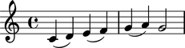
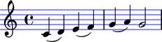
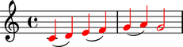

Overriding containers
=====================

You can override LilyPond grobs to change Abjad containers their contents.

Examining defaults
------------------

The symbols below are black with fixed thickness and predetermined spacing:

::

	abjad> staff = Staff("c'4 d'4 e'4 f'4 g'4 a'4 g'2")
	abjad> slur_1 = spannertools.SlurSpanner(staff[:2])
	abjad> slur_2 = spannertools.SlurSpanner(staff[2:4])
	abjad> slur_3 = spannertools.SlurSpanner(staff[4:6])

::

	abjad> f(staff)
	\new Staff {
		c'4 (
		d'4 )
		e'4 (
		f'4 )
		g'4 (
		a'4 )
		g'2
	}

::

	abjad> show(staff)

Overriding containers
---------------------

You can override LilyPond grobs to change the look of Abjad containers:

::

	abjad> staff.override.staff_symbol.color = 'blue'

::

	abjad> f(staff)
	\new Staff \with {
		\override StaffSymbol #'color = #blue
	} {
		c'4 (
		d'4 )
		e'4 (
		f'4 )
		g'4 (
		a'4 )
		g'2
	}

::

	abjad> show(staff)

Overriding containers' contents
-------------------------------

You can override LilyPond grobs to change the look of containers' contents, too:

::

	abjad> staff.override.note_head.color = 'red'
	abjad> staff.override.stem.color = 'red'

::

	abjad> f(staff)
	\new Staff \with {
		\override NoteHead #'color = #red
		\override StaffSymbol #'color = #blue
		\override Stem #'color = #red
	} {
		c'4 (
		d'4 )
		e'4 (
		f'4 )
		g'4 (
		a'4 )
		g'2
	}

::

	abjad> show(staff)

Deleting overrides
------------------

Delete grob overrides you no longer want:

::

	abjad> del(staff.override.staff_symbol)

::

	abjad> f(staff)
	\new Staff \with {
		\override NoteHead #'color = #red
		\override Stem #'color = #red
	} {
		c'4 (
		d'4 )
		e'4 (
		f'4 )
		g'4 (
		a'4 )
		g'2
	}

::

	abjad> show(staff)

