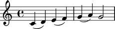
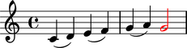
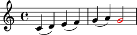

Overriding leaves
=================

You can override LilyPond grobs to change notes, rests and chords.

Examining defaults
------------------

The symbols below are black with fixed thickness and predetermined spacing:

::

	abjad> staff = Staff("c'4 d'4 e'4 f'4 g'4 a'4 g'2")
	abjad> slur_1 = spannertools.SlurSpanner(staff[:2])
	abjad> slur_2 = spannertools.SlurSpanner(staff[2:4])
	abjad> slur_3 = spannertools.SlurSpanner(staff[4:6])

::

	abjad> f(staff)
	\new Staff {
		c'4 (
		d'4 )
		e'4 (
		f'4 )
		g'4 (
		a'4 )
		g'2
	}

::

	abjad> show(staff)

Overriding leaves
-----------------

You can override LilyPond grobs to change the look of notes, rests and chords:

::

	abjad> staff[-1].override.note_head.color = 'red'
	abjad> staff[-1].override.stem.color = 'red'

::

	abjad> f(staff)
	\new Staff {
		c'4 (
		d'4 )
		e'4 (
		f'4 )
		g'4 (
		a'4 )
		\once \override NoteHead #'color = #red
		\once \override Stem #'color = #red
		g'2
	}

::

	abjad> show(staff)

Deleting overrides
------------------

Delete grob overrides you no longer want:

::

	abjad> del(staff[-1].override.stem)

::

	abjad> f(staff)
	\new Staff {
		c'4 (
		d'4 )
		e'4 (
		f'4 )
		g'4 (
		a'4 )
		\once \override NoteHead #'color = #red
		g'2
	}

::

	abjad> show(staff)

