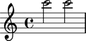
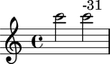

Setting pitch deviation
=======================

Use deviation to model the fact that two pitches differ by a fraction of a semitone:

::

	abjad> note_1 = Note(24, (1, 2))
	abjad> note_2 = Note(24, (1, 2))
	abjad> staff = Staff([note_1, note_2])

::

	abjad> show(staff)

::

	abjad> note_2.pitch = pitchtools.NamedChromaticPitch(24, deviation = -31)

The pitch of the the first note is greater than the pitch of the second:

::

	abjad> note_1.pitch > note_2.pitch
	True

Use markup to include indications of pitch deviation in your score:

::

	abjad> markuptools.Markup(note_2.pitch.deviation, 'up')(note_2)

