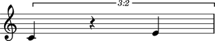

Rests
=====

Making rests from strings
-------------------------

You can make rests from a string:

::

	abjad> rest = Rest('r8')

::

	abjad> show(rest)

Making rests from durations
---------------------------

You can also make rests from a duration:

::

	abjad> rest = Rest(Duration(1, 4))

::

	abjad> show(rest)

(You can even use ``Rest((1, 8))`` to make rests from a duration pair.)

Getting the duration attributes of rests
----------------------------------------

Get the written duration of rests like this:

::

	abjad> rest.duration.written
	Duration(1, 4)

Which is usually the same as preprolated duration:

::

	abjad> rest.duration.preprolated
	Duration(1, 4)

And prolated duration:

::

	abjad> rest.duration.prolated
	Duration(1, 4)

Except for rests inside a tuplet:

::

	abjad> tuplet = Tuplet((2, 3), [Note("c'4"), Rest('r4'), Note("e'4")])

::

	abjad> show(tuplet)

::

	abjad> rest = tuplet[1]

Tupletted rests carry written duration:

::

	abjad> rest.duration.written
	Duration(1, 4)

Prolation:

::

	abjad> rest.duration.prolation
	Fraction(2, 3)

And prolated duration that is the product of the two:

::

	abjad> rest.duration.prolated
	Duration(1, 6)

Changing the written duration of rests
--------------------------------------

You can change the written duration of notes and rests:

::

	abjad> tuplet[0].duration.written = Duration(1, 8)
	abjad> tuplet[1].duration.written = Duration(1, 8)
	abjad> tuplet[2].duration.written = Duration(1, 8)

::

	abjad> show(tuplet)

Other duration attributes are read-only.
