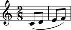

Score Snippet Gallery
=====================

Abjad uses a collection of score snippets in many places throughout the 
docs, tests and other parts of the codebase. Some of these are collected here.

Score snippet 1
---------------

This score features two measures with a beam spanner applied to each measure
and a slur spanner applied to all the notes in the score:

::

   >>> staff = Staff(r"abj: | 2/8 c'8 d'8 || 2/8 e'8 f'8 |")
   >>> beamtools.apply_beam_spanners_to_measures_in_expr(staff)
   [BeamSpanner(|2/8(2)|), BeamSpanner(|2/8(2)|)]
   >>> spannertools.SlurSpanner(staff.leaves)
   SlurSpanner(c'8, d'8, e'8, f'8)

::

   >>> f(staff)
   \new Staff {
       {
           \time 2/8
           c'8 [ (
           d'8 ]
       }
       {
           e'8 [
           f'8 ] )
       }
   }

::

   >>> show(staff)

Score snippet 1 is used widely in the component split tests.
