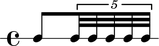

Ferneyhough: *Unsichtbare Farben*
=================================

Mikhïal Malt analyzes the rhythmic materials of Ferneyhough's `Unsichtbare Farben` in
`The OM Composer's Book 2`.

Malt explains that Ferneyhough used OpenMusic to create an "exhaustive catalogue
of rhythmic cells" such that:

    1. They are subdivided into two pulses, with proportions from ``1/1`` to ``1/11``.

    2. The second pulse is subdivided successively by ``1``, ``2``, ``3``, ``4``, ``5`` and ``6``.

Let's recreate Malt's results in Abjad.

The proportions
---------------

First we define proportions:

::

   >>> proportions = [(1, n) for n in range(1, 11 + 1)]

::

   >>> proportions
   [(1, 1), (1, 2), (1, 3), (1, 4), (1, 5), (1, 6), (1, 7), (1, 8), (1, 9), (1, 10), (1, 11)]

The transforms
--------------

Then we define a helper function:

::

   def divide_tuplet(tuplet, n):
       last_tie_chain = tietools.get_tie_chain(tuplet[-1])
       proportions = n * [1]
       tietools.tie_chain_to_tuplet_with_proportions(last_tie_chain, proportions)

The rhythms
-----------

We set the duration of each tuplet equal to a quarter note:

::

   >>> duration = Fraction(1, 4)

And then we make the rhythms:

::

   >>> music = []
   >>> for proportion in proportions:
   ...     tuplets = []
   ...     for n in range(1, 6 + 1):
   ...         tuplet = tuplettools.make_tuplet_from_duration_and_proportions(duration, proportion)
   ...         divide_tuplet(tuplet, n)
   ...         tuplets.append(tuplet)
   ...     music.extend(tuplets)
   ... 

The score
---------

We make the score:

::

   >>> staff = stafftools.RhythmicStaff(music)
   >>> time_signature = contexttools.TimeSignatureMark((1, 4))(staff)
   >>> score = Score([staff])

And then configure it:

::

   >>> score.set.proportional_notation_duration = schemetools.SchemeMoment(1, 56)
   >>> score.set.tuplet_full_length = True
   >>> score.override.bar_line.stencil = False
   >>> score.override.bar_number.transparent = True
   >>> score.override.spacing_spanner.uniform_stretching = True
   >>> score.override.spacing_spanner.strict_note_spacing = True
   >>> score.override.time_signature.stencil = False
   >>> score.override.tuplet_bracket.padding = 2
   >>> score.override.tuplet_bracket.staff_padding = 4
   >>> score.override.tuplet_number.text = schemetools.Scheme('tuplet-number::calc-fraction-text')

The LilyPond file
-----------------

Finally we insert the score into a LilyPond file:

::

   >>> lilypond_file = lilypondfiletools.make_basic_lilypond_file(score)

And then configure it:

::

   >>> lilypond_file.default_paper_size = '11x17', 'portrait'
   >>> lilypond_file.global_staff_size = 12
   >>> lilypond_file.layout_block.indent = 0
   >>> lilypond_file.layout_block.ragged_right = True
   >>> lilypond_file.paper_block.ragged_bottom = True
   >>> lilypond_file.paper_block.system_system_spacing = layouttools.make_spacing_vector(0, 0, 8, 0)

Which looks like this:

::

   >>> show(lilypond_file)

