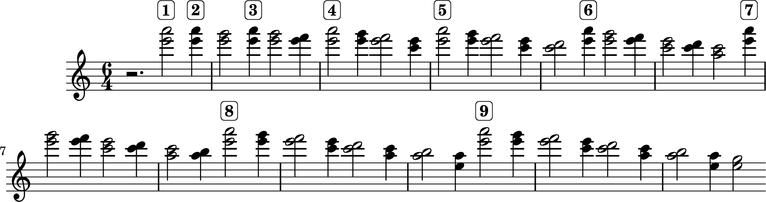
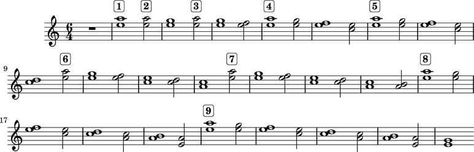
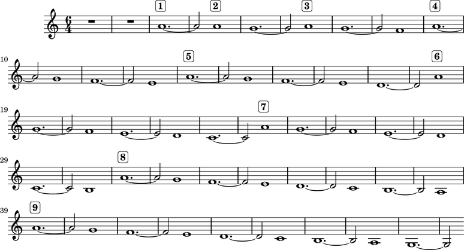
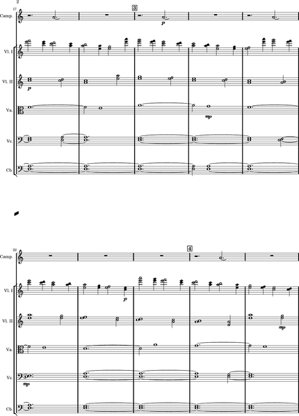

Pärt: *Cantus in Memory of Benjamin Britten*
============================================

.. note:: Explore the `abjad/demos/part/` directory for the complete code to this example,
    or import it into your Python session directly with:

    * `from abjad.demos import part`

Let's make some imports:

::

   >>> import copy
   >>> from abjad import *

::

   def make_part_lilypond_file():
   
       score_template = PartCantusScoreTemplate()
       score = score_template()
   
       add_bell_music_to_score(score)
       add_string_music_to_score(score)
   
       apply_bowing_marks(score)
       apply_dynamic_marks(score)
       apply_expressive_marks(score)
       apply_page_breaks(score)
       apply_rehearsal_marks(score)
       apply_final_bar_lines(score)
   
       configure_score(score)
       lilypond_file = lilypondfiletools.make_basic_lilypond_file(score)
       configure_lilypond_file(lilypond_file)
   
       return lilypond_file

The score template
------------------

::

   class PartCantusScoreTemplate(scoretemplatetools.ScoreTemplate):
   
       ### INITIALIZER ###
   
       def __init__(self):
           pass
   
       ### SPECIAL METHODS ###
   
       def __call__(self):
   
           # make bell voice and staff
           bell_voice = voicetools.Voice(name='Bell Voice')
           bell_staff = stafftools.Staff([bell_voice], name='Bell Staff')
           contexttools.ClefMark('treble')(bell_staff)
           contexttools.InstrumentMark('Campana in La', 'Camp.')(bell_staff)
           contexttools.TempoMark((1, 4), (112, 120))(bell_staff)
           contexttools.TimeSignatureMark((6, 4))(bell_staff)
   
           # make first violin voice and staff
           first_violin_voice = voicetools.Voice(name='First Violin Voice')
           first_violin_staff = stafftools.Staff([first_violin_voice], name='First Violin Staff')
           contexttools.ClefMark('treble')(first_violin_staff)
           instrumenttools.Violin(
               instrument_name_markup='Violin I',
               short_instrument_name_markup='Vl. I'
               )(first_violin_staff)
   
           # make second violin voice and staff
           second_violin_voice = voicetools.Voice(name='Second Violin Voice')
           second_violin_staff = stafftools.Staff([second_violin_voice], name='Second Violin Staff')
           contexttools.ClefMark('treble')(second_violin_staff)
           instrumenttools.Violin(
               instrument_name_markup='Violin II',
               short_instrument_name_markup='Vl. II'
               )(second_violin_staff)
   
           # make viola voice and staff
           viola_voice = voicetools.Voice(name='Viola Voice')
           viola_staff = stafftools.Staff([viola_voice], name='Viola Staff')
           contexttools.ClefMark('alto')(viola_staff)
           instrumenttools.Viola()(viola_staff)
   
           # make cello voice and staff
           cello_voice = voicetools.Voice(name='Cello Voice')
           cello_staff = stafftools.Staff([cello_voice], name='Cello Staff')
           contexttools.ClefMark('bass')(cello_staff)
           instrumenttools.Cello(
               short_instrument_name_markup='Vc.'
               )(cello_staff)
   
           # make bass voice and staff
           bass_voice = voicetools.Voice(name='Bass Voice')
           bass_staff = stafftools.Staff([bass_voice], name='Bass Staff')
           contexttools.ClefMark('bass')(bass_staff)
           instrumenttools.Contrabass(
               short_instrument_name_markup='Cb.'
               )(bass_staff)
   
           # make strings staff group
           strings_staff_group = scoretools.StaffGroup([
               first_violin_staff,
               second_violin_staff,
               viola_staff,
               cello_staff,
               bass_staff,
               ],
               name='Strings Staff Group',
               )
   
           # make score
           score = scoretools.Score([
               bell_staff,
               strings_staff_group,
               ],
               name='Pärt Cantus Score'
               )
   
           # return Pärt Cantus score
           return score

The bell music
--------------

::

   def add_bell_music_to_score(score):
   
       bell_voice = score['Bell Voice']
   
       def make_bell_phrase():
           phrase = []
           for _ in range(3):
               phrase.append(measuretools.Measure((6, 4), r"r2. a'2. \laissezVibrer"))
               phrase.append(measuretools.Measure((6, 4), 'R1.'))
           for _ in range(2):
               phrase.append(measuretools.Measure((6, 4), 'R1.'))
           return phrase
   
       for _ in range(11):
           bell_voice.extend(make_bell_phrase())
   
       for _ in range(19):
           bell_voice.append(measuretools.Measure((6, 4), 'R1.'))
   
       bell_voice.append(measuretools.Measure((6,4), r"a'1. \laissezVibrer"))

The string music
----------------

Creating the music for the strings is a bit more involved, but conceptually falls into two steps.
First, we'll procedurally generate basic pitches and rhythms for all string voices.  Then, we'll
make edits to the generated material by hand.  The entire process is encapsulated in the following
function:

::

   def add_string_music_to_score(score):
   
       # generate some pitch and rhythm information
       pitch_contour_reservoir = create_pitch_contour_reservoir()
       shadowed_contour_reservoir = shadow_pitch_contour_reservoir(
           pitch_contour_reservoir)
       durated_reservoir = durate_pitch_contour_reservoir(
           shadowed_contour_reservoir)
   
       # add six dotted-whole notes and the durated contours to each string voice
       for instrument_name, descents in durated_reservoir.iteritems():
           instrument_voice = score['%s Voice' % instrument_name]
           instrument_voice.extend("R1. R1. R1. R1. R1. R1.")
           for descent in descents:
               instrument_voice.extend(descent)
   
       # apply instrument-specific edits
       edit_first_violin_voice(score, durated_reservoir)
       edit_second_violin_voice(score, durated_reservoir)
       edit_viola_voice(score, durated_reservoir)
       edit_cello_voice(score, durated_reservoir)
       edit_bass_voice(score, durated_reservoir)
   
       # chop all string parts into 6/4 measures
       for voice in iterationtools.iterate_voices_in_expr(score['Strings Staff Group']):
           for shard in componenttools.split_components_at_offsets(voice[:],
               [(6, 4)], cyclic=True):
               measuretools.Measure((6, 4), shard)

The pitch material is the same for all of the strings: a descending a-minor scale, generally
decorated with diads.  But, each instrument uses a different overall range, with the lower
instrument playing slower and slower than the higher instruments, creating a sort of mensuration
canon.

For each instrument, the descending scale is fragmented into what we'll call "descents".
The first descent uses only the first note of that instrument's scale, while the second descent
adds the second note, and the third another.  We'll generate as many descents per instruments
as there are pitches in its overall scale:

::

   def create_pitch_contour_reservoir():
   
       scale = tonalitytools.Scale('a', 'minor')
       pitch_ranges = {
           'First Violin': pitchtools.PitchRange(("c'", "a'''")),
           'Second Violin': pitchtools.PitchRange(('a', "a''")),
           'Viola': pitchtools.PitchRange(('e', "a'")),
           'Cello': pitchtools.PitchRange(('a,', 'a')),
           'Bass': pitchtools.PitchRange(('c', 'a')),
       }
   
       reservoir = {}
       for instrument_name, pitch_range in pitch_ranges.iteritems():
           pitch_set = scale.create_named_chromatic_pitch_set_in_pitch_range(pitch_range)
           pitches = sorted(pitch_set.named_chromatic_pitches, reverse=True)
           pitch_descents = []
           for i in xrange(len(pitches)):
               descent = tuple(pitches[:i + 1])
               pitch_descents.append(descent)
           reservoir[instrument_name] = tuple(pitch_descents)
   
       return reservoir

Here's what the first 10 descents for the first violin look like:

::

   >>> reservoir = create_pitch_contour_reservoir()
   >>> for i in range(10):
   ...     descent = reservoir['First Violin'][i]
   ...     print ' '.join(str(x) for x in descent)
   ... 
   a'''
   a''' g'''
   a''' g''' f'''
   a''' g''' f''' e'''
   a''' g''' f''' e''' d'''
   a''' g''' f''' e''' d''' c'''
   a''' g''' f''' e''' d''' c''' b''
   a''' g''' f''' e''' d''' c''' b'' a''
   a''' g''' f''' e''' d''' c''' b'' a'' g''
   a''' g''' f''' e''' d''' c''' b'' a'' g'' f''

Next we add diads to all of the descents, except for the viola's.  We'll use a dictionary
as a lookup table, to tell us what interval to add below a given pitch class:

::

   def shadow_pitch_contour_reservoir(pitch_contour_reservoir):
   
       shadow_pitch_lookup = {
           pitchtools.NamedDiatonicPitchClass('a'): -5, # add a P4 below
           pitchtools.NamedDiatonicPitchClass('g'): -3, # add a m3 below
           pitchtools.NamedDiatonicPitchClass('f'): -1, # add a m2 below
           pitchtools.NamedDiatonicPitchClass('e'): -4, # add a M3 below
           pitchtools.NamedDiatonicPitchClass('d'): -2, # add a M2 below
           pitchtools.NamedDiatonicPitchClass('c'): -3, # add a m3 below
           pitchtools.NamedDiatonicPitchClass('b'): -2, # add a M2 below
       }
   
       shadowed_reservoir = {}
   
       for instrument_name, pitch_contours in pitch_contour_reservoir.iteritems():
           # The viola does not receive any diads
           if instrument_name == 'Viola':
               shadowed_reservoir['Viola'] = pitch_contours
               continue
   
           shadowed_pitch_contours = []
   
           for pitch_contour in pitch_contours[:-1]:
               shadowed_pitch_contour = []
               for pitch in pitch_contour:
                   pitch_class = pitch.named_diatonic_pitch_class
                   shadow_pitch = pitch + shadow_pitch_lookup[pitch_class]
                   diad = (shadow_pitch, pitch)
                   shadowed_pitch_contour.append(diad)
               shadowed_pitch_contours.append(tuple(shadowed_pitch_contour))
   
           # treat the final contour differently: the last note does not become a diad
           final_shadowed_pitch_contour = []
           for pitch in pitch_contours[-1][:-1]:
               pitch_class = pitch.named_diatonic_pitch_class
               shadow_pitch = pitch + shadow_pitch_lookup[pitch_class]
               diad = (shadow_pitch, pitch)
               final_shadowed_pitch_contour.append(diad)
           final_shadowed_pitch_contour.append(pitch_contours[-1][-1])
           shadowed_pitch_contours.append(tuple(final_shadowed_pitch_contour))
   
           shadowed_reservoir[instrument_name] = tuple(shadowed_pitch_contours)
   
       return shadowed_reservoir

Finally, we'll add rhythms to the pitch contours we've been constructing.  Each
string instrument plays twice as slow as the string instrument above it in the
score.  Additionally, all the strings start with some rests, and use a "long-short"
pattern for their rhythms:

::

   def durate_pitch_contour_reservoir(pitch_contour_reservoir):
   
       instrument_names = [
           'First Violin',
           'Second Violin',
           'Viola',
           'Cello',
           'Bass',
           ]
   
       durated_reservoir = {}
   
       for i, instrument_name in enumerate(instrument_names):
           long_duration = Duration(1, 2) * pow(2, i)
           short_duration = long_duration / 2
           rest_duration = long_duration * Multiplier(3, 2)
   
           div = rest_duration // Duration(3, 2)
           mod = rest_duration % Duration(3, 2)
   
           initial_rest = resttools.MultiMeasureRest((3, 2)) * div
           if mod:
               initial_rest += resttools.make_rests(mod)
   
           durated_contours = [tuple(initial_rest)]
   
           pitch_contours = pitch_contour_reservoir[instrument_name]
           durations = [long_duration, short_duration]
           counter = 0
           for pitch_contour in pitch_contours:
               contour = []
               for pitch in pitch_contour:
                   contour.extend(leaftools.make_leaves([pitch], [durations[counter]]))
                   counter = (counter + 1) % 2
               durated_contours.append(tuple(contour))
   
           durated_reservoir[instrument_name] = tuple(durated_contours)
   
       return durated_reservoir

Let's see what a few of those look like.  First, we'll build the entire
reservoir from scratch, so you can see the process:

::

   >>> pitch_contour_reservoir = create_pitch_contour_reservoir()
   >>> shadowed_contour_reservoir = shadow_pitch_contour_reservoir(pitch_contour_reservoir)
   >>> durated_reservoir = durate_pitch_contour_reservoir(shadowed_contour_reservoir)

Then we'll grab the sub-reservoir for the first violins, taking the first ten
descents (which includes the silences we've been adding as well).  We'll label
each descent with some markup, to distinguish them, throw them into a
Staff and give them a 6/4 time signature, just so they line up properly.

::

   >>> descents = durated_reservoir['First Violin'][:10]
   >>> for i, descent in enumerate(descents[1:], 1):
   ...     markup = markuptools.Markup(r'\rounded-box \bold {}'.format(i), Up)(descent[0])
   ... 
   >>> staff = Staff(sequencetools.flatten_sequence(descents))
   >>> time_signature = contexttools.TimeSignatureMark((6, 4))(staff)
   >>> show(staff)

Let's look at the second violins too:

::

   >>> descents = durated_reservoir['Second Violin'][:10]
   >>> for i, descent in enumerate(descents[1:], 1):
   ...     markup = markuptools.Markup(r'\rounded-box \bold {}'.format(i), Up)(descent[0])
   ... 
   >>> staff = Staff(sequencetools.flatten_sequence(descents))
   >>> time_signature = contexttools.TimeSignatureMark((6, 4))(staff)
   >>> show(staff)

And, last we'll take a peek at the violas.  They have some longer notes,
so we'll split their music cyclically every 3 half notes, just so nothing
crosses the bar lines accidentally:

::

   >>> descents = durated_reservoir['Viola'][:10]
   >>> for i, descent in enumerate(descents[1:], 1):
   ...     markup = markuptools.Markup(r'\rounded-box \bold {}'.format(i), Up)(descent[0])
   ... 
   >>> staff = Staff(sequencetools.flatten_sequence(descents))
   >>> shards = componenttools.split_components_at_offsets(staff[:], [(3, 2)], cyclic=True)
   >>> time_signature = contexttools.TimeSignatureMark((6, 4))(staff)
   >>> show(staff)

You can see how each part is twice as slow as the previous, and starts a
little bit later too.

The edits
---------

::

   def edit_first_violin_voice(score, durated_reservoir):
   
       voice = score['First Violin Voice']
       descents = durated_reservoir['First Violin']
   
       copied_descent = componenttools.copy_components_and_remove_spanners(descents[-1])
       voice.extend(copied_descent)
   
       final_sustain_rhythm = [(6, 4)] * 43 + [(1, 2)]
       final_sustain_notes = notetools.make_notes(["c'"], final_sustain_rhythm)
       voice.extend(final_sustain_notes)
       tietools.TieSpanner(final_sustain_notes)
       voice.extend('r4 r2.')

::

   def edit_second_violin_voice(score, durated_reservoir):
   
       voice = score['Second Violin Voice']
       descents = durated_reservoir['Second Violin']
   
       copied_descent = list(componenttools.copy_components_and_remove_spanners(descents[-1]))
       copied_descent[-1].written_duration = durationtools.Duration(1, 1)
       copied_descent.append(notetools.Note('a2'))
       for leaf in copied_descent:
           marktools.Articulation('accent')(leaf)
           marktools.Articulation('tenuto')(leaf)
       voice.extend(copied_descent)
   
       final_sustain = []
       for _ in range(32):
           final_sustain.append(notetools.Note('a1.'))
       final_sustain.append(notetools.Note('a2'))
       marktools.Articulation('accent')(final_sustain[0])
       marktools.Articulation('tenuto')(final_sustain[0])
   
       voice.extend(final_sustain)
       tietools.TieSpanner(final_sustain)
       voice.extend('r4 r2.')

::

   def edit_viola_voice(score, durated_reservoir):
   
       voice = score['Viola Voice']
       descents = durated_reservoir['Viola']
   
       for leaf in descents[-1]:
           marktools.Articulation('accent')(leaf)
           marktools.Articulation('tenuto')(leaf)
       copied_descent = componenttools.copy_components_and_remove_spanners(descents[-1])
       for leaf in copied_descent:
           if leaf.written_duration == durationtools.Duration(4, 4):
               leaf.written_duration = durationtools.Duration(8, 4)
           else:
               leaf.written_duration = durationtools.Duration(4, 4)
       voice.extend(copied_descent)
   
       bridge = notetools.Note('e1')
       marktools.Articulation('tenuto')(bridge)
       marktools.Articulation('accent')(bridge)
       voice.append(bridge)
   
       final_sustain_rhythm = [(6, 4)] * 21 + [(1, 2)]
       final_sustain_notes = notetools.make_notes(['e'], final_sustain_rhythm)
       marktools.Articulation('accent')(final_sustain_notes[0])
       marktools.Articulation('tenuto')(final_sustain_notes[0])
       voice.extend(final_sustain_notes)
       tietools.TieSpanner(final_sustain_notes)
       voice.extend('r4 r2.')

::

   def edit_cello_voice(score, durated_reservoir):
   
       voice = score['Cello Voice']
       descents = durated_reservoir['Cello']
   
       tie_chain = tietools.get_tie_chain(voice[-1])
       for leaf in tie_chain.leaves:
           parent = leaf.parent
           index = parent.index(leaf)
           parent[index] = chordtools.Chord(['e,', 'a,'], leaf.written_duration)
   
       unison_descent = componenttools.copy_components_and_remove_spanners(voice[-len(descents[-1]):])
       voice.extend(unison_descent)
       for chord in unison_descent:
           index = chord.parent.index(chord)
           parent[index] = notetools.Note(chord.written_pitches[1], chord.written_duration)
           marktools.Articulation('accent')(parent[index])
           marktools.Articulation('tenuto')(parent[index])
   
       voice.extend('a,1. ~ a,2 b,1 ~ b,1. ~ b,1. a,1. ~ a,1. ~ a,1. ~ a,1. ~ a,1. ~ a,2 r4 r2.')

::

   def edit_bass_voice(score, durated_reservoir):
   
       voice = score['Bass Voice']
   
       voice[-3:] = '<e, e>\maxima <d, d>\longa <c, c>\maxima <b,>\longa <a,>\maxima r4 r2.'

The marks
---------

Now we'll apply various kinds of marks, including dynamics, articulations,
bowing indications, expressive instructures, page breaks and rehearsal marks.

We'll start with the bowing marks.  This involves creating a piece of custom
markup to indicate rebowing.  We accomplish this by aggregating together
some `markuptools.MarkupCommand` and `markuptools.MusicGlyph` objects.  The
completed `markuptools.Markup` object is then copied and attached at the correct
locations in the score.

Why copy it?  A `Mark` can only be attached to a single
`Component`.  If we attached the original piece of markup to each of our target
components in turn, only the last would actually receive the markup, as it would
have be detached from the preceding components.

Let's take a look:

::

   def apply_bowing_marks(score):
   
       # apply alternating upbow and downbow for first two sounding bars
       # of the first violin
       for measure in score['First Violin Voice'][6:8]:
           for i, chord in enumerate(iterationtools.iterate_chords_in_expr(measure)):
               if i % 2 == 0:
                   marktools.Articulation('downbow')(chord)
               else:
                   marktools.Articulation('upbow')(chord)
   
       # create and apply rebowing markup
       rebow_markup = markuptools.Markup(
           markuptools.MarkupCommand(
               'concat', [
                   markuptools.MusicGlyph('scripts.downbow'),
                   markuptools.MarkupCommand('hspace', 1),
                   markuptools.MusicGlyph('scripts.upbow'),
               ]))
       copy.copy(rebow_markup)(score['First Violin Voice'][64][0])
       copy.copy(rebow_markup)(score['Second Violin Voice'][75][0])
       copy.copy(rebow_markup)(score['Viola Voice'][86][0])

After dealing with custom markup, applying dynamics is easy.  Just instantiate and attach:

::

   def apply_dynamic_marks(score):
   
       voice = score['Bell Voice']
       contexttools.DynamicMark('ppp')(voice[0][1])
       contexttools.DynamicMark('pp')(voice[8][1])
       contexttools.DynamicMark('p')(voice[18][1])
       contexttools.DynamicMark('mp')(voice[26][1])
       contexttools.DynamicMark('mf')(voice[34][1])
       contexttools.DynamicMark('f')(voice[42][1])
       contexttools.DynamicMark('ff')(voice[52][1])
       contexttools.DynamicMark('fff')(voice[60][1])
       contexttools.DynamicMark('ff')(voice[68][1])
       contexttools.DynamicMark('f')(voice[76][1])
       contexttools.DynamicMark('mf')(voice[84][1])
       contexttools.DynamicMark('pp')(voice[-1][0])
   
       voice = score['First Violin Voice']
       contexttools.DynamicMark('ppp')(voice[6][1])
       contexttools.DynamicMark('pp')(voice[15][0])
       contexttools.DynamicMark('p')(voice[22][3])
       contexttools.DynamicMark('mp')(voice[31][0])
       contexttools.DynamicMark('mf')(voice[38][3])
       contexttools.DynamicMark('f')(voice[47][0])
       contexttools.DynamicMark('ff')(voice[55][2])
       contexttools.DynamicMark('fff')(voice[62][2])
   
       voice = score['Second Violin Voice']
       contexttools.DynamicMark('pp')(voice[7][0])
       contexttools.DynamicMark('p')(voice[12][0])
       contexttools.DynamicMark('p')(voice[16][0])
       contexttools.DynamicMark('mp')(voice[25][1])
       contexttools.DynamicMark('mf')(voice[34][1])
       contexttools.DynamicMark('f')(voice[44][1])
       contexttools.DynamicMark('ff')(voice[54][0])
       contexttools.DynamicMark('fff')(voice[62][1])
   
       voice = score['Viola Voice']
       contexttools.DynamicMark('p')(voice[8][0])
       contexttools.DynamicMark('mp')(voice[19][1])
       contexttools.DynamicMark('mf')(voice[30][0])
       contexttools.DynamicMark('f')(voice[36][0])
       contexttools.DynamicMark('f')(voice[42][0])
       contexttools.DynamicMark('ff')(voice[52][0])
       contexttools.DynamicMark('fff')(voice[62][0])
   
       voice = score['Cello Voice']
       contexttools.DynamicMark('p')(voice[10][0])
       contexttools.DynamicMark('mp')(voice[21][0])
       contexttools.DynamicMark('mf')(voice[31][0])
       contexttools.DynamicMark('f')(voice[43][0])
       contexttools.DynamicMark('ff')(voice[52][1])
       contexttools.DynamicMark('fff')(voice[62][0])
   
       voice = score['Bass Voice']
       contexttools.DynamicMark('mp')(voice[14][0])
       contexttools.DynamicMark('mf')(voice[27][0])
       contexttools.DynamicMark('f')(voice[39][0])
       contexttools.DynamicMark('ff')(voice[51][0])
       contexttools.DynamicMark('fff')(voice[62][0])

We apply expressive marks the same way we applied our dynamics:

::

   def apply_expressive_marks(score):
   
       voice = score['First Violin Voice']
       markuptools.Markup(r'\left-column { div. \line { con sord. } }', Up)(voice[6][1])
       markuptools.Markup('sim.', Up)(voice[8][0])
       markuptools.Markup('uniti', Up)(voice[58][3])
       markuptools.Markup('div.', Up)(voice[59][0])
       markuptools.Markup('uniti', Up)(voice[63][3])
   
       voice = score['Second Violin Voice']
       markuptools.Markup('div.', Up)(voice[7][0])
       markuptools.Markup('uniti', Up)(voice[66][1])
       markuptools.Markup('div.', Up)(voice[67][0])
       markuptools.Markup('uniti', Up)(voice[74][0])
   
       voice = score['Viola Voice']
       markuptools.Markup('sole', Up)(voice[8][0])
   
       voice = score['Cello Voice']
       markuptools.Markup('div.', Up)(voice[10][0])
       markuptools.Markup('uniti', Up)(voice[74][0])
       markuptools.Markup('uniti', Up)(voice[84][1])
       markuptools.Markup(r'\italic { espr. }', Down)(voice[86][0])
       markuptools.Markup(r'\italic { molto espr. }', Down)(voice[88][1])
   
       voice = score['Bass Voice']
       markuptools.Markup('div.', Up)(voice[14][0])
       markuptools.Markup(r'\italic { espr. }', Down)(voice[86][0])
       componenttools.split_components_at_offsets(voice[88][:], [Duration(1, 1), Duration(1, 2)])
       markuptools.Markup(r'\italic { molto espr. }', Down)(voice[88][1])
       markuptools.Markup('uniti', Up)(voice[99][1])
   
       for voice in iterationtools.iterate_voices_in_expr(score['Strings Staff Group']):
           markuptools.Markup(r'\italic { (non dim.) }', Down)(voice[102][0])

We use the `marktools.LilyPondCommandClass` to create LilyPond system breaks,
and attach them to measures in the percussion part.  After this, our score will
break in the exact same places as the original:

::

   def apply_page_breaks(score):
   
       bell_voice = score['Bell Voice']
   
       measure_indices = [5, 10, 15, 20, 25, 30, 35, 40, 45, 50, 55, 60, 65, 72,
           79, 86, 93, 100]
   
       for measure_index in measure_indices:
           marktools.LilyPondCommandMark(
               'break',
               'after'
               )(bell_voice[measure_index])

We'll make the rehearsal marks the exact same way we made our line
breaks:

::

   def apply_rehearsal_marks(score):
   
       bell_voice = score['Bell Voice']
   
       measure_indices = [6, 12, 18, 24, 30, 36, 42, 48, 54, 60, 66, 72, 78, 84,
           90, 96, 102]
   
       for measure_index in measure_indices:
           marktools.LilyPondCommandMark(
               r'mark \default',
               'before'
               )(bell_voice[measure_index])

And then we add our final bar lines.  `marktools.BarLine` objects inherit from
`marktools.Mark`, so you can probably guess by now how we add them to the
score... instantiate and attach:

::

   def apply_final_bar_lines(score):
   
       for voice in iterationtools.iterate_voices_in_expr(score):
           marktools.BarLine('|.')(voice[-1])

The LilyPond file
-----------------

Finally, we create some functions to apply formatting directives to our `Score`
object, then wrap it into a `LilyPondFile` and apply some more formatting.

In our `configure_score()` functions, we use `layouttools.make_spacing_vector()`
to create the correct Scheme construct to tell LilyPond how to handle vertical
space for its staves and staff groups. You should consult LilyPond's vertical
spacing documentation for a complete explanation of what this Scheme code means:

::

   >>> spacing_vector = layouttools.make_spacing_vector(0, 0, 8, 0)
   >>> f(spacing_vector)
   #'((basic-distance . 0) (minimum-distance . 0) (padding . 8) (stretchability . 0))

::

   def configure_score(score):
   
       spacing_vector = layouttools.make_spacing_vector(0, 0, 8, 0)
       score.override.vertical_axis_group.staff_staff_spacing = spacing_vector
       score.override.staff_grouper.staff_staff_spacing = spacing_vector
       score.override.staff_symbol.thickness = 0.5
       score.set.mark_formatter = schemetools.Scheme('format-mark-box-numbers')

In our `configure_lilypond_file()` function, we need to construct a ContextBlock
definition in order to tell LilyPond to hide empty staves, and additionally to
hide empty staves if they appear in the first system:

::

   def configure_lilypond_file(lilypond_file):
   
       lilypond_file.global_staff_size = 8
   
       context_block = lilypondfiletools.ContextBlock()
       context_block.context_name = r'Staff \RemoveEmptyStaves'
       context_block.override.vertical_axis_group.remove_first = True
       lilypond_file.layout_block.context_blocks.append(context_block)
   
       lilypond_file.paper_block.system_separator_markup = marktools.LilyPondCommandMark('slashSeparator')
       lilypond_file.paper_block.bottom_margin = lilypondfiletools.LilyPondDimension(0.5, 'in')
       lilypond_file.paper_block.top_margin =    lilypondfiletools.LilyPondDimension(0.5, 'in')
       lilypond_file.paper_block.left_margin =   lilypondfiletools.LilyPondDimension(0.75, 'in')
       lilypond_file.paper_block.right_margin =  lilypondfiletools.LilyPondDimension(0.5, 'in')
       lilypond_file.paper_block.paper_width =   lilypondfiletools.LilyPondDimension(5.25, 'in')
       lilypond_file.paper_block.paper_height =  lilypondfiletools.LilyPondDimension(7.25, 'in')
   
       lilypond_file.header_block.composer = markuptools.Markup('Arvo Pärt')
       lilypond_file.header_block.title = markuptools.Markup('Cantus in Memory of Benjamin Britten (1980)')

Let's run our original toplevel function to build the complete score:

::

   >>> lilypond_file = make_part_lilypond_file()

And here we show it:

::

   >>> show(lilypond_file) 

.. note:

   We only show the first two pages as the *Cantus* is still under copyright.

