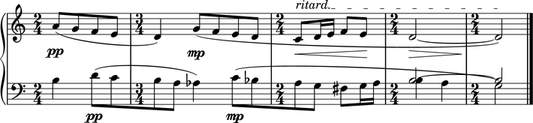

.. Abjad documentation master file, created by
    sphinx-quickstart on Tue Apr 14 22:09:19 2009.
    You can adapt this file completely to your liking, 
    but it should at least contain the root `toctree` directive.

Welcome to Abjad (|release|)
=============================

Abjad helps composers build up complex pieces of music notation
in an iterative and incremental way. 
Use Abjad to create a symbolic representation of all the notes, 
rests, staves, tuplets, beams and slurs in any score.
Because Abjad extends the Python programming language,
you can use Abjad to make systematic changes to your music as you work.
And because Abjad wraps the powerful LilyPond music notation package,
you can use Abjad to control the typographic details of the symbols on the page.

Start here
----------

.. toctree::
    :maxdepth: 1

    start_here/abjad/index
    start_here/installation/index
    start_here/versions/index

Examples
--------

.. toctree::
    :numbered:

    examples/bartok/index
    examples/ferneyhough/index
    examples/ligeti/index
    examples/mozart/index

System Overview
---------------

.. toctree::
    :numbered:

    system_overview/lcs/index
    system_overview/parsing/index

Tutorials
---------

.. toctree::
    :numbered:

    tutorials/getting_started/index
    tutorials/lilypond_hello_world/index
    tutorials/python_hello_world_at_the_interpreter/index
    tutorials/python_hello_world_in_a_file/index
    tutorials/more_about_python/index
    tutorials/abjad_hello_world_at_the_interpreter/index
    tutorials/abjad_hello_world_in_a_file/index
    tutorials/more_about_abjad/index
    tutorials/changing_notes_to_rests/index
    tutorials/creating_rest_delimited_slurs/index
    tutorials/making_grob_overrides/index
    tutorials/understanding_lilypond_grobs/index
    tutorials/understanding_time_signature_marks/index
    tutorials/working_with_component_parentage/index
    tutorials/working_with_threads/index

Reference manual
----------------

.. toctree::
    :numbered:

    reference_manual/annotations/index
    reference_manual/articulations/index
    reference_manual/chords/index
    reference_manual/containers/index
    reference_manual/durations/index
    reference_manual/instrument_marks/index
    reference_manual/io/index
    reference_manual/lilypond_command_marks/index
    reference_manual/lilypond_comments/index
    reference_manual/lilypond_files/index
    reference_manual/measures/index
    reference_manual/notes/index
    reference_manual/named_chromatic_pitch/index
    reference_manual/python_basics/index
    reference_manual/rests/index
    reference_manual/scores/index
    reference_manual/spanners/index
    reference_manual/staves/index
    reference_manual/tuplets/index
    reference_manual/voices/index

Developer documentation
-----------------------

.. toctree::
    :numbered:

    developer_documentation/codebase/index
    developer_documentation/documentation/index
    developer_documentation/tests/index
    developer_documentation/scripts/index
    developer_documentation/abjad_book/index
    developer_documentation/timing/index
    developer_documentation/profiling/index
    developer_documentation/memory/index
    developer_documentation/class_attributes/index
    developer_documentation/slots/index
    developer_documentation/coding_standards/index

Appendices
----------

.. toctree::
    :numbered:
    :maxdepth: 1

    appendices/history/index
    appendices/text_alignment/index
    appendices/score_snippet_gallery/index
    appendices/change_log/index
    appendices/bibliography/index

Abjad API
---------

.. toctree::
    :maxdepth: 1

    api/index
