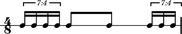

Why LilyPond is right for Abjad
===============================

Early versions of Abjad wrote MIDI files for input to Finale and Sibelius.
Later versions of Abjad wrote ``.pbx`` files for input into Leland Smith's
SCORE. Over time we found LilyPond superior to Finale, Sibelius and SCORE.

Nested tuplets works out of the box
-----------------------------------

LilyPond uses a single construct to nest tuplets arbitrarily:

::

    \new stafftools.RhythmicStaff {
        \time 7/8
        \times 7/8 {
            c8.
            \times 7/5 { c16 c16 c16 c16 c16 }
            \times 3/5 { c8 c8 c8 c8 c8 }
        }
    }

::

   >>> staff = stafftools.RhythmicStaff([Measure((7, 8), [])])
   >>> measure = staff[0]
   >>> measure.append(Note('c8.'))
   >>> measure.append(Tuplet(Fraction(7, 5), 5 * Note('c16')))
   >>> spannertools.BeamSpanner(measure[-1])
   BeamSpanner({c16, c16, c16, c16, c16})
   >>> measure.append(Tuplet(Fraction(3, 5), 5 * Note('c8')))
   >>> spannertools.BeamSpanner(measure[-1])
   BeamSpanner({c8, c8, c8, c8, c8})
   >>> Tuplet(Fraction(7, 8), measure.music)
   Traceback (most recent call last):
     File "<stdin>", line 1, in <module>
   AttributeError: 'Measure' object has no attribute 'music'
   >>> staff.override.tuplet_bracket.bracket_visibility = True
   >>> staff.override.tuplet_bracket.padding = 1.6

::

   >>> show(staff, docs=True)

::

   Traceback (most recent call last):
     File "<stdin>", line 1, in <module>
     File "/Users/trevorbaca/Documents/abjad/trunk/abjad/tools/iotools/write_expr_to_ly.py", line 36, in write_expr_to_ly
       output = lilypond_file.lilypond_format
     File "/Users/trevorbaca/Documents/abjad/trunk/abjad/tools/lilypondfiletools/LilyPondFile/LilyPondFile.py", line 278, in lilypond_format
       return '\n\n'.join(self._format_pieces)
     File "/Users/trevorbaca/Documents/abjad/trunk/abjad/tools/lilypondfiletools/LilyPondFile/LilyPondFile.py", line 115, in _format_pieces
       result.extend(self._formatted_blocks)
     File "/Users/trevorbaca/Documents/abjad/trunk/abjad/tools/lilypondfiletools/LilyPondFile/LilyPondFile.py", line 123, in _formatted_blocks
       lilypond_format = x.lilypond_format
     File "/Users/trevorbaca/Documents/abjad/trunk/abjad/tools/lilypondfiletools/NonattributedBlock/NonattributedBlock.py", line 61, in lilypond_format
       return '\n'.join(self._format_pieces)
     File "/Users/trevorbaca/Documents/abjad/trunk/abjad/tools/lilypondfiletools/ScoreBlock/ScoreBlock.py", line 71, in _format_pieces
       ['\t' + piece for piece in x._format_pieces])
     File "/Users/trevorbaca/Documents/abjad/trunk/abjad/tools/contexttools/Context/Context.py", line 84, in _format_pieces
       return self._format_component(pieces=True)
     File "/Users/trevorbaca/Documents/abjad/trunk/abjad/tools/componenttools/Component/Component.py", line 190, in _format_component
       result.extend(self._format_contents_slot(format_contributions))
     File "/Users/trevorbaca/Documents/abjad/trunk/abjad/tools/containertools/Container/Container.py", line 263, in _format_contents_slot
       [('contents', '_contents'), self._format_content_pieces()])
     File "/Users/trevorbaca/Documents/abjad/trunk/abjad/tools/containertools/Container/Container.py", line 256, in _format_content_pieces
       result.extend(m.lilypond_format.split('\n'))
     File "/Users/trevorbaca/Documents/abjad/trunk/abjad/tools/measuretools/Measure/Measure.py", line 517, in lilypond_format
       self._check_duration()
     File "/Users/trevorbaca/Documents/abjad/trunk/abjad/tools/measuretools/Measure/Measure.py", line 194, in _check_duration
       raise OverfullContainerError
   abjad.tools.exceptiontools.OverfullContainerError.OverfullContainerError

LilyPond's tuplet input syntax works the same as any other recursive construct.

Broken tuplets work out of the box
----------------------------------

LilyPond engraves tupletted notes interrupted by nontupletted notes correctly:

::

    \new Staff {
        \times 4/7 { c'16 c'16 c'16 c'16 }
        c'8 c'8
        \times 4/7 { c'16 c'16 c'16 }
    }

::

   >>> t = Tuplet(Fraction(4, 7), Note(0, (1, 16)) * 4)
   >>> notes = Note(0, (1, 8)) * 2
   >>> u = Tuplet(Fraction(4, 7), Note(0, (1, 16)) * 3)
   >>> spannertools.BeamSpanner(t)
   BeamSpanner({c'16, c'16, c'16, c'16})
   >>> spannertools.BeamSpanner(notes)
   BeamSpanner(c'8, c'8)
   >>> spannertools.BeamSpanner(u)
   BeamSpanner({c'16, c'16, c'16})
   >>> measure = Measure((4, 8), [t] + notes + [u])
   >>> staff = stafftools.RhythmicStaff([measure])

::

   >>> show(staff, docs=True)

Non-power-of-two meters work out of the box
-------------------------------------------

The rhythm above rewrites with time signatures in place of tuplets:

::

    \new Staff {
        \time 4/28 c'16 c'16 c'16 c'16 |
        \time 2/8  c'8  c'8 |
        \time 3/28 c'16 c'16 c'16 |
    }

::

   >>> t = Measure((4, 28), Note(0, (1, 16)) * 4)
   >>> u = Measure((2, 8), Note(0, (1, 8)) * 2)
   >>> v = Measure((3, 28), Note(0, (1, 16)) * 3)
   >>> spannertools.BeamSpanner(t)
   BeamSpanner(|4/28(4)|)
   >>> spannertools.BeamSpanner(u)
   BeamSpanner(|2/8(2)|)
   >>> spannertools.BeamSpanner(v)
   BeamSpanner(|3/28(3)|)
   >>> staff = stafftools.RhythmicStaff([t, u, v])

::

   >>> show(staff)

The time signatures ``4/28`` and ``3/28`` here have a denominator not equal to
``4``, ``8``, ``16`` or any other nonnegative integer power of two. Abjad calls
such time signatures **nonbinary meters** and LilyPond engraves them correctly.

Lilypond models the musical measure correctly
---------------------------------------------

Most engraving packages make the concept of the measure out to be more
important than it should. We see evidence of this wherever an engraving package
makes it difficult for either a long note or the notes of a tuplet to cross a
barline. These difficulties come from working the idea of measure-as-container
deep into object model of the package.

There is a competing way to model the musical measure that we might call the
measure-as-background way of thinking about things. Western notation pratice
started absent any concept of the barline, introduced the idea gradually, and
has since retreated from the necessity of the convention.  Engraving packages
that pick out an understanding of the barline from the 18th or 19th centuries
subscribe to the measure-as-container view of things and oversimplify the
problem. One result of this is to render certain barline-crossing rhythmic
figures either an inelegant hack or an outright impossibility. LilyPond eschews
the measure-as-container model in favor of the measure-as-background model
better able to handle both earlier and later notation practice.
