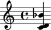
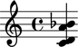
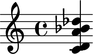
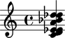
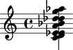
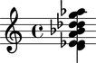
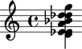
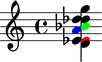
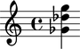

Chords
======

Making chords from a LilyPond input string
------------------------------------------

You can make chords from a LilyPond input string:

::

   >>> chord = Chord("<c' d' bf'>4")
   >>> show(chord)

Making chords from numbers
--------------------------

You can also make chords from pitch numbers and duration:

::

   >>> chord = Chord([0, 2, 10], Duration(1, 4))
   >>> show(chord)

Getting all the written pitches of a chord at once
--------------------------------------------------

You can get all the written pitches of a chord at one time:

::

   >>> chord.written_pitches
   (NamedPitch("c'"), NamedPitch("d'"), NamedPitch("bf'"))

Abjad returns a read-only tuple of named pitches.

Getting the written pitches of a chord one at a time
----------------------------------------------------

You can get the written pitches of a chord one at a time:

::

   >>> chord.written_pitches[0]
   NamedPitch("c'")

Chords index the pitch they contain starting from ``0``, just like tuples and
lists.

Adding one pitch to a chord at a time
-------------------------------------

Use ``append()`` to add one pitch to a chord.

You can add a pitch to a chord with a pitch number:

::

   >>> chord.append(9)
   >>> show(chord)

Or you can add a pitch to a chord with a pitch name:

::

   >>> chord.append("df''")
   >>> show(chord)

Chords sort their pitches every time you add a new one.

This means you can add pitches to your chord in any order.

Adding many pitches to a chord at once
--------------------------------------

Use ``extend()`` to add many pitches to a chord.

You can use pitch numbers:

::

   >>> chord.extend([3, 4, 14])
   >>> show(chord)

Or you can use pitch names:

::

   >>> chord.extend(["g''", "af''"])
   >>> show(chord)

Deleting pitches from a chord
-----------------------------

Delete pitches from a chord with ``del()``:

::

   >>> del(chord[0])
   >>> show(chord)

Negative indices work too:

::

   >>> del(chord[-1])
   >>> show(chord)

Formatting chords
-----------------

Get the LilyPond input format of any Abjad object with ``lilypond_format``:

::

   >>> chord.lilypond_format
   "<d' ef' e' a' bf' df'' d'' g''>4"

Use ``f()`` as a short-cut to print the LilyPond input format 
of any Abjad object:

::

   >>> f(chord)
   <d' ef' e' a' bf' df'' d'' g''>4

Working with note heads
-----------------------

Most of the time you will work with the pitches of a chord.
But you can get the note heads of a chord, too:

::

   >>> chord.note_heads
   (NoteHead("d'"), NoteHead("ef'"), NoteHead("e'"), NoteHead("a'"), NoteHead("bf'"), NoteHead("df''"), NoteHead("d''"), NoteHead("g''"))

This is useful when you want to apply LilyPond overrides to note 
heads in a chord one at a time:

::

   >>> chord[2].tweak.color = 'red'
   >>> chord[3].tweak.color = 'blue'
   >>> chord[4].tweak.color = 'green'
   >>> show(chord)

Working with empty chords
-------------------------

Abjad allows empty chords:

::

   >>> chord = Chord([], Duration(1, 4))

Abjad formats empty chords, too:

::

   >>> f(chord)
   <>4

But if you pass empty chords to ``show()`` LilyPond will complain
because empty chords don't constitute valid LilyPond input.

When you are done working with an empty chord you can add pitches back
into it chord in any of the ways described above:

::

   >>> chord.extend(["gf'", "df''", "g''"])
   >>> show(chord)

