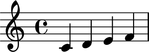
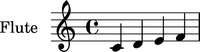

Instruments
===========

Initializing instruments
------------------------

Use ``instrumenttools`` to initialize instruments:

::

   >>> violin = instrumenttools.Violin()

::

   >>> violin
   Violin()

Attaching instruments to a component
------------------------------------

Use ``attach()`` to attach instruments to a component:

::

   >>> staff = Staff("c'4 d'4 e'4 f'4")
   >>> violin.attach(staff)
   Violin()(Staff{4})

::

   >>> show(staff)

Getting the instrument attached to a component
----------------------------------------------

Use the inspector to get the instrument attached to a component:

::

   >>> inspect(staff).get_mark(instrumenttools.Instrument)
   Violin()(Staff{4})

Getting the instrument in effect for a component
------------------------------------------------

Or to get the instrument currently in effect for a component:

::

   >>> inspect(staff[1]).get_effective_context_mark(instrumenttools.Instrument)
   Violin()(Staff{4})

Detaching instruments from a component
--------------------------------------

Use ``detach()`` to detach an instrument from a component:

::

   >>> violin.detach()
   Violin()

::

   >>> violin
   Violin()

::

   >>> show(staff)

Inspecting the component to which an instrument is attached
-----------------------------------------------------------

Use ``start_component`` to inspect the component to which an instrument is
attached:

::

   >>> flute = instrumenttools.Flute()
   >>> flute.attach(staff)
   Flute()(Staff{4})

::

   >>> show(staff)

::

   >>> flute.start_component
   Staff{4}

Inspecting the instrument name of an instrument
-----------------------------------------------

Use ``instrument_name`` to get the name of any instrument:

::

   >>> flute.instrument_name
   'flute'

And use ``instrument_name_markup`` to get the instrument name markup of
any instrument:

::

   >>> flute.instrument_name_markup
   Markup(('Flute',))

Inspecting the short instrument name of an instrument
-----------------------------------------------------

Use ``short_instrument_name`` to get the short instrument name of any
instrument:

::

   >>> flute.short_instrument_name
   'fl.'

And use ``short_instrument_name_markup`` to get the short instrument name
markup of any instrument:

::

   >>> flute.short_instrument_name_markup
   Markup(('Fl.',))

