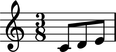
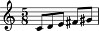
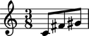
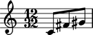
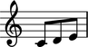
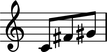

Measures
========

Understanding measures in LilyPond
----------------------------------

In LilyPond you specify time signatures by hand and LilyPond creates measures automatically:

::

    \new Staff {
        \time 3/8
        c'8
        d'8
        e'8
        d'8
        e'8
        f'8
        \time 2/4
        g'4
        e'4
        f'4
        d'4
        c'2
    }

.. image:: images/index-1.png

Here LilyPond creates five measures from two time signatures.
This happens because behind-the-scenes LilyPond time-keeping tells the program
when measures start and stop and how to draw the barlines that come between them.

Understanding measures in Abjad
-------------------------------

Measures are optional in Abjad, too, and you may omit them in favor of time signatures:

::

   >>> staff = Staff("c'8 d'8 e'8 d'8 e'8 f'8 g'4 e'4 f'4 d'4 c'2")

::

   >>> contexttools.TimeSignatureMark((3, 8))(staff)
   TimeSignatureMark((3, 8))(Staff{11})
   >>> contexttools.TimeSignatureMark((2, 4))(staff[6])
   TimeSignatureMark((2, 4))(g'4)

::

   >>> show(staff)

.. image:: images/index-2.png

But you may also include explicit measures in the Abjad scores you build.
The following sections explain how.

Creating measures
-----------------

Create a measure with a time signature and music:

::

   >>> measure = Measure((3, 8), "c'8 d'8 e'8")

::

   >>> f(measure)
   {
       \time 3/8
       c'8
       d'8
       e'8
   }

::

   >>> show(measure)

.. image:: images/index-3.png

Working with dynamic measures
-----------------------------

Dynamic measures adjust their time signatures on the fly as you add
and remove music.

Create dynamic measures without a time signature:

::

   >>> measure = measuretools.DynamicMeasure("c'8 d'8 e'8")

::

   >>> show(measure)

Adding music to dynamic measures
--------------------------------

Add music to dynamic measures the same as to all containers:

::

   >>> measure.extend([Note("fs'8"), Note("gs'8")])

::

   >>> show(measure)

Removing music from dynamic measures
------------------------------------

Remove music from dynamic measures the same as with other containers:

::

   >>> del(measure[1:3])

::

   >>> show(measure)

InputSetExpression the denominator of dynamic measures
-------------------------------------------

You can set the denominator of dynamic measures to any integer power of ``2``:

::

   >>> measure.denominator = 32

::

   >>> show(measure)

Suppressing the time signature of dynamic measures
--------------------------------------------------

You can temporarily suppress the time signature of dynamic measures:

::

   >>> measure.suppress_time_signature = True

::

   >>> f(measure)
   {
       c'8
       fs'8
       gs'8
   }

LilyPond will engrave the last active time signature.

Working with anonymous measures
-------------------------------

Anonymous determine their time signatures on the fly and then hide them at format time.

Create anonymous measures without a time signature:

::

   >>> measure = measuretools.AnonymousMeasure("c'8 d'8 e'8")

::

   >>> show(measure)

Adding music to anonymous measures
----------------------------------

Add music to anonymous measures the same as to other containers:

::

   >>> measure.extend([Note("fs'8"), Note("gs'8")])

::

   >>> show(measure)

.. image:: images/index-9.png

Removing music from anonymous measures
--------------------------------------

Remove music from anonymous measure the same as from other containers:

::

   >>> del(measure[1:3])

::

   >>> show(measure)

