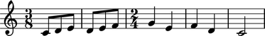
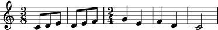
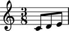

Measures
========

Understanding measures in LilyPond
----------------------------------

In LilyPond you specify time signatures by hand and LilyPond creates measures automatically:

::

    \new Staff {
        \time 3/8
        c'8
        d'8
        e'8
        d'8
        e'8
        f'8
        \time 2/4
        g'4
        e'4
        f'4
        d'4
        c'2
    }

Here LilyPond creates five measures from two time signatures.
This happens because behind-the-scenes LilyPond time-keeping tells the program
when measures start and stop and how to draw the barlines that come between them.

Understanding measures in Abjad
-------------------------------

Measures are optional in Abjad, too, and you may omit them in favor of time signatures:

::

   >>> staff = Staff("c'8 d'8 e'8 d'8 e'8 f'8 g'4 e'4 f'4 d'4 c'2")

::

   >>> contexttools.TimeSignatureMark((3, 8))(staff)
   TimeSignatureMark((3, 8))(Staff{11})
   >>> contexttools.TimeSignatureMark((2, 4))(staff[6])
   TimeSignatureMark((2, 4))(g'4)

::

   >>> show(staff)

But you may also include explicit measures in the Abjad scores you build.
The following sections explain how.

Creating measures
-----------------

Create a measure with a time signature and music:

::

   >>> measure = Measure((3, 8), "c'8 d'8 e'8")

::

   >>> f(measure)
   {
       \time 3/8
       c'8
       d'8
       e'8
   }

::

   >>> show(measure)

