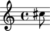
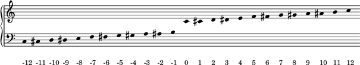
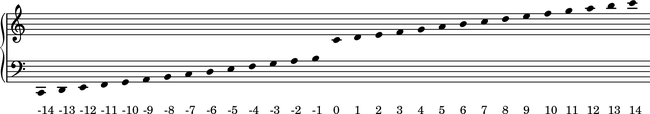
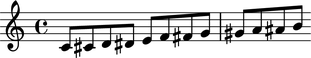
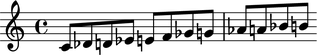

Named pitches
=============

Named pitches are the everyday pitches attached to notes and chords:

::

   >>> note = Note("cs''8")
   >>> show(note)

::

   >>> note.written_pitch
   NamedPitch("cs''")

Creating named pitches
----------------------

Create named pitches like this:

::

   >>> named_pitch = NamedPitch("cs''")

::

   >>> named_pitch
   NamedPitch("cs''")

Inspecting the name of a named pitch
------------------------------------

Use ``str()`` to get the name of named pitches:

::

   >>> str(named_pitch)
   "cs''"

Inspecting the octave of a named pitch
--------------------------------------

Get the octave number of named pitches with ``octave_number``:

::

   >>> named_pitch.octave_number
   5

Sorting named pitches
---------------------

Named pitches sort by octave, diatonic pitch-class and accidental:

::

   >>> pitchtools.NamedPitch('es') < pitchtools.NamedPitch('ff')
   True

Comparing named pitches
-----------------------

You can compare named pitches to each other:

::

   >>> named_pitch_1 = pitchtools.NamedPitch("c''")
   >>> named_pitch_2 = pitchtools.NamedPitch("d''")

::

   >>> named_pitch_1 == named_pitch_2
   False

::

   >>> named_pitch_1 != named_pitch_2
   True

::

   >>> named_pitch_1 > named_pitch_2
   False

::

   >>> named_pitch_1 < named_pitch_2
   True

::

   >>> named_pitch_1 >= named_pitch_2
   False

::

   >>> named_pitch_1 <= named_pitch_2
   True

Converting a named pitch to a numbered pitch
--------------------------------------------

Convert a named pitch to a numbered pitch like this:

::

   >>> named_pitch.numbered_pitch
   NumberedPitch(13)

Or like this:

::

   >>> pitchtools.NumberedPitch(named_pitch)
   NumberedPitch(13)

Converting a named pitch to a named pitch-class
-----------------------------------------------

Convert a named pitch to a named pitch-class like this:

::

   >>> named_pitch.named_pitch_class
   NamedPitchClass('cs')

Or like this:

::

   >>> pitchtools.NamedPitchClass(named_pitch)
   NamedPitchClass('cs')

Converting a named pitch to a numbered pitch-class
--------------------------------------------------

Convert a named pitch to a numbered pitch-class like this:

::

   >>> named_pitch.numbered_pitch_class
   NumberedPitchClass(1)

Or like this:

::

   >>> pitchtools.NumberedPitchClass(named_pitch)
   NumberedPitchClass(1)

Copying named pitches
---------------------

Use ``copy.copy()`` to copy named pitches:

::

   >>> import copy

::

   >>> copy.copy(named_pitch)
   NamedPitch("cs''")

Or use ``copy.deepcopy()`` to do the same thing.

Accidental abbreviations
------------------------

Abjad abbreviates accidentals according to the LilyPond ``english.ly`` module:

    ======================         ============================
    accidental name                  abbreviation
    ======================         ============================
    quarter sharp                  'qs'
    quarter flat                   'qf'
    sharp                          's'
    flat                           'f'
    three-quarters sharp           'tqs'
    three-quarters flat            'tqf'
    double sharp                   'ss'
    double flat                    'ff'
    ======================         ============================

Pitch numbers
-------------

Abjad numbers pitches like this:

::

   >>> score, treble_staff, bass_staff = scoretools.make_empty_piano_score()
   >>> duration = Duration(1, 32)

::

   >>> pitches = range(-12, 12 + 1)
   >>> abjad_configuration.set_default_accidental_spelling('sharps')

::

   >>> for pitch in pitches:
   ...     note = Note(pitch, duration)
   ...     rest = Rest(duration)
   ...     clef = pitchtools.suggest_clef_for_named_pitches([note.written_pitch])
   ...     if clef == contexttools.ClefMark('treble'):
   ...         treble_staff.append(note)
   ...         bass_staff.append(rest)
   ...     else:
   ...         treble_staff.append(rest)
   ...         bass_staff.append(note)
   ...     pitch_number = note.written_pitch.pitch_number
   ...     markup = markuptools.Markup(str(pitch_number), Down)
   ...     markup = markup.attach(bass_staff[-1])
   ... 

::

   >>> score.override.beam.transparent = True
   >>> score.override.time_signature.stencil = False
   >>> score.override.flag.transparent = True
   >>> score.override.rest.transparent = True
   >>> score.override.stem.stencil = False
   >>> score.override.text_script.staff_padding = 6
   >>> score.set.proportional_notation_duration = schemetools.SchemeMoment(1, 56)

::

   >>> lilypond_file = lilypondfiletools.make_basic_lilypond_file(score)
   >>> lilypond_file.global_staff_size = 15
   >>> show(lilypond_file)

Diatonic pitch numbers
----------------------

Abjad numbers diatonic pitches like this:

::

   >>> score, treble_staff, bass_staff = scoretools.make_empty_piano_score()
   >>> duration = Duration(1, 32)

::

   >>> pitches = []
   >>> diatonic_pitches = [0, 2, 4, 5, 7, 9, 11]

::

   >>> pitches.extend([-24 + x for x in diatonic_pitches])
   >>> pitches.extend([-12 + x for x in diatonic_pitches])
   >>> pitches.extend([0 + x for x in diatonic_pitches])
   >>> pitches.extend([12 + x for x in diatonic_pitches])
   >>> pitches.append(24)
   >>> abjad_configuration.set_default_accidental_spelling('sharps')

::

   >>> for pitch in pitches:
   ...     note = Note(pitch, duration)
   ...     rest = Rest(duration)
   ...     clef = pitchtools.suggest_clef_for_named_pitches([note.written_pitch])
   ...     if clef == contexttools.ClefMark('treble'):
   ...         treble_staff.append(note)
   ...         bass_staff.append(rest)
   ...     else:
   ...         treble_staff.append(rest)
   ...         bass_staff.append(note)
   ...     diatonic_pitch_number = note.written_pitch.diatonic_pitch_number
   ...     markup = markuptools.Markup(str(diatonic_pitch_number), Down)
   ...     markup = markup.attach(bass_staff[-1])
   ... 

::

   >>> score.override.beam.transparent = True
   >>> score.override.time_signature.stencil = False
   >>> score.override.flag.transparent = True
   >>> score.override.rest.transparent = True
   >>> score.override.stem.stencil = False
   >>> score.override.text_script.staff_padding = 6
   >>> score.set.proportional_notation_duration = schemetools.SchemeMoment(1, 52)

::

   >>> lilypond_file = lilypondfiletools.make_basic_lilypond_file(score)
   >>> lilypond_file.global_staff_size = 15
   >>> show(lilypond_file)

Octave designation
------------------

Abjad designates octaves with both numbers and ticks:

    ===============        =============
    Octave notation        Tick notation
    ===============        =============
    C7                     c''''
    C6                     c'''
    C5                     c''
    C4                     c'
    C3                     c
    C2                     c,
    C1                     c,,
    ===============        =============

Accidental spelling
-------------------

Abjad chooses between enharmonic spellings at pitch-initialization
according to the following table:

    ============================        ====================================
    Pitch-class number                  Pitch-class name (default)
    ============================        ====================================
    0                                   C
    1                                   C#
    2                                   D
    3                                   Eb
    4                                   E
    5                                   F
    6                                   F#
    7                                   G
    8                                   Gb
    9                                   A
    10                                  Bb
    11                                  B
    ============================        ====================================

::

   >>> staff = Staff([Note(n, (1, 8)) for n in range(12)])
   >>> show(staff)

Use ``mutate()`` to respell with sharps:

::

   >>> mutate(staff).respell_with_sharps()
   >>> show(staff)

Or flats:

::

   >>> mutate(staff).respell_with_flats()
   >>> show(staff)

