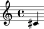
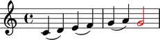
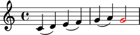

Notes
=====

Making notes from a LilyPond input string
-----------------------------------------

You can make notes from a LilyPond input string:

::

   >>> note = Note("c'4")
   >>> show(note)

Making notes from numbers
-------------------------

You can also make notes from a pitch number and duration:

::

   >>> note = Note(0, Duration(1, 4))
   >>> show(note)

Getting and setting the written pitch of notes
----------------------------------------------

Get the written pitch of notes like this:

::

   >>> note.written_pitch
   NamedPitch("c'")

Set the written pitch of notes like this:

::

   >>> note.written_pitch = NamedPitch("cs'")
   >>> show(note)

Or this:

::

   >>> note.written_pitch = "d'"
   >>> show(note)

Or this:

::

   >>> note.written_pitch = 3
   >>> show(note)

Getting and setting the written duration of notes
-------------------------------------------------

Get the written duration of notes like this:

::

   >>> note.written_duration
   Duration(1, 4)

Set the written duration of notes like this:

::

   >>> note.written_duration = Duration(3, 16)
   >>> show(note)

Overriding notes
----------------

The notes below are black with fixed thickness and predetermined spacing:

::

   >>> staff = Staff("c'4 d'4 e'4 f'4 g'4 a'4 g'2")
   >>> slur_1 = spannertools.SlurSpanner(staff[:2])
   >>> slur_2 = spannertools.SlurSpanner(staff[2:4])
   >>> slur_3 = spannertools.SlurSpanner(staff[4:6])
   >>> show(staff)

You can override LilyPond grobs to change the way notes look:

::

   >>> staff[-1].override.note_head.color = 'red'
   >>> staff[-1].override.stem.color = 'red'
   >>> show(staff)

Removing note overrides
-----------------------

Delete grob overrides you no longer want like this:

::

   >>> del(staff[-1].override.stem)
   >>> show(staff)

