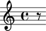
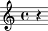
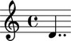
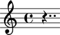
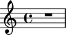
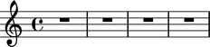
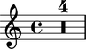
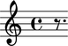

Rests
=====

Making rests from strings
-------------------------

You can make a rest from a LilyPond input string:

::

   >>> rest = Rest('r8')

::

   >>> show(rest)

Making rests from durations
---------------------------

You can also make rests from a duration:

::

   >>> rest = Rest(Duration(1, 4))

::

   >>> show(rest)

(You can even use ``Rest((1, 8))`` to make rests from a duration pair.)

Making rests from other Abjad leaves
------------------------------------

You can make rests from other Abjad leaves:

::

   >>> note = Note("d'4..")

::

   >>> show(note)

::

   >>> rest = Rest(note)

::

   >>> show(rest)

Making multi-measure rests
--------------------------

You can create multi-measure rests too:

::

   >>> multimeasure_rest = resttools.MultimeasureRest('R1')

::

   >>> show(multimeasure_rest)

::

   >>> multimeasure_rest.lilypond_duration_multiplier = 4
   >>> staff = Staff([multimeasure_rest])
   >>> show(staff)

::

   >>> compress_full_bar_rests = marktools.LilyPondCommandMark('compressFullBarRests')
   >>> compress_full_bar_rests.attach(staff)
   LilyPondCommandMark('compressFullBarRests')(Staff{1})
   >>> show(staff)

Changing the written duration of rests
--------------------------------------

You can change the written duration of notes and rests:

::

   >>> tuplet = Tuplet(Fraction(2, 3), [Note("c'4"), Rest('r4'), Note("e'4")])

::

   >>> tuplet[0].written_duration = Duration(1, 8)
   >>> tuplet[1].written_duration = Duration(1, 8)
   >>> tuplet[2].written_duration = Duration(1, 8)

::

   >>> show(tuplet)

