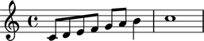
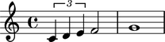
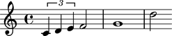
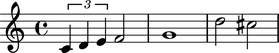
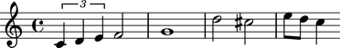
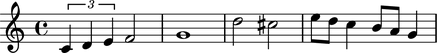
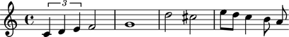
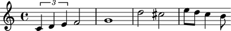
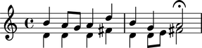

Staves
======

Making a staff from a LilyPond input string
-------------------------------------------

You can make a staff from a LilyPond input string:

::

   >>> staff = Staff("c'8 d'8 e'8 f'8 g'8 a'8 b'4 c''1")

::

   >>> show(staff)

Making a staff from a list of Abjad components
----------------------------------------------

You can also make a staff from a list of other Abjad components:

::

   >>> components = [Tuplet(Fraction(2, 3), "c'4 d'4 e'4"), Note("f'2"), Note("g'1")]

::

   >>> staff = Staff(components)

::

   >>> show(staff)

Understanding the interpreter representation of a staff
-------------------------------------------------------

The interpreter representation of a staff contains three parts:

::

   >>> staff
   Staff{3}

``Staff`` tells you the staff's class.

``3`` tells you the staff's length (which is the number of top-level components
the staff contains).

Curly braces ``{`` and ``}`` tell you that the music inside the staff is
interpreted sequentially rather than simultaneously.

Inspecting the LilyPond format of a staff
-----------------------------------------

Get the LilyPond input format of any Abjad object with ``lilypond_format``:

::

   >>> staff.lilypond_format
   "\\new Staff {\n\t\\times 2/3 {\n\t\tc'4\n\t\td'4\n\t\te'4\n\t}\n\tf'2\n\tg'1\n}"

Use ``f()`` as a short-cut to print the LilyPond format of any Abjad object:

::

   >>> f(staff)
   \new Staff {
       \times 2/3 {
           c'4
           d'4
           e'4
       }
       f'2
       g'1
   }

Selecting the music in a staff
------------------------------

Slice a staff to select its components:

::

   >>> staff[:]
   SliceSelection(Tuplet(2/3, [c'4, d'4, e'4]), Note("f'2"), Note("g'1"))

Abjad returns a selection.

Inspecting a staff's leaves
---------------------------

Get the leaves in a staff with ``select_leaves()``:

::

   >>> staff.select_leaves()
   ContiguousSelection(Note("c'4"), Note("d'4"), Note("e'4"), Note("f'2"), Note("g'1"))

Abjad returns a selection.

Getting the length of a staff
-----------------------------

Get the length of a staff with ``len()``:

::

   >>> len(staff)
   3

The length of a staff is defined equal to the number of top-level components
the staff contains.

Inspecting duration
-------------------

Use the inspector to get the duration of a staff:

::

   >>> inspect(staff).get_duration()
   Duration(2, 1)

Adding one component to the end of a staff
------------------------------------------

Add one component to the end of a staff with ``append()``:

::

   >>> staff.append(Note("d''2"))

::

   >>> show(staff)

You can also use a LilyPond input string:

::

   >>> staff.append("cs''2")

::

   >>> show(staff)

Adding many components to the end of a staff
--------------------------------------------

Add many components to the end of a staff with ``extend()``:

::

   >>> notes = [Note("e''8"), Note("d''8"), Note("c''4")]
   >>> staff.extend(notes)

::

   >>> show(staff)

You can also use a LilyPond input string:

::

   >>> staff.extend("b'8 a'8 g'4")

::

   >>> show(staff)

Finding the index of a component in a staff
-------------------------------------------

Find staff component index with ``index()``:

::

   >>> notes[0]
   Note("e''8")

::

   >>> staff.index(notes[0])
   5

Removing a staff component by index
-----------------------------------

Use ``pop()`` to remove the last component of a staff:

::

   >>> staff[8]
   Note("b'8")

::

   >>> staff.pop()
   Note("g'4")

::

   >>> show(staff)

Removing a staff component by reference
---------------------------------------

Remove staff components by reference with ``remove()``:

::

   >>> staff.remove(staff[-1])

::

   >>> show(staff)

Naming staves
-------------

You can name Abjad staves:

::

   >>> staff.name = 'Example Staff'

Staff names appear in LilyPond input:

::

   >>> f(staff)
   \context Staff = "Example Staff" {
       \times 2/3 {
           c'4
           d'4
           e'4
       }
       f'2
       g'1
       d''2
       cs''2
       e''8
       d''8
       c''4
       b'8
   }

But not in notational output:

::

   >>> show(staff)

Changing the context of a voice
-------------------------------

The context of a staff is set to ``Staff`` by default:

::

   >>> staff.context_name
   'Staff'

But you can change the context of a staff if you want:

::

   >>> staff.context_name = 'CustomUserStaff'

::

   >>> staff.context_name
   'CustomUserStaff'

::

   >>> f(staff)
   \context CustomUserStaff = "Example Staff" {
       \times 2/3 {
           c'4
           d'4
           e'4
       }
       f'2
       g'1
       d''2
       cs''2
       e''8
       d''8
       c''4
       b'8
   }

Change the context of a voice when you have defined a new LilyPond context
based on a LilyPond staff.

Making parallel voices in a staff
---------------------------------

You can make a staff treat its contents as simultaneous with
``is_simultaneous``:

::

   >>> soprano_voice = Voice(r"b'4 a'8 g'8 a'4 d''4 b'4 g'4 a'2 \fermata")
   >>> alto_voice = Voice(r"d'4 d'4 d'4 fs'4 d'4 d'8 e'8 fs'2") 
   >>> soprano_voice.override.stem.direction = Up
   >>> alto_voice.override.stem.direction = Down
   >>> staff = Staff([soprano_voice, alto_voice])
   >>> staff.is_simultaneous = True
   >>> show(staff)

