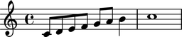
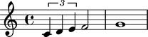
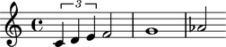
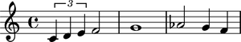
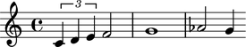

Voices
======

Making a voice from a LilyPond input string
-------------------------------------------

You can make an Abjad voice from a LilyPond input string:

::

	>>> voice = Voice("c'8 d'8 e'8 f'8 g'8 a'8 b'4 c''1")

::

	>>> show(voice)

Making a voice from a list of other Abjad components
----------------------------------------------------

You can also make a voice from a list of other Abjad components:

::

	>>> components = [Tuplet(Fraction(2, 3), "c'4 d'4 e'4"), Note("f'2"), Note("g'1")]

::

	>>> voice = Voice(components)

::

	>>> show(voice)

Understanding the ``repr`` of a voice
-------------------------------------

The ``repr`` of an Abjad voice contains three parts:

::

	>>> voice
	Voice{3}

``Voice`` tells you the voice's class.

``3`` tells you the voice's length (which is the number of
top-level components the voice contains).

Curly braces ``{`` and ``}`` tell you that the music inside the voice is
interpreted sequentially rather than in parallel.

Inspecting the LilyPond format of a voice
-----------------------------------------

Get the LilyPond input format of any Abjad object with ``format``:

::

	>>> voice.format
	"\\new Voice {\n\t\\times 2/3 {\n\t\tc'4\n\t\td'4\n\t\te'4\n\t}\n\tf'2\n\tg'1\n}"

Use ``f()`` as a short-cut to print the LilyPond format of any Abjad object:

::

	>>> f(voice)
	\new Voice {
		\times 2/3 {
			c'4
			d'4
			e'4
		}
		f'2
		g'1
	}

Inspecting the music in a voice
-------------------------------

Get voice components with ``music``:

::

	>>> voice.music
	(Tuplet(2/3, [c'4, d'4, e'4]), Note("f'2"), Note("g'1"))

Abjad returns a read-only tuple of components.

Inspecting a voice's leaves
---------------------------

Get the leaves in a voice with ``leaves``:

::

	>>> voice.leaves
	(Note("c'4"), Note("d'4"), Note("e'4"), Note("f'2"), Note("g'1"))

Abjad returns a read-only tuple of leaves.

Getting the length of a voice
-----------------------------

Get voice length with ``len()``:

::

	>>> len(voice)
	3

The length of a voice is defined equal to the number of
top-level components the voice contains.

Getting the duration attributes of a voice
------------------------------------------

The contents durations of a voice equals the sum of durations of the components in the voice:

::

	>>> voice.contents_duration
	Duration(2, 1)

The preprolated duration of a voice is usually equal to the voice's contents duration:

::

	>>> voice.preprolated_duration
	Duration(2, 1)

The prolated duration of a voice is usually equal to the voice's contents duration, too:

::

	>>> voice.preprolated_duration
	Duration(2, 1)

Only when you nest a very small voice inside a tuplet will the prolated and
preprolated duration of a voice differ.

Voices that are not nested inside a tuplet carry a prolation of ``1``:

::

	>>> voice.prolation
	Fraction(1, 1)

All voice duration attributes are read-only.

Adding one component to the end of a voice
------------------------------------------

Add one component to the end of a voice with ``append``:

::

	>>> voice.append(Note("af'2"))

::

	>>> show(voice)

Adding many components to the end of a voice
--------------------------------------------

Add many components to the end of a voice with ``extend``:

::

	>>> notes = [Note("g'4"), Note("f'4")]
	>>> voice.extend(notes)

::

	>>> show(voice)

Finding the index of a component in a voice
-------------------------------------------

Find the index of a component in a voice with ``index()``:

::

	>>> notes[0]
	Note("g'4")

::

	>>> voice.index(notes[0])
	4

Removing a voice component by index
-----------------------------------

Use ``pop()`` to remove a voice component by index:

::

	>>> voice[5]
	Note("f'4")

::

	>>> voice.pop(5)

::

	>>> show(voice)

Removing a voice component by reference
---------------------------------------

Remove voice components by reference with ``remove()``:

::

	>>> voice.remove(voice[-1])

::

	>>> show(voice)

.. image:: images/voices-6.png

Naming voices
-------------

You can name Abjad voices:

::

	>>> voice.name = 'Upper Voice'

Voice names appear in LilyPond input:

::

	>>> f(voice)
	\context Voice = "Upper Voice" {
		\times 2/3 {
			c'4
			d'4
			e'4
		}
		f'2
		g'1
		af'2
	}

But not in notational output:

::

	>>> show(voice)

.. image:: images/voices-7.png

Changing the context of a voice
-------------------------------

The context of a voice is set to ``'Voice'`` by default:

::

	>>> voice.context
	'Voice'

But you can change the context of a voice if you want:

::

	>>> voice.context = 'SpeciallyDefinedVoice'

::

	>>> voice.context
	'SpeciallyDefinedVoice'

::

	>>> f(voice)
	\context SpeciallyDefinedVoice = "Upper Voice" {
		\times 2/3 {
			c'4
			d'4
			e'4
		}
		f'2
		g'1
		af'2
	}

Change the context of a voice when you have defined
a new LilyPond context based on a LilyPond voice.
