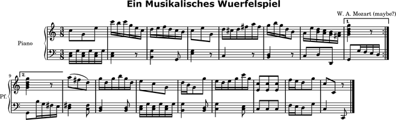

Version history
===============

Abjad 2.10
----------

Released 2012-10-05. Built from r7615.
Implements 437 public classes and 982 functions totalling 179,000 lines of code.

The following packages now load by default when you start Abjad::

    Abjad 2.10
    >>> [x for x in dir() if x.endswith('tools')]
    ['abjadbooktools', 'beamtools', 'chordtools', 'componenttools', 'containertools', 'contexttools', 
    'developerscripttools', 'durationtools', 'formattools', 'gracetools', 'instrumenttools', 
    'introspectiontools', 'iotools', 'iterationtools', 'labeltools', 'layouttools', 'leaftools', 
    'lilypondfiletools', 'marktools', 'markuptools', 'mathtools', 'measuretools', 'notetools', '
    'offsettools', 'pitcharraytools', 'pitchtools', 'resttools', 'rhythmtreetools', 'schemetools', 
    'scoretemplatetools', 'scoretools', 'sequencetools', 'sievetools', 'skiptools', 'spannertools', 
    'stafftools', 'stringtools', 'tempotools', 'tietools', 'timeintervaltools', 'timesignaturetools', 
    'timetokentools', 'tonalitytools', 'tuplettools', 'verticalitytools', 'voicetools']

Improved formatting engine.  Scores now format approximately 30% faster.

Improved LilyPond parser.

Markup objects now parse input string input on initialization::

    >>> markuptools.Markup(r'\bold \tiny { foo bar baz }')
    Markup((MarkupCommand('bold', MarkupCommand('tiny', ['foo', 'bar', 'baz'])),))
  
::

    >>> print _.indented_lilypond_format
    \markup {
        \bold
            \tiny
                {
                    foo
                    bar
                    baz
                }
        }

You can now use context names to reference named contexts attached to any container:: 

    >>> template = scoretemplatetools.StringQuartetScoreTemplate()
    >>> score = template()

::

    >>> score['First Violin Staff']
    Staff-"First Violin Staff"{1}

::

    >>> score['First Violin Voice']
    Voice-"First Violin Voice"{}

Five new constants are available globally. 

- The constants are ``Left``, ``Right``, ``Up``, ``Down`` and ``Center``.

- The constants function like Python's built-in ``True`` and ``False``.

- Use the constants as keyword defaults.

A new configuration tool is available::

    configurationtools.get_abjad_startup_string()

New context tools are available::

    contexttools.all_are_contexts()

A new ``iterationtools`` package is available::

    iterationtools.iterate_chords_in_expr()
    iterationtools.iterate_components_and_grace_containers_in_expr()
    iterationtools.iterate_components_depth_first()
    iterationtools.iterate_components_in_expr()
    iterationtools.iterate_containers_in_expr()
    iterationtools.iterate_contexts_in_expr()
    iterationtools.iterate_leaf_pairs_in_expr()
    iterationtools.iterate_leaves_in_expr()
    iterationtools.iterate_measures_in_expr()
    iterationtools.iterate_namesakes_from_component()
    iterationtools.iterate_notes_and_chords_in_expr()
    iterationtools.iterate_notes_in_expr()
    iterationtools.iterate_rests_in_expr()
    iterationtools.iterate_scores_in_expr()
    iterationtools.iterate_semantic_voices_in_expr()
    iterationtools.iterate_skips_in_expr()
    iterationtools.iterate_staves_in_expr()
    iterationtools.iterate_thread_from_component()
    iterationtools.iterate_thread_in_expr()
    iterationtools.iterate_timeline_from_component()
    iterationtools.iterate_timeline_in_expr()
    iterationtools.iterate_tuplets_in_expr()
    iterationtools.iterate_voices_in_expr()

New LilyPond file tools are available::

    lilypondfiletools.make_floating_time_signature_lilypond_file()
    
New LilyPond parser tools are available::

    lilypondparsertools.GuileProxy
    lilypondparsertools.LilyPondDuration
    lilypondparsertools.LilyPondEvent
    lilypondparsertools.LilyPondFraction
    lilypondparsertools.LilyPondLexicalDefinition
    lilypondparsertools.LilyPondSyntacticalDefinition
    lilypondparsertools.ReducedLyParser
    lilypondparsertools.SchemeParser
    lilypondparsertools.SyntaxNode
    lilypondparsertools.lilypond_enharmonic_transpose()

A new ``Ratio`` class is available in the ``mathtools`` package::

    >>> mathtools.Ratio(1, 2, -1)
    Ratio(1, 2, -1)

New rhythm-tree tools are available.

- Implemented RTM expression parser::

    rhythmtreetools.RhythmTreeParser

- Implemented new classes for explicitly constructing rhythm-trees::

    RhythmTreeNode
    RhythmTreeLeaf
    RhythmTreeContainer

  ::

    >>> from abjad import *
    >>> rtm = '(1 (1 (2 (1 -1 1)) -2))'
    >>> result = rhythmtreetools.RhythmTreeParser()(rtm)

  ::

    >>> result[0]
    RhythmTreeContainer(
        children=(
            RhythmTreeLeaf(
                duration=1,
                pitched=True,
                ),
            RhythmTreeContainer(
                children=(
                    RhythmTreeLeaf(
                        duration=1,
                        pitched=True,
                        ),
                    RhythmTreeLeaf(
                        duration=1,
                        pitched=False,
                        ),
                    RhythmTreeLeaf(
                        duration=1,
                        pitched=True,
                        ),
                ),
                duration=2
                ),
            RhythmTreeLeaf(
                duration=2,
                pitched=False,
                ),
        ),
        duration=1
        )

  ::

    >>> _.rtm_format
    '(1 (1 (2 (1 -1 1)) -2))'

  ::

    >>> result[0]((1, 4))
    FixedDurationTuplet(1/4, [c'16, {@ 3:2 c'16, r16, c'16 @}, r8])

  ::

    >>> f(_)
    \times 4/5 {
        c'16
        \times 2/3 {
            c'16
            r16
            c'16
        }
        r8
    }

New Scheme tools are available.

- Added ``force_quotes`` boolean keyword to ``schemetools.Scheme`` 
  and ``schemetools.format_scheme_value()``::

    >>> schemetools.format_scheme_value('foo')
    'foo'

  ::

    >>> schemetools.format_scheme_value('foo', force_quotes=True)
    '"foo"'

  This allows you to force double quotes around strings which contain no spaces.
  This is necessary for some LilyPond grob overrides.

- A new Scheme formatting function is available::

    schemetools.format_scheme_value()

New score-template tools are available::

    scoretemplatetools.GroupedStavesScoreTemplate

New sequence tools are available:

- Added ``sequencetools.merge_duration_sequences()``::

    >>> sequencetools.merge_duration_sequences([10, 10, 10], [7])
    [7, 3, 10, 10]

- Added ``sequencetools.pair_duration_sequence_elements_with_input_pair_values()``::

    >>> duration_sequence = [10, 10, 10, 10]
    >>> input_pairs = [('red', 1), ('orange', 18), ('yellow', 200)]
    >>> sequencetools.pair_duration_sequence_elements_with_input_pair_values(
    ... duration_sequence, input_pairs)
    [(10, 'red'), (10, 'orange'), (10, 'yellow'), (10, 'yellow')]

New tie tools are available::

    tietools.get_tie_spanner_attached_to_component()

New time-interval tools are available::

    timeintervaltools.make_voice_from_nonoverlapping_intervals()

New time-token tools are available:

- Added ``SkipFilledTimeTokenMaker`` to ``timetokentools`` package::

    >>> maker = timetokentools.SkipFilledTimeTokenMaker()

  ::

    >>> duration_tokens = [(1, 5), (1, 4), (1, 6), (7, 9)]
    >>> leaf_lists = maker(duration_tokens)
    >>> leaves = sequencetools.flatten_sequence(leaf_lists)

  ::

    >>> staff = Staff(leaves)

  ::

    >>> f(staff)
    \new Staff {
        s1 * 1/5
        s1 * 1/4
        s1 * 1/6
        s1 * 7/9
    }

- Added ``TupletMonadTimeTokenMaker`` to ``timetokentools`` package::

    >>> maker = timetokentools.TupletMonadTimeTokenMaker()

  ::

    >>> duration_tokens = [(1, 5), (1, 4), (1, 6), (7, 9)]
    >>> tuplets = maker(duration_tokens)
    >>> staff = Staff(tuplets)

  ::

    >>> f(staff)
    \new Staff {
        \times 4/5 {
            c'4
        }
        {
            c'4
        }
        \times 2/3 {
            c'4
        }
        \times 8/9 {
            c'2..
        }
    }

Abjad 2.9
---------

Released 2012-06-05. Built from r5795.
Implements 405 public classes and 1066 functions totalling 182,000 lines of code.

Extended markup handling is now available.

- The LilyPond parser accepts complex markup as input::

    >>> f(p(r'''{ c'4 _ \markup { \put-adjacent #1 #-1 \bold \fontsize #2 \upright foo bar } }'''))
    {
        c'4
            _ \markup {
                \put-adjacent
                    #1
                    #-1
                    \bold
                        \fontsize
                            #2
                            \upright
                                foo
                    bar
                }
    }

- Format routines allow for markup indentation::

    >>> circle = markuptools.MarkupCommand('draw-circle', 2.5, 0.1, False)
    >>> square = markuptools.MarkupCommand('rounded-box', 'hello?')
    >>> line = markuptools.MarkupCommand('line', [square, 'wow!'])
    >>> markup = markuptools.Markup(('X', square, 'Y', line, 'Z'), direction='up')

  ::

    >>> print '\n'.join(markup._get_format_pieces(is_indented=True))
    ^ \markup {
        X
        \rounded-box
            hello?
        Y
        \line
            {
                \rounded-box
                    hello?
                wow!
            }
        Z
        }

- Nontrivial markup format with indentation automatically::

    >>> staff = Staff("c")
    >>> m1 = markuptools.Markup('foo')(staff[0])
    >>> m2 = markuptools.Markup('bar')(staff[0])
    >>> m3 = markuptools.Markup('baz', 'up')(staff[0])
    >>> m4 = markuptools.Markup('quux', 'down')(staff[0])
    >>> accent = marktools.Articulation('accent')(staff[0])

  ::

    >>> f(staff)
    \new Staff {
        c4 -\accent
            ^ \markup { baz }
            _ \markup { quux }
            - \markup {
                \column
                    {
                        foo
                        bar
                    }
                }
    }

- ``Markup.contents`` is now a tuple of strings or ``MarkupCommand`` instances. 

- Removed the markup ``style_string`` property.
  Use ``schemetools`` classes for constructing Scheme-style formatting.

- Changed ``Markup.contents_string`` to ``Markup.contents``.

An entirely new tuplet microlanguage is now available.

- This "reduced ly" syntax uses braces to show tuplet nesting and represents rhythm without pitch::

    >>> from abjad.tools import rhythmtreetools

  ::

    >>> container = rhythmtreetools.parse_reduced_ly_syntax('4 -4 8 5/3 { 2/3 { 8 8 8 } { 8 8 } -8 } 4')

  ::

    >>> f(container)
    {
        c'4
        r4
        c'8
        \fraction \times 5/3 {
            \times 2/3 {
                c'8
                c'8
                c'8
            }
            {
                c'8
                c'8
            }
            r8
        }
        c'4
    }

- Measures and dotted values are also available::

    >>> container = rhythmtreetools.parse_reduced_ly_syntax('|2/4 8. 16 8. 16| |4/4 2/3 { 2 2 2 }|')

  ::

    f(container)

  ::

    {
        {
            \time 2/4
            c'8.
            c'16
            c'8.
            c'16
        }
        {
            \time 4/4
            \times 2/3 {
                c'2
                c'2
                c'2
            }
        }
    }

Extended container input syntax.

- You can now pass strings directly to the ``append()`` and ``extend()`` methods of any container::

    >>> container = Container()
    >>> container
    {}

  ::

    >>> container.extend('a b c')
    >>> container
    {a4, b4, c4}

  ::

    >>> container.append('d')
    >>> container
    {a4, b4, c4, d4}

- You can assign a string to any container item:: 

    >>> container = Container("c' d' e'")
    >>> container
    {c'4, d'4, e'4}

  ::

    >>> container[1] = 'r'
    >>> container
    {c'4, r4, e'4}

- You can assign a string to any container slice::

    >>> container = Container("c' d' e'")
    >>> container
    {c'4, d'4, e'4}

  ::

    >>> container[:2] = 'r8 r r'
    >>> container
    {r8, r8, r8, e'4}

- You can initialize containers from strings using alternate parsers.

  Use the ``'abj'`` prefix to initialize a container with the new reduced ly syntax::

    >>> staff = Staff('abj: | 2/4 2/3 { 8 4 } 8 8 || 3/4 4 4 4 |')

  ::

    >>> f(staff)
    \new Staff {
        {
            \time 2/4
            \times 2/3 {
                c'8
                c'4
            }
            c'8
            c'8
        }
        {
            \time 3/4
            c'4
            c'4
            c'4
        }
    }

- Use the ``'rtm'`` prefix to initialize a container with IRCAM RTM-style syntax::

    >>> staff = Staff('rtm: (1 (1 (2 (1 1 1)) 1)) (1 (1 1))')

  ::

    >>> f(staff)
    \new Staff {
        c'16
        \times 2/3 {
            c'16
            c'16
            c'16
        }
        c'16
        c'8
        c'8
    }

- Parallel contexts, such as Score, can be instantiated from strings which parse
  to a sequence of contexts::

    Score(r'''\new Staff { c' } \new Staff = { c, }''')

- Added a new ``FixedDurationContainer`` class to the ``containertools`` package.

  Fixed-duration containers extend container behavior with format-time
  checking against a user-specified target duration::

    >>> container = containertools.FixedDurationContainer((3, 8), "c'8 d'8 e'8")

  ::

    >>> container
    FixedDurationContainer(Duration(3, 8), [Note("c'8"), Note("d'8"), Note("e'8")])

  ::

    >>> f(container)
    {
        c'8
        d'8
        e'8
    }

  ::

    >>> container.is_misfilled
    False

  ::

    >>> container.pop()
    Note("e'8")

  ::

    >>> container
    FixedDurationContainer(Duration(3, 8), [Note("c'8"), Note("d'8")])

  ::

    >>> container.is_misfilled
    True

  Misfilled fixed-duration containers will raise an exception at format-time.
  Fixed-duration containers share this behavior with measures.

Regularized measure modification behavior.

- By default measures do not automatically adjust time signature after contents modification:: 

    >>> measure = Measure((3, 4), "c' d' e'")
    >>> measure
    Measure(3/4, [c'4, d'4, e'4])

  ::

    >>> measure.append('r')
    >>> measure
    Measure(3/4, [c'4, d'4, e'4, r4])

  ::

    >>> measure.is_overfull
    True

- But it is now possible to cause measures to automatically adjust time signature after
  contents modification::

    >>> measure = Measure((3, 4), "c' d' e'")
    >>> measure.automatically_adjust_time_signature = True
    >>> measure
    Measure(3/4, [c'4, d'4, e'4])

  ::

    >>> measure.append('r')
    >>> measure
    Measure(4/4, [c'4, d'4, e'4, r4])

  ::

    >>> measure.is_misfilled
    False

  Previous implementations of measure ``append()``, ``extend()`` and set-item
  never adjusted measure time signatures.

  Now the behavior of such operations is controllable on a measure-by-measure basis by the end user.

New functionality is available for working with ties.

- Added a ``TieChain`` class to the ``tietools`` package.
  Tie chains now return as a custom ``TieChain`` object instead of tuple:: 

    >>> staff = Staff("c' d' e' ~ e'")

  ::

    >>> tietools.get_tie_chain(staff[2])
    TieChain((Note("e'4"), Note("e'4")))

  Reimplemented tie chain duration attributes as explicit class attributes.
  The following four functions have been removed::

    tietools.get_preprolated_tie_chain_duration()
    tietools.get_prolated_tie_chain_duration()
    tietools.get_tie_chain_duration_in_seconds()
    tietools.get_written_tie_chain_duration()

  Use these read-only properties instead::

    TieChain.preprolated_duration
    TieChain.prolated_duration
    TieChain.duration_in_seconds
    TieChain.written_duration

  The ``TieChain`` class inherits from the new ``ScoreSelection`` abstract base class.

  Added new ``tietools`` functions:: 

    tietools.iterate_pitched_tie_chains_forward_in_expr()
    tietools.iterate_pitched_tie_chains_backward_in_expr()
    tietools.iterate_nontrivial_tie_chains_forward_in_expr()
    tietools.iterate_nontrivial_tie_chains_backward_in_expr()

  Removed ``tietools.is_tie_chain(expr)``.  Use ``isinstance(expr, tietools.TieChain)`` instead.

  Removed ``tietools.get_leaves_in_tie_chain()``. Use ``TieChain.leaves`` instead.

  Removed ``tietools.group_leaves_in_tie_chain_by_immediate_parents()``.
  Use ``TieChain.leaves_grouped_by_immediate_parents instead``.

  Removed ``tietools.is_tie_chain_with_all_leaves_in_same_parent()``.
  Use ``TieChain.all_leaves_are_in_same_parent`` instead.

Added a new ``stringtools`` package.

- The following functions all migrated from the ``iotools`` package::

    stringtools.capitalize_string_start()
    stringtools.format_input_lines_as_doc_string()
    stringtools.format_input_lines_as_regression_test()
    stringtools.is_lowercamelcase_string()
    stringtools.is_space_delimited_lowercase_string()
    stringtools.is_underscore_delimited_lowercase_file_name()
    stringtools.is_underscore_delimited_lowercase_file_name_with_extension()
    stringtools.is_underscore_delimited_lowercase_package_name()
    stringtools.is_underscore_delimited_lowercase_string()
    stringtools.is_uppercamelcase_string()
    stringtools.space_delimited_lowercase_to_uppercamelcase()
    stringtools.string_to_strict_directory_name()
    stringtools.strip_diacritics_from_binary_string()
    stringtools.underscore_delimited_lowercase_to_lowercamelcase()
    stringtools.underscore_delimited_lowercase_to_uppercamelcase()
    stringtools.uppercamelcase_to_space_delimited_lowercase()
    stringtools.uppercamelcase_to_underscore_delimited_lowercase()

  The package also contains these new functions::

    stringtools.arg_to_bidirectional_direction_string()
    stringtools.arg_to_bidirectional_lilypond_symbol()
    stringtools.arg_to_tridirectional_direction_string()
    stringtools.arg_to_tridirectional_lilypond_symbol()

  ::

    >>> stringtools.arg_to_bidirectional_lilypond_symbol(1)
    '^'
    >>> stringtools.arg_to_tridirectional_direction_string('-')
    'neutral'

Added a new ``beamtools`` package.

- This release of the ``beamtools`` package contains the following classes and functions::

    beamtools.BeamSpanner
    beamtools.ComplexBeamSpanner
    beamtools.DuratedComplexBeamSpanner
    beamtools.MultipartBeamSpanner

  ::

    beamtools.is_beamable_component
    beamtools.apply_beam_spanner_to_measure
    beamtools.apply_beam_spanners_to_measures_in_expr
    beamtools.apply_complex_beam_spanner_to_measure
    beamtools.apply_complex_beam_spanners_to_measures_in_expr
    beamtools.apply_durated_complex_beam_spanner_to_measures
    beamtools.beam_bottommost_tuplets_in_expr
    beamtools.get_beam_spanner_attached_to_component
    beamtools.is_beamable_component
    beamtools.is_component_with_beam_spanner_attached

  Note that the following two functions have been removed::

    beamtools.apply_beam_spanner_to_measure()
    beamtools.apply_complex_beam_spanner_to_measure()

  Use these two functions instead::
    
    beamtools.apply_beam_spanners_to_measures_in_expr()
    beamtools.apply_complex_beam_spanners_to_measures_in_expr()

New ``constrainttools`` functionality is now available.

- Extended the ``VariableLengthStreamSolver`` class.

  The class now produces more randomly
  ordered solution sets than before, when in randomized mode.  Note that the
  solution sets tend to increase in size.
  Also note that there is an increased performance hit for such PMC-style
  randomized constraint solving::

    >>> from abjad.tools.constrainttools import *

  ::

    >>> domain = Domain([1, 2, 3, 4], 1)
    >>> boundary_sum = GlobalConstraint(lambda x: sum(x) < 6)
    >>> target_sum = GlobalConstraint(lambda x: sum(x) == 5)
    >>> random_solver = VariableLengthStreamSolver(domain,
    ... [boundary_sum], [target_sum], randomized=True)
    >>> for x in random_solver: x
    ... 
    [1, 3, 1]
    [4, 1]
    [3, 2]
    [2, 3]
    [1, 4]
    [3, 1, 1]
    [2, 1, 2]
    [1, 2, 1, 1]
    [2, 1, 1, 1]
    [2, 2, 1]
    [1, 1, 1, 2]
    [1, 2, 2]
    [1, 1, 1, 1, 1]
    [1, 1, 3]
    [1, 1, 2, 1]

- Randomized the ``FixedLengthStreamSolvers`` class.

  The class now produces truly randomly ordered solution sets.

New sequence tools are available.

- Added new type- and form-checking predicates to the ``sequencetools`` package:: 

    sequencetools.all_are_integer_equivalent_exprs
    sequencetools.is_null_tuple(expr)
    sequencetools.is_singleton(expr)
    sequencetools.is_pair(expr)
    sequencetools.is_n_tuple(expr, n)
    sequencetools.is_integer_singleton(expr)
    sequencetools.is_integer_pair(expr)
    sequencetools.is_integer_n_tuple(expr, n)
    sequencetools.is_integer_equivalent_n_tuple
    sequencetools.is_integer_equivalent_pair
    sequencetools.is_integer_equivalent_singleton
    sequencetools.is_fraction_equivalent_pair
 
  Each function returns a boolean::

    >>> sequencetools.is_integer_singleton((19,))
    True

- Added a new ``NonreducedFraction`` class to the ``sequencetools`` package::

    >>> sequencetools.NonreducedFraction(3, 6)
    NonreducedFraction(3, 6)

  Like built-in fraction but numerator and denominator do NOT simplify.

  All six comparators are implemented on nonreduced fractions.

  Addition and subtraction are implemented on nonreduced fractions::

    >>> sequencetools.NonreducedFraction(3, 6) + sequencetools.NonreducedFraction(3, 6)
    NonreducedFraction(6, 6)

  Use nonreduced fractions to model arithmetic operations on time signature-like objects
  absent any of the special time signature features like partial-measure pick-ups.

New spanners and spanner handlers are now available.

- Added a ``ComplexGlissandoSpanner`` to the ``spannertools`` package.

  This spanner generates a glissando which skips over rests.  It can be used
  in combination with spannertools.BeamSpanner and an override of the Stem grob
  to generate the appearance of durated glissandi::

    >>> staff = Staff("c'16 [ d' r e' r r r g' ]")

  ::

    >>> f(staff)
    \new Staff {
        c'16 [
        d'16
        r16
        e'16
        r16
        r16
        r16
        g'16 ]
    }

    >>> spannertools.ComplexGlissandoSpanner(staff[:])
    ComplexGlissandoSpanner(c'16, d'16, r16, e'16, r16, r16, r16, g'16)

  ::

    >>> staff.override.stem.stemlet_length = 2
    >>> f(staff)
    \new Staff \with {
        \override Stem #'stemlet-length = #2
    } {
        c'16 [ \glissando
        d'16 \glissando
        \once \override NoteColumn #'glissando-skip = ##t
        \once \override Rest #'transparent = ##t
        r16
        e'16 \glissando
        \once \override NoteColumn #'glissando-skip = ##t
        \once \override Rest #'transparent = ##t
        r16
        \once \override NoteColumn #'glissando-skip = ##t
        \once \override Rest #'transparent = ##t
        r16
        \once \override NoteColumn #'glissando-skip = ##t
        \once \override Rest #'transparent = ##t
        r16
        g'16 ]
    }

- Added new ``spannertools`` function::

    spannertools.destory_spanners_attached_to_components_in_expr(expr, klass=None)

  The function can be useful for removing all spanners when debugging a complex expression.

- Spanners are now callable::

    >>> staff = Staff("c'8 d'8 e'8 f'8")

  ::

    >>> beam = spannertools.BeamSpanner()
    >>> beam(staff[:])
    Staff{4}

  ::

    >>> f(staff)
    \new Staff {
        c'8 [
        d'8
        e'8
        f'8 ]
    }

  This works the same way as marks::

    >>> marktools.Articulation('.')(staff[1])
    Articulation('.')(d'8)

  ::

    >>> f(staff)
    \new Staff {
        c'8 [
        d'8 -\staccato
        e'8
        f'8 ]
    }

  Callable spanners are provided as an experimental way of unifying
  the attachment syntax of spanners and marks.

Many new functions are available in the ``componenttools`` package.

- New getters::

    componenttools.get_proper_contents_of_component()
    componenttools.get_improper_contents_of_component()
    componenttools.get_improper_contents_of_component_that_start_with_component()
    componenttools.get_improper_contents_of_component_that_stop_with_component()
    componenttools.get_proper_descendents_of_component()
    componenttools.get_improper_descendents_of_component()
    componenttools.get_improper_descendents_of_component_that_cross_prolated_offset
    componenttools.get_improper_descendents_of_component_that_start_with_component
    componenttools.get_improper_descendents_of_component_that_stop_with_component
    componenttools.get_lineage_of_component()
    componenttools.get_lineage_of_component_that_start_with_component()
    componenttools.get_lineage_of_component_that_stop_with_component()
    componenttools.get_nth_sibling_from_component(component, n)
    componenttools.get_nth_component_from_component_in_time_order(component, n)
    componenttools.get_nth_namesake_from_component
    componenttools.get_most_distant_sequential_container_in_improper_parentage_of_component()

  Use these functions to interrogate the structural relations of components resident
  inside arbitrarily complex pieces of score.

  The functions are useful as primitive methods when implementing more complex
  operations designed to mutate the score tree.

- Note the difference between the 'contents' of a component and the 'descendents' of a component::

    >>> componenttools.get_proper_contents_of_component(staff)
    [Note("c'4"), Tuplet(2/3, [d'8, e'8, f'8])]

  Versus::

    >>> componenttools.get_proper_descendents_of_component(staff)
    [Note("c'4"), Tuplet(2/3, [d'8, e'8, f'8]), Note("d'8"), Note("e'8"), Note("f'8")]

- Also add the following ``componenttools`` predicate::

    componenttools.is_immediate_temporal_successor_of_component()

Further new functionality:

- Added new ``gracetools`` function::

    gracetools.detach_grace_containers_attached_to_leaves_in_expr()

  Use the function to strip all grace containers from an arbitrary piece of score.

- Added new ``marktools`` functions::

    marktools.get_marks_attached_to_components_in_expr()
    marktools.detach_marks_attached_to_components_in_expr()
    marktools.move_marks(donor, recipient).

- Added new ``pitchtools`` function::

    pitchtools.set_written_pitch_of_pitched_components_in_expr(expr, written_pitch=0)

  Use the function to neutralize pitch information in an arbitrary piece of score.

- Added new ``tuplettools`` functions::

   tuplettools.change_fixed_duration_tuplets_in_expr_to_tuplets()
   tuplettools.change_tuplets_in_expr_to_fixed_duration_tuplets()

- Extended ``lilypondfiletools.ContextBlock`` with the following attributes::

    ContextBlock.engraver_consists
    ContextBlock.engraver_removals
    ContextBlock.context_name
    ContextBlock.name
    ContextBlock.type

  The attributes correspond to backslash-initiated LilyPond commands available in LilyPond context blocks.

- Updated ``LilyPondLanguageToken`` to format LilyPond ``\language`` command 
  instead of LilyPond ``\include`` command.

- Extended ``Duration`` to initialize from LilyPond duration strings::

    >>> Duration('8.')
    Duration(3, 16)

  Note that this means that ``Duration('2')`` now gives ``Duration(1, 2)``.
  Previously ``Duration('2')`` gave ``Duration(2, 1)`` just like ``Fraction('2')``.

Changes to end-user functionality:

- Changed::

    componenttools.copy_components_and_remove_all_spanners()

  ::

    componenttools.copy_components_and_remove_spanners()

- Changed::

    componenttools.get_improper_contents_of_component_that_cross_prolated_offset()

  ::

    componenttools.get_leftmost_components_with_prolated_duration_at_most()

- Changed::

    componenttools.list_improper_contents_of_component_that_cross_prolated_offset()

  ::

    componenttools.list_leftmost_components_with_prolated_duration_at_most()

- Changed::

    configurationtool.set_default_accidental_spelling()

  ::

    pitchtools.set_default_accidental_spelling()

- Changed::

    gracetools.Grace

  ::

    gracetools.GraceContainer

- Changed::

    spannertools.destory_all_spanners_attached_to_component()

  ::

    spannertools.destory_spanners_attached_to_component()

- Changed::

    spannertools.fracture_all_spanners_attached_to_component()

  ::

    spannertools.fracture_spanners_attached_to_component()

- Changed::

    spannertools.report_as_string_format_contributions_of_all_spanners_attached_to_component()

  ::

    spannertools.report_as_string_format_contributions_of_spanners_attached_to_component()

- Changed::

    spannertools.report_as_string_format_contributions_of_all_spanners_attached_to_improper_parentage_of_component()

  ::

    spannertools.report_as_string_format_contributions_of_spanners_attached_to_improper_parentage_of_component()

- Changed::

    tietools.get_tie_chains_in_expr()

  ::

    tietools.get_nontrivial_tie_chains_masked_by_components()

- Changed::

    tietools.remove_all_leaves_in_tie_chain_except_first()

  ::

    tietools.remove_nonfirst_leaves_in_tie_chain()

- Changed::

    scr/devel/rename-public-helper

  ::

    scr/devel/rename-public-function

- Removed the ``threadtools`` package and moved all functions to ``componenttools``.

  Instead of these::

    threadtools.iterate_thread_backward_from_component()
    threadtools.iterate_thread_backward_in_expr()
    threadtools.iterate_thread_forward_from_component()
    threadtools.iterate_thread_forward_in_expr()
    threadtools.component_to_thread_signature()

  Use these::

    componenttools.iterate_thread_backward_from_component()
    componenttools.iterate_thread_backward_in_expr()
    componenttools.iterate_thread_forward_from_component()
    componenttools.iterate_thread_forward_in_expr()
    componenttools.component_to_containment_signature()

- Removed the read-only ``Component.marks`` property entirely.

- Removed the top-level ``abjad/exceptions`` directory.
  Use the new ``exceptiontools`` package instead.

- Removed the top-level ``abjad/templates`` directory.

  Make sure to read the changes carefully.

  If you have been working with grace notes, for example, 
  you will need to change all occurrences of ``gracetools.Grace``
  to ``gracetools.GraceContainer``.

Abjad 2.8
---------

Released 2012-04-16. Built from r5421.
Implements 306 public classes and 1037 functions totalling 178,000 lines of code.

Many documentation improvements appear in this release.

- A source link now accompanies all classes and functions in the API:

  .. image:: images/arpeggiate-chord-source-listing.png

- All parts of the Abjad codebase are now viewable through
  the HTML version of the API.

- Inheritance diagrams now accompany all classes:

  .. image:: images/multimeasure-rest-inheritance-graph.png

- Inherited attributes now appear in the API entry of each class.

- Added new ``documentationtools`` package::

    documentationtools.APICrawler
    documentationtools.AbjadAPIGenerator
    documentationtools.ClassCrawler
    documentationtools.ClassDocumenter
    documentationtools.Documenter
    documentationtools.FunctionCrawler
    documentationtools.FunctionDocumenter
    documentationtools.InheritanceGraph
    documentationtools.ModuleCrawler
    documentationtools.Pipe

  The package houses custom code to build Abjad documentation.

Added the new ``constrainttools`` API. 

- This release of the ``constrainttools`` package implements the following classes::

    constrainttools.AbsoluteIndexConstraint
    constrainttools.Domain
    constrainttools.FixedLengthStreamSolver
    constrainttools.GlobalConstraint
    constrainttools.GlobalCountsConstraint
    constrainttools.GlobalReferenceConstraint
    constrainttools.RelativeCountsConstraint
    constrainttools.RelativeIndexConstraint
    constrainttools.VariableLengthStreamSolver

- Example::

    >>> from abjad.tools.constraintstools import *

  ::

    >>> domain = Domain([1, 2, 3, 4], 4)

  ::

    >>> all_unique = GlobalCountsConstraint(lambda x: all([y == 1 for y in x.values()]))
    >>> max_interval = RelativeIndexConstraint([0, 1], lambda x, y: abs(x - y) < 3)
    >>> solver = FiniteStreamSolver(domain, [all_unique, max_interval])

  ::

    >>> for solution in solver: print solution
    ... 
    (1, 2, 3, 4)
    (1, 2, 4, 3)
    (1, 3, 2, 4)
    (1, 3, 4, 2)
    (2, 1, 3, 4)
    (2, 4, 3, 1)
    (3, 1, 2, 4)
    (3, 4, 2, 1)
    (4, 2, 1, 3)
    (4, 2, 3, 1)
    (4, 3, 1, 2)
    (4, 3, 2, 1)

- The ``constrainttools`` package is considered unstable and will be subject
  to changes in the next releases of Abjad.

Added octave-transposition mapping model.

- This version of the system contains the following classes::

    pitchtools.OctaveTranspositionMapping
    pitchtools.OctaveTranspositionMappingComponent
    pitchtools.OctaveTranspositionMappingInventory

- Octave-transposition mappings specify a way to maybe pitches 
  from one registral space to another.

- Use octave-transposition mappings
  as input to ``pitchtools.transpose_chromatic_pitch_number_ty_octave_transposition_mapping()``.

Many Abjad classes are now implemented as abstract base classes.

- Abstract base classes provide functionality to child subclasses.

- Abstract base classes can not be instantiated directly.

- The Abjad API now lists abstract classes and concrete classes separately.

- See http://docs.python.org/library/abc.html for a description of ABCs in Python.

Added the new ``abctools`` package to house abstract classes that are core to the Abjad object model.

- This version of the package contains the following classes::

    abctools.AbjadObject
    abctools.AttributeEqualityAbjadObject
    abctools.ImmutableAbjadObject
    abctools.SortableAttributeEqualityAbjadObject

- All Abjad classes now inherit from ``AbjadObject``.

Added object inventories for several classes.

- This release contains inventories for the following classes::

    contexttools.ClefMarkInventory
    contexttools.TempoMarkInventory
    instrumenttools.InstrumentInventory
    markuptools.MarkupInventory
    pitchtools.OctaveTranspositionMappingInventory
    pitchtools.PitchRangeInventory
    scoretools.PerformerInventory

- Object inventories model ordered collections of system objects.

Add the new ``datastructuretools`` package.

- This version of the package includes the following classes::

    datastructuretools.Digraph
    datastructuretools.ImmutableDictionary
    datastructuretools.ObjectInventory

- Use ``datastructuretools.Digraph`` to detect cycles in any collection of hashable objects::

    >>> from abjad.tools.datastructuretools import Digraph

  ::

    >>> edges = [('a', 'b'), ('a', 'c'), ('a', 'f'), ('c', 'd'), ('d', 'e'), ('e', 'c')]
    >>> digraph = Digraph(edges)
    >>> digraph
    Digraph(edges=[('a', 'c'), ('a', 'b'), ('a', 'f'), ('c', 'd'), ('d', 'e'), ('e', 'c')])

  ::

    >>> digraph.root_nodes
    ('a',)
    >>> digraph.terminal_nodes
    ('b', 'f')
    >>> digraph.cyclic_nodes
    ('c', 'd', 'e')
    >>> digraph.is_cyclic
    True

- Use ``datastructuretools.ObjectInventory`` as the base class for an ordered collection
  of system objects.

- Object inventories inherit from ``list`` and are mutable.

- Object inventories extend ``append()``, ``extend()`` and ``__contains__()`` to allow
  token input.

Added new ``wellformednesstools`` package.

- This version of the package implements the following classes::

    wellformednesstools.BeamedQuarterNoteCheck
    wellformednesstools.DiscontiguousSpannerCheck
    wellformednesstools.DuplicateIdCheck
    wellformednesstools.EmptyContainerCheck
    wellformednesstools.IntermarkedHairpinCheck
    wellformednesstools.MisduratedMeasureCheck
    wellformednesstools.MisfilledMeasureCheck
    wellformednesstools.MispitchedTieCheck
    wellformednesstools.MisrepresentedFlagCheck
    wellformednesstools.MissingParentCheck
    wellformednesstools.NestedMeasureCheck
    wellformednesstools.OverlappingBeamCheck
    wellformednesstools.OverlappingGlissandoCheck
    wellformednesstools.OverlappingOctavationCheck
    wellformednesstools.ShortHairpinCheck

- The classes check different aspects of score well-formedness.

- To call these classes use ``componenttools.is_well_formed_component()``
  or ``componenttools.tabulate_well_formedness_violations_in_expr()``.

Added new ``decoratortools`` package.

- This version of the package contains only the ``requires`` decorator.

- The ``requires`` decorator will be used in later versions of Abjad
  to specify the input and output types of functions explicitly.

- This will help in the construction of function- and class-population tools.

Added new ``scoretemplatetools`` package.

- This version of the package implements the following classes::

    scoretemplatetools.StringQuartetScoreTemplate
    scoretemplatetools.TwoStaffPianoScoreTemplate

- Example::

    >>> from abjad.tools import scoretemplatetools

  ::

    >>> template = scoretemplatetools.StringQuartetScoreTemplate()
    >>> score = template()

  ::

    >>> score
    Score-"String Quartet Score"<<1>>

  ::

    >>> f(score)
    \context Score = "String Quartet Score" <<
        \context StaffGroup = "String Quartet Staff Group" <<
            \context Staff = "First Violin Staff" {
                \clef "treble"
                \context Voice = "First Violin Voice" {
                }
            }
            \context Staff = "Second Violin Voice" {
                \clef "treble"
            }
            \context Staff = "Viola Staff" {
                \clef "alto"
            }
            \context Staff = "Cello Staff" {
                \clef "bass"
            }
        >>
    >>

- Class usage follows a two-step initialize-then-call pattern.

Added new ``rhythmtreetools`` package for parsing IRCAM-like RTM syntax.

- This version of the package implements the following function::

    rhythmtreetools.parse_rtm_syntax.parse_rtm_syntax()

- Example::

    >>> from abjad.tools.rhythmtreetools import parse_rtm_syntax

  ::

    >>> rtm = '(1 (1 (1 (1 1)) 1))'
    >>> result = parse_rtm_syntax(rtm)
    >>> result
    FixedDurationTuplet(1/4, [c'8, c'16, c'16, c'8])

- Use the ``rhythmtreetools`` package to turn nested lists of numbers into Abjad tuplets.

Added new ``timetokentools`` package.

- This version of the package contains the following concrete classes::

    timetokentools.NoteFilledTimeTokenMaker
    timetokentools.OutputBurnishedSignalFilledTimeTokenMaker
    timetokentools.OutputIncisedNoteFilledTimeTokenMaker
    timetokentools.OutputIncisedRestFilledTimeTokenMaker
    timetokentools.RestFilledTimeTokenMaker
    timetokentools.SignalFilledTimeTokenMaker
    timetokentools.TokenBurnishedSignalFilledTimeTokenMaker
    timetokentools.TokenIncisedNoteFilledTimeTokenMaker
    timetokentools.TokenIncisedRestFilledTimeTokenMaker

- The ``timetokentools`` package implements a family of related rhythm-making classes.

- Class usage follows a two-step initialize-then-call pattern.

Added new classes to ``instrumenttools``.

- Added human voice classes::

    instrumenttools.BaritoneVoice
    instrumenttools.BassVoice
    instrumenttools.ContraltoVoice
    instrumenttools.MezzoSopranoVoice
    instrumenttools.SopranoVoice
    instrumenttools.TenorVoice

Added new time-interval tree functionality:

- Extended ``TimeIntervalTree`` with the following public methods::

    scale_by_rational()
    scale_to_rational()
    shift_by_rational()
    shift_to_rational()
    split_at_rationals()

- These methods allow time-interval trees to behave
  more similary to time-intervals.

All score components are now public.

- The following classes are now publically available for the first time::

    componenttools.Component
    contexttools.Context
    leaftools.Leaf

Further new functionality:

- Added the ``marktools.BendAfter`` class to model LilyPond's ``\bendAfter command``::

    >>> n = Note(0, 1)
    >>> marktools.BendAfter(8)(n)
    BendAfter(8.0)(c'1)
    >>> f(n)
    c'1 - \bendAfter #'8.0

- Added public ``pair`` property to ``contexttools.TimeSignatureMark``::

    >>> time_signature = contexttools.TimeSignatureMark((3, 16))
    >>> time_signature.pair
    (3, 16)

- Added ``is_hairpin_token()`` to ``spannertools.HairpinSpanner`` class.

  Hairpin tokens are triples of the form ``(x, y, z)`` with dynamic tokens ``x``, ``y``
  and hairpin shape string ``z``. For example ``('p', '<', 'f')``.

- Added ``resttools.replace_leaves_in_expr_with_rests()``.

- Added ``leaftools.replace_leaves_in_expr_with_parallel_voices()``.

- Added ``leaftools.replace_leaves_in_expr_with_named_parallel_voices()``.

  Use the functions listed above to replace leaves in an expression with parallel
  voices containing copies of those leaves in both voices. This is useful for
  generating stemmed-glissandi structures.

- Added ``contexttools.list_clef_names()``::

    >>> contexttools.list_clef_names()
    ['alto', 'baritone', 'bass', 'mezzosoprano', 'percussion', 'soprano', 'treble']

- Added ``find-slots-implementation-inconsistencies`` development script.

Changes to end-user functionality:

- Changed ``intervaltreetools`` to ``timeintervaltools``.

- Changed ``contexttools.Context.context`` to ``contexttools.Context.context_name``.

- Calling ``bool(Container())`` on empty containers now returns false.
  The previous behavior of the system was to return true.
  The new behavior better conforms to the Python iterable interface.

- Moved ``abjad/docs/scr/make-abjad-api`` to ``abjad/scr/make-abjad-api``.

Abjad 2.7
---------

Released 2012-02-27. Built from r5100. 
Implements 221 public classes and 1029 functions totalling 168,000 lines of code.

- Added ``lilypondparsertools.LilyPondParser`` class, which arses a subset of LilyPond input syntax::

    >>> from abjad.tools.lilypondparsertools import LilyPondParser
    >>> parser = LilyPondParser( )
    >>> input = r"\new Staff { c'4 ( d'8 e' fs'2) \fermata }"
    >>> result = parser(input)
    >>> f(result)
    \new Staff {
        c'4 (
        d'8
        e'8
        fs'2 -\fermata )
    }

  LilyPondParser defaults to English note names, but any of the other
  languages supported by LilyPond may be used::

    >>> parser = LilyPondParser('nederlands')
    >>> input = '{ c des e fis }'
    >>> result = parser(input)
    >>> f(result)
    {
        c4
        df4
        e4
        fs4
    }

  Briefly, LilyPondParser understands theses aspects of LilyPond syntax:

  - Notes, chords, rests, skips and multi-measure rests
  - Durations, dots, and multipliers
  - All pitchnames, and octave ticks
  - Simple markup (i.e. ``c'4 ^ "hello!"``)
  - Most articulations
  - Most spanners, including beams, slurs, phrasing slurs, ties, and glissandi
  - Most context types via ``\new`` and ``\context``, as well as context ids (i.e. ``\new Staff = "foo" { }``)
  - Variable assignment (i.e. ``global = { \time 3/4 } \new Staff { \global }``)
  - Many music functions:
    - ``\acciaccatura``
    - ``\appoggiatura``
    - ``\bar``
    - ``\breathe``
    - ``\clef``
    - ``\grace``
    - ``\key``
    - ``\transpose``
    - ``\language``
    - ``\makeClusters``
    - ``\mark``
    - ``\oneVoice``
    - ``\relative``
    - ``\skip``
    - ``\slashedGrace``
    - ``\time``
    - ``\times``
    - ``\transpose``
    - ``\voiceOne``, ``\voiceTwo``, ``\voiceThree``, ``\voiceFour``

  LilyPondParser currently **DOES NOT** understand many other aspects of LilyPond syntax:

  - ``\markup``
  - ``\book``, ``\bookpart``, ``\header``, ``\layout``, ``\midi`` and ``\paper``
  - ``\repeat`` and ``\alternative``
  - Lyrics
  - ``\chordmode``, ``\drummode`` or ``\figuremode``
  - Property operations, such as ``\override``, ``\revert``, ``\set``, ``\unset``, and ``\once``
  - Music functions which generate or extensively mutate musical structures
  - Embedded Scheme statements (anything beginning with ``#``)

- Added ``iotools.p( )``, for conveniently parsing LilyPond syntax::

    >>> result = p(r"\new Staff { c'4 d e f }")
    >>> f(result)
    \new Staff {
        c'4
        d4
        e4
        f4
    }

- Added ``schemetools.Scheme``, as a more robust replacement for nearly all other ``schemetools``
  classes::

    >>> from abjad.tools.schemetools import Scheme
    >>> print Scheme(True).format
    ##t
    >>> print Scheme('a', 'list', 'of', 'strings').format
    #(a list of strings)
    >>> print Scheme(('simulate', 'a', 'vector'), quoting="'#").format
    #'#(simulate a vector)
    >>> print Scheme('a', ('nested', ('data', 'structure'))).format
    #(a (nested (data structure))

- Removed deprecated ``schemetools`` classes:

  * ``SchemeBoolean``
  * ``SchemeFunction``
  * ``SchemeNumber``
  * ``SchemeString``
  * ``SchemeVariable``

  In all cases, simply use ``schemetools.Scheme`` instead.

- Reimplemented MarkupCommand.

  The new implementation is initialized from a command-name, and a variable-size
  list of arguments.  Arguments which are lists or tuples will be enclosed in
  curly-braces::

    >>> from abjad.tools.markuptools import MarkupCommand
    >>> bold = MarkupCommand('bold', ['two', 'words'])
    >>> rotate = MarkupCommand('rotate', 60, bold)
    >>> triangle = MarkupCommand('triangle', False)
    >>> concat = MarkupCommand('concat', ['one word', rotate, triangle])
    >>> print concat.format
    \concat { #"one word" \rotate #60 \bold { two words } \triangle ##f }

- Added ``contexttools.TempoMarkInventory``, which models an ordered list of tempo marks::

    >>> contexttools.TempoMarkInventory([('Andante', Duration(1, 8), 72), ('Allegro', Duration(1, 8), 84)])
    TempoMarkInventory([TempoMark('Andante', Duration(1, 8), 72), TempoMark('Allegro', Duration(1, 8), 84)])

  Inherits from list. Allows initialization, append and extent on tempo mark tokens.

- Added new ``pitchtools.PitchRangeInventory`` class.

  The class acts as an ordered list of PitchRange objects.

  The purpose of the class is to model something like palettes of different pitches
  available in all part of a score::

    >>> pitchtools.PitchRangeInventory(['[C3, C6]', '[C4, C6]'])
    PitchRangeInventory([PitchRange('[C3, C6]'), PitchRange('[C4, C6]')])

  The class inherits from list.

- Added ``sequencetools.all_are_pairs()`` predicate::

    >>> from abjad.tools.sequencetools import all_are_pairs
    >>> all_are_pairs([(1, 2), (3, 4), (5, 6)])
    True

- Added ``sequencetools.all_are_pairs_of_types()`` predicate::

    >>> from abjad.tools.sequencetools import all_are_pairs_of_types
    >>> all_are_pairs_of_types([('a', 1.4), ('b', 2.3), ('c', 1.5)], str, float)
    True

- Added ``stringtools.is_underscore_delimited_lowercase_file_name_with_extension()`` string predicate::

    >>> stringtools.is_underscore_delimited_lowercase_file_name_with_extension('foo_bar.blah')
    True

- Added ``iotools.is_underscore_delimited_file_name()`` string predicate.

  Returns true on any underscore-delimited lowercase string.

  Also returns trun on an underscore-delimtied lowercase string terminated with an extension.

  ::

    >>> stringtools.is_underscore_delimited_lowercase_file_name('foo_bar.py')
    True

    >>> stringtools.is_underscore_delimited_lowercase_file_name('foo_bar')
    True

- Added ``ImpreciseTempoError`` to exceptions.

- Added ``LilyPondParserError`` to exceptions.

- Added ``scr/devel/fix-test-cases``.  The script is a two-line wrapper around the following other two scripts:

  * ``scr/devel/fix-test-case-names``
  * ``scr/devel/fix-test-case-numbers``

- Extended ``Container`` to use ``LilyPondParser`` to parse input strings.

- Extended ``contexttools.InstrumentMark``, ``scoretools.Performer`` and 
  ``markuptools.Markup`` with ``__hash__`` equality.

  Now, if two instances compare equally (via ==), their hashes also compare equally,
  allowing for more intuitive use of these classes as dictionary keys.

- Extended ``contexttools.TempoMark`` with textual indications and tempo ranges
  You may instantiate as normal, or in some new combinations::

    >>> from abjad.tools.contexttools import TempoMark
    >>> t = TempoMark('Langsam', Duration(1, 4), (52, 57))
    >>> t = TempoMark('Langsam')
    >>> t = TempoMark((1, 4), (52, 57))

  In addition to its new read/write "textual_indication" attribute, TempoMark
  now also exposes a read-only "is_imprecise" property, which returns True if
  the mark cannot be expressed simply as duration=units_per_minute.  Arithmetic
  operations on TempoMarks will now raise ImpreciseTempoErrors if any mark
  involved is imprecise.

- Extended tempo marks to be able to initialize from 'tempo mark tokens'.
  A tempo mark token is a length-2 or length-3 tuple of tempo mark arguments.

- Extended tempo mark with ``is_tempo_mark_token()`` method::

    >>> tempo_mark = contexttools.TempoMark(Duration(1, 4), 72)
    >>> tempo_mark.is_tempo_mark_token((Duration(1, 4), 84))
    True

- Extended case-testing ``iotools`` string predicates to allow digits.

  Functions changed:

  * ``stringtools.is_space_delimited_lowercase_string``
  * ``stringtools.is_underscore_delimited_lowercase_file_name``
  * ``stringtools.is_lowercamelcase_string``
  * ``stringtools.is_uppercamelcase_string``
  * ``stringtools.is_underscore_delimited_lowercase_string``
  * ``stringtools.is_underscore_delimited_lowercase_file_name_with_extension``

- Extended ``lilypondfiletools.NonattributedBlock`` with ``is_formatted_when_empty`` read-write property.
  ``lilypondfiletools.ScoreBlock`` no longer formats when empty, by default.

- Extended ``marktools.BarLine`` with ``format_slot`` keyword.

- Extended ``pitchtools.PitchRange`` class with read-only ``pitch_range_name`` and ``pitch_range_name_markup`` attributes.

- Extended ``scoretools.InstrumentationSpecifier`` with read-only ``performer_name_string`` attribute.

- Extended all ``beamtools.Beam-``, ``Slur-`` and ``Hairpin-``related spanner classes, as well as
  ``tietools.TieSpanner` with an optional ``direction`` keyword::

    >>> c = Container("c'4 d'4 e'4 f'4")
    >>> spanner = spannertools.SlurSpanner(c[:], 'up')
    >>> f(c)
    {
        c'4 ^ (
        d'4
        e'4
        f'4 )
    }

  The direction options are exactly the same as for ``Articulation`` and ``Markup``: 
  ``'up'``, ``'^'``, ``'down'``, ``'_'``, ``'neutral'``, ``'-'`` and ``None``.

- Extended ``tonalitytools.Scale`` with ``create_named_chromatic_pitch_set_in_pitch_range()`` method.

- Changed ``tuplettools.FixedDurationTuplet.multiplier`` to return fraction instead of duration.

- Renamed attributes, methods and functions throughout ``intervaltreetools``:

  * ``centroid`` => ``center`` (except where a weighted mean is actually used)
  * ``high`` => stop``
  * ``high_min`` => earliest_stop``
  * ``high_max`` => latest_stop``
  * ``low`` => ``start``
  * ``low_min`` => ``earliest_start``
  * ``low_max`` => ``latest_start``
  * ``magnitude`` => ``duration``

  This both clarifies the API, and prevents shadowing of Python's builtin ``min()`` and ``max()``.

- Renamed ``marktools.Articulation.direction_string`` => ``marktools.Articulation.direction``.

- Renamed ``markuptools.Markup.direction_string` => ``markuptools.Markup.direction``.

- Renamed ``tuplettools.Tuplet.ratio`` to ``tuplettools.Tuplet.ratio_string``.

- Renamed ``scr/devel/find-nonalphabetized-method-names`` to ``scr/devel/find-nonalphabetized-class-attributes``.

- Improved ``scr/devel/find-nonalphabetzied-methods``.

- Updated literature examples to match API changes.

- Removed ancient ``stafftools.make_invisible_staff()``.

- Added ``text_editor`` key to user config dictionary (in ``~/.abjad/config.py``).

- Improved ``__repr__`` strings of ``tonalitytools.Mode`` and ``tonalitytools.Scale``.

- ``contexttools.TempoMark`` ``__repr__`` now shows ``__repr__`` version of duration
  instead of string version of duration.

- ``scr/devel/abj-grp`` no longer excludes lines of code that include the string ``'svn'``.

Abjad 2.6
---------

Released 2012-01-29. Built from r4979. 
Implements 197 public classes and 941 public functions totalling 153,000 lines of code.

* Added top-level ``decorators`` directory with ``requires`` decorator.
  The ``requires`` decorator renders the following two function definitions equivalent::

    from abjad.tools.decoratortools import requires

  ::

    @requires(int)
    def foo(x):
        return x ** 2

  ::

    def foo(x):
        assert isinstance(x, int)
        return x ** 2

* Added new classes to ``scoretools``::

    scoretools.InstrumentationSpecifier
    scoretools.Performer

* Added ``scoretools.list_performer_names()``::

    >>> for name in scoretools.list_performer_names()[:10]:
    ...     name
    ... 
    'accordionist'
    'bassist'
    'bassoonist'
    'cellist'
    'clarinetist'
    'flutist'
    'guitarist'
    'harpist'
    'harpsichordist'
    'hornist'

* Added ``scoretools.list_primary_performer_names()``.

* Added ``measuretools.measure_to_one_line_input_string()``::

    >>> measure = Measure((3, 4), "c4 d4 e4")

  ::

    >>> measure
    Measure(3/4, [c4, d4, e4])

  ::

    >>> measuretools.measure_to_one_line_input_string(measure)
    "Measure((3, 4), 'c4 d4 e4')"

* Added new classes to ``instrumenttools``::

    SopraninoSaxophone
    SopranoSaxophone
    AltoSaxophone
    TenorSaxophone
    BaritoneSaxophone
    BassSaxophone
    ContrabassSaxophone

  ::

    ClarinetInA

  ::

        AltoTrombone
        BassTrombone

  ::

        Harpsichord

* Added known untuned percussion::

    >>> for name in instrumenttools.UntunedPercussion.known_untuned_percussion[:10]:
    ...     print name
    ... 
    agog
    anvil
    bass drum
    bongo drums
    cabasa
    cajn
    castanets
    caxixi
    claves
    conga drums

* Added ``_Instrument.get_default_performer_name()``::

    >>> bassoon = instrumenttools.Bassoon()

  ::

    >>> bassoon.get_default_performer_name()
    'bassoonist'

* Added ``_Instrument.get_performer_names()``::

    >>> bassoon.get_performer_names()
    ['instrumentalist', 'reed player', 'double reed player', 'bassoonist']

* Added read / write ``_Instrument.pitch_range``::

    >>> marimba.pitch_range = (-24, 36)
    >>> marimba.pitch_range
    PitchRange('[C2, C7]')

* Added read-only ``_Instrument.traditional_pitch_range``::

    >>> marimba = instrumenttools = instrumenttools.Marimba()
    >>> marimba.traditional_pitch_range
    PitchRange('[F2, C7]')

* Added ``instrumenttools.list_instruments()``::

    >>> for instrument_name in instrumenttools.list_instrument_names()[:10]:
    ...     instrument_name
    ... 
    'accordion'
    'alto flute'
    'alto saxophone'
    'alto trombone'
    'clarinet in B-flat'
    'baritone saxophone'
    'bass clarinet'
    'bass flute'
    'bass saxophone'
    'bass trombone'

* Added other functions to ``instrumenttools``::

    instrumenttools.list_primary_instrument_names()
    instrumenttools.list_secondary_instrument_names()

* Added new class to ``lilypondfiletools``::

    ContextBlock

* Added ``pitchtools.is_symbolic_pitch_range_string()``::

    >>> pitchtools.is_symbolic_pitch_range_string('[A0, C8]')
    True

* Added ``pitchtools.pitch_class_octave_number_string_to_chromatic_pitch_name()``::

    >>> pitchtools.pitch_class_octave_number_string_to_chromatic_pitch_name('A#4')
    "as'"

* Added ``pitchtools.symbolic_accidental_string_to_alphabetic_accidental_string_abbreviation()``::

    >>> pitchtools.alphabetic_accidental_abbreviation_to_symbolic_accidental_string('tqs')
    '#+'

* Added other new functions to ``pitchtools``::

    pitchtools.alphabetic_accidental_abbreviation_to_symbolic_accidental_string()
    pitchtools.is_smbolic_accidental_string()
    pitchtools.is_pitch_class_octave_number_string()

* Added ``stringtools.string_to_strict_directory_name()``::

    >>> stringtools.string_to_strict_directory_name('Dja vu')
    'deja_vu'

* Added ``stringtools.strip_diacritics_from_binary_string()``::

    >>> binary_string = 'Dvok'
    >>> stringtools.strip_diacritics_from_binary_string(binary_string)
    'Dvorak'

* Added other new functions to ``iotools``::

    stringtools.capitalize_string_start()
    iotools.is_space_delimited_lowercamelcase_string()
    iotools.is_underscore_delimited_lowercamelcase_package_name()
    iotools.is_underscore_delimited_lowercamelcase_string()
    stringtools.is_lowercamelcase_string()
    stringtools.is_uppercamelcase_string()
    stringtools.space_delimited_lowercase_to_uppercamelcase()
    stringtools.uppercamelcase_to_space_delimited_lowercase()
    stringtools.uppercamelcase_to_underscore_delimited_lowercase()

* Added new functions to ``mathtools``::

    mathtools.is_positive_integer_power_of_two()
    mathtools.is_integer_equivalent_expr()

* Added sequence type-checking predicates::

    chordtools.all_are_chords()
    containertools.all_are_containers()
    durationtools.all_are_duration_tokens()
    durationtools.all_are_durations()
    gracetools.all_are_grace_containers()
    leaftools.all_are_leaves()
    markuptools.all_are_markup()
    measuretools.all_are_measures()
    notetools.all_are_notes()
    pitcharraytools.all_are_pitch_arrays()
    pitchtools.all_are_named_chromatic_pitch_tokens()
    resttools.all_are_rests()
    scoretools.all_are_scores()
    sievetools.all_are_residue_class_expressions()
    skiptools.all_are_skips()
    spannertools.all_are_spanners()
    stafftools.all_are_staves()
    tuplettools.all_are_tuplets()

* Extended ``NamedChromaticPitch`` to allow initialization from pitch-class / octave number strings::

    >>> pitchtools.NamedChromaticPitch('C#2')
    NamedChromaticPitch('cs,')

* Extended ``PitchRange`` to allow initialization from symbolic pitch range strings::

    >>> pitchtools.PitchRange('[A0, C8]')
    PitchRange('[A0, C8]')

* Extended ``PitchRange`` to allow initialization from pitch-class / octave number strings::

    >>> pitchtools.PitchRange('A0', 'C8')
    PitchRange('[A0, C8]')

* Extended ``leaftools.is_bar_line_crossing_leaf()`` to work when no explicit time signature mark is found.
* Extended ``Markup`` to be able to function as a top-level ``LilyPondFile`` element.
* Extended instruments with ``is_primary`` and ``is_secondary`` attributes.
* Extended instruments with ``instrument_name`` and ``instrument_name_markup`` attributes.
* Extended instruments with ``short_instrument_name`` and ``short_instrument_name_markup`` attributes.
* Extended ``iotools.write_expr_to_ly()`` and ``iotools.write_expr_to_pdf()`` with ``'tagline'`` keyword.
* Extended ``replace-in-files`` script to skip ``.text``, ``.ly`` and ``.txt`` files.

* Renamed ``Accidental.symbolic_string`` to ``Accidental.symbolic_accidental_string``.
* Renamed ``Accidental.alphabetic_string`` to ``Accidental.alphabetic_accidental_abbreviation``.

* Fixed bug in ``iotools.play()``.
* Fixed bug in ``quantizationtools`` regarding quantizing a stream of ``QEvents`` directly.

Abjad 2.5
---------

Released 2011-09-22. Built from r4803.

* Added ``get_leaf_in_expr_with_minimum_prolated_duration()`` function to ``leaftools``.
* Added ``get_leaf_in_expr_with_maximum_prolated_duration()`` function to ``leaftools``.
* Added ``are_relatively_prime()`` function to ``mathtools``.
* Added ``CyclicTree`` class to ``sequencetools``.
* Added ``get_next_n_nodes_at_leve(n, level)`` method to ``sequencetools.Tree``.
* Extended spanners to sort by repr.
* Renamed ``lilyfiletools`` to ``lilypondfiletools``.
* Renamed ``lilyfiletools.LilyFile`` to ``lilypondfiletools.LilyPondFile``.
* Renamed ``lilyfiletools.make_basic_lily_file()`` to ``lilypondfiletools.make_basic_lilypond_file()``.

Note that the three renames change user syntax.
Composers working with the ``lilypondfiletools`` module should update their score code.

Abjad 2.4
---------

Released 2011-09-12. Built from r4769.

* Added Mozart Musikalisches Wuerfelspiel.

* Added new ``Tree`` class to ``sequencetools`` to work with sequences whose elements have been grouped into arbitrarily many levels of containment.

* Added new ``BarLine`` class to ``marktools`` package.
* Added new ``HorizontalBracketSpanner`` to ``spannertools`` package.
* Improved ``schemetools.SchemePair`` handling.
* Extended ``LilyPondFile`` blocks with double underscore-delimited attributes.

Abjad 2.3
---------

Released 2011-09-04. Built from r4747.

Filled out the API for working with marks::

    marktools.attach_articulations_to_components_in_expr()
    marktools.detach_articulations_attached_to_component()
    marktools.get_articulations_attached_to_component()
    marktools.get_articulation_attached_to_component()
    marktools.is_component_with_articulation_attached()

These five type of functions are now implemented for the following marks::

    marktools.Annotation
    marktools.Articulation
    marktools.LilyPondCommandMark
    marktools.LilyPondComment
    marktools.StemTremolo

The same type of functions are likewise implemented for the following context marks::

    contexttools.ClefMark
    contexttools.DynamicMark
    contexttools.InstrumentMark
    contexttools.KeySignatureMark
    contexttools.StaffChangeMark
    contexttools.TempoMark
    contexttools.TimeSignatureMark

* Extended ``Container.extend()`` to allow for LilyPond input strings. You can now say ``container.extend("c'4 d'4 e'4 f'4")``.

* Added public ``parent`` attribute to all components. You can now say ``note.parent``. The attribute is read-only.
* Added ``cfgtools.list_package_dependency_version()``.
* Added ``py.test`` and ``Sphinx`` dependencies to the Abjad package.
* Added LilyPond command mark chapter to reference manual

* Renamed ``cfgtools`` to ``configurationtools``.
* Renamed ``durtools`` to ``durationtools``.
* Renamed ``metertools`` to ``timesignaturetools``.
* Renamed ``seqtools`` to ``sequencetools``.
* Renamed ``Mark.attach_mark()`` to ``Mark.attach()``.
* Renamed ``Mark.detach_mark()`` to ``Mark.detach()``.
* Renamed ``marktools.Comment`` to ``marktools.LilyPondComment``. This matches ``marktools.LilyPondCommandMark``.
* Removed ``contexttools.TimeSignatureMark(3, 8)`` initialization. You must now say ``contexttools.TimeSignatureMark((3, 8))`` instead. This parallels the initialization syntax for rests, skips and measures.

Abjad 2.2
---------

Released 2011-08-30. Built from r4677. 

* Added articulations chapter to reference manual.
* Reordered the way in which Abjad determines the value of the ``HOME`` environment variable.
* Updated ``scr/devel/replace-in-files`` to avoid image files.
* Updated ``iotools.log()`` to call operating-specific text editor.

Abjad 2.1
---------

Released 2011-08-21. Built from r4655. 

* Updated instrument mark ``repr`` to display target context when instrument mark is attached.
* Extended ``scr/abj`` and ``scr/abjad`` to display Abjad version and revision numbers on startup.

Abjad 2.0
---------

Released 2011-08-17. Built from r4638.

Abjad 2.0 is the first public release of Abjad in more than two years. The new release of the system more than doubles the number of classes, functions and packages available in Abjad.

* The API has been cleaned up and completely reorganized. Features have been organized into a collection of 39 different libraries::

    cfgtools/          instrumenttools/   mathtools/         resttools/         tempotools/
    chordtools/        intervaltreetools/ measuretools/      schemetools/       threadtools/
    componenttools/    iotools/           metertools/        scoretools/        tietools/
    containertools/    layouttools/       musicxmltools/     seqtools/          tonalitytools/
    contexttools/      leaftools/         notetools/         sievetools/        tuplettools/
    durtools/          lilyfiletools/     pitcharraytools/   skiptools/         verticalitytools/
    gracetools/        marktools/         pitchtools/        spannertools/      voicetools/
    importtools/       markuptools/       quantizationtools/ stafftools/

* The name of almost every function in the public API has been changed to better indication what the function does. While this has the effect of making Abjad 2.0 largely non-backwards compatible with code written in Abjad 1.x, the longer and much more explicit function names in Abjad 2.0 make code used to structure complex scores dramatically easier to maintain and understand.

* The ``contexttools``, ``instrumenttools``, ``intervaltreetools``, ``lilyfiletools``, ``marktools``, ``pitcharraytools``, ``quantizationtools``, ``sievetools``, ``tonalitytools`` and ``verticalitytools`` packages are completely new.

* The classes implemented in the ``contexttools`` and ``marktools`` packages provide an object-oriented interfaces to clefs, time signatures, key signatures, articulations, tempo marks and other symbols stuck to the outside of the hierarchical score tree. The classes implemented in ``contexttools`` and ``marktools`` model information outside the score tree much the way that the classes implemented in ``spannertools`` implement object-oriented interfaces to beams, brackets, hairpins, glissandi and other line-like symbols.

* The ``instrumenttools`` package provides an object-oriented model of most of the conventional instruments of the orchestra.

* The ``intervaltreetools`` package implements a custom way of working with chunks of score during composition.

* The ``lilyfiletools`` package implements an object-oriented interface to arbitrarily structured LilyPond input files.

* The ``pitcharraytools`` package implements an object-oriented way of composing with pitches, pitch-classes and other pitch-related objects independent of rhythmic context.

* The experimental ``quantizationtools`` package implements classes and functions for quantizing rhythmic events.

* The ``sievetools`` package implements an object-oriented interface to the basics of Xenakis's system of sieves.

* The ``tonalitytools`` package implements classes and methods to model the basics of functional harmonic analysis.

* The ``verticalitytools`` package provides vertical-moment-based iteration and analysis of any score. 

* The ``pitchtools`` package has grown considerably in size and functionality. Classes now exist to model named and numbered chromatic pitches (and pitch-classes), named and numbered diatonic pitches (and pitch-classes), melodic and harmonic diatonic intervals (and interval-classes), melodic and harmonic chromatic intervals (and interval-classes), as well as ordered segments and unordered sets of these and related objects. The package contains dozens of functions to create, inspect, iterate, analyze and transpose these classes and their collections.

* The old ``listtools`` package has been renamed seqtools.

* Dozens of new functions for cutting, pasting, partitioning, breaking, arranging and reordering score components have been added to the system. See the new functions in ``componenttools``, ``containertools``, ``leaftools``, ``measuretools`` and ``scoretools`` for details.

* The core component classes modeling notes, rests, chords, tuplets, measures, voices, staves and scores have been reimplemented to consume dramatically less memory, making it much easier to work with arrays of hundreds and thousands of components.

* Abjad core formatting logic has been optimized to make the formatting of scores with hundreds or thousands of events take much less time than before. 

* The component duration interfaces have been replaced by more straightforward read-only component attributes.

* Added Ferneyhough Unsichbare Farben example.

