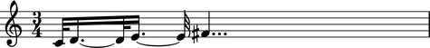
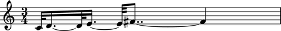

:tocdepth: 2

Version history
===============

Abjad 2.11
----------

Released 2012-12-17. Built from r8379.
Implements 490 public classes and 1004 functions totalling 201,000 lines of code.

The ``MetricalHierarchy`` class
^^^^^^^^^^^^^^^^^^^^^^^^^^^^^^^

A new ``MetricalHierarchy`` class is now available in the ``timesignaturetools`` package.

A rhythm tree-based model of nested time signature groupings.

The structure of the tree corresponds to the monotonically increasing sequence of 
factors of the time signature’s numerator.

Each deeper level of the tree divides the previous by the next factor in sequence.

Prime divisions greater than 3 are converted to sequences of 2 and 3 summing to that prime. 
Hence 5 becomes 3+2 and 7 becomes 3+2+2.

The metrical hierarchy models many parts of the common practice understanding of meter::

    >>> metrical_hierarchy = timesignaturetools.MetricalHierarchy((4, 4))

::

    >>> metrical_hierarchy
    MetricalHierarchy('(4/4 (1/4 1/4 1/4 1/4))')

::

    >>> print metrical_hierarchy.pretty_rtm_format
    (4/4 (
        1/4
        1/4
        1/4
        1/4))

::

    >>> print timesignaturetools.MetricalHierarchy((3, 4)).pretty_rtm_format
    (3/4 (
        1/4
        1/4
        1/4))

::

    >>> print timesignaturetools.MetricalHierarchy((6, 8)).pretty_rtm_format
    (6/8 (
        (3/8 (
            1/8
            1/8
            1/8))
        (3/8 (
            1/8
            1/8
            1/8))))

::

    >>> print timesignaturetools.MetricalHierarchy((5, 4)).pretty_rtm_format
    (5/4 (
        (3/4 (
            1/4
            1/4
            1/4))
        (2/4 (
            1/4
            1/4))))

::

    >>> print timesignaturetools.MetricalHierarchy((5, 4),
    ...     decrease_durations_monotonically=False).pretty_rtm_format
    (5/4 (
        (2/4 (
            1/4
            1/4))
        (3/4 (
            1/4
            1/4
            1/4))))

::

    >>> print timesignaturetools.MetricalHierarchy((12, 8)).pretty_rtm_format
    (12/8 (
        (3/8 (
            1/8
            1/8
            1/8))
        (3/8 (
            1/8
            1/8
            1/8))
        (3/8 (
            1/8
            1/8
            1/8))
        (3/8 (
            1/8
            1/8
            1/8))))

Rewriting rhythms according to a different metric hierarchy
^^^^^^^^^^^^^^^^^^^^^^^^^^^^^^^^^^^^^^^^^^^^^^^^^^^^^^^^^^^

A new ``establish_metrical_hierarchy()`` function is now available in ``timesignaturetools``:

Rewrite the contents of tie chains in an expression to match a metrical
hierarchy.

Example 1. Rewrite the contents of a measure in a staff using the default metrical
hierarchy for that measure's time signature:

::

    >>> parseable = "abj: | 2/4 c'2 ~ || 4/4 c'32 d'2.. ~ d'16 e'32 ~ || 2/4 e'2 |"

::

    >>> staff = Staff(parseable)
    >>> f(staff)
    \new Staff {
        {
            \time 2/4
            c'2 ~
        }
        {
            \time 4/4
            c'32
            d'2.. ~
            d'16
            e'32 ~
        }
        {
            \time 2/4
            e'2
        }
    }

::

    >>> hierarchy = timesignaturetools.MetricalHierarchy((4, 4))
    >>> print hierarchy.pretty_rtm_format
    (4/4 (
        1/4
        1/4
        1/4
        1/4))

::

    >>> timesignaturetools.establish_metrical_hierarchy(staff[1][:], hierarchy)
    >>> f(staff)
    \new Staff {
        {
            \time 2/4
            c'2 ~
        }
        {
            \time 4/4
            c'32
            d'8.. ~
            d'2 ~
            d'8..
            e'32 ~
        }
        {
            \time 2/4
            e'2
        }
    }

.. image:: images/establish-2.png

Example 2. Rewrite the contents of a measure in a staff using a custom
metrical hierarchy:

::

    >>> staff = Staff(parseable)
    >>> f(staff)
    \new Staff {
        {
            \time 2/4
            c'2 ~
        }
        {
            \time 4/4
            c'32
            d'2.. ~
            d'16
            e'32 ~
        }
        {
            \time 2/4
            e'2
        }
    }

::

    >>> rtm = '(4/4 ((2/4 (1/4 1/4)) (2/4 (1/4 1/4))))'
    >>> hierarchy = timesignaturetools.MetricalHierarchy(rtm)
    >>> print hierarchy.pretty_rtm_format
    (4/4 (
        (2/4 (
            1/4
            1/4))
        (2/4 (
            1/4
            1/4))))

::

    >>> timesignaturetools.establish_metrical_hierarchy(staff[1][:], hierarchy)
    >>> f(staff)
    \new Staff {
        {
            \time 2/4
            c'2 ~
        }
        {
            \time 4/4
            c'32
            d'4... ~
            d'4...
            e'32 ~
        }
        {
            \time 2/4
            e'2
        }
    }

Example 3. Limit the maximum number of dots per leaf using
`maximum_dot_count`:

::

    >>> parseable = "abj: | 3/4 c'32 d'8 e'8 fs'4... |"
    >>> measure = p(parseable)
    >>> f(measure)
    {
        \time 3/4
        c'32
        d'8
        e'8
        fs'4...
    }

Without constraining the `maximum_dot_count`:

::

    >>> timesignaturetools.establish_metrical_hierarchy(measure[:], measure)
    >>> f(measure)
    {
        \time 3/4
        c'32
        d'16. ~
        d'32
        e'16. ~
        e'32
        fs'4...
    }

Constraining the `maximum_dot_count` to `2`:

::

    >>> measure = p(parseable)
    >>> timesignaturetools.establish_metrical_hierarchy(measure[:], measure,
    ...     maximum_dot_count=2)
    >>> f(measure)
    {
        \time 3/4
        c'32
        d'16. ~
        d'32
        e'16. ~
        e'32
        fs'8.. ~
        fs'4
    }

Constraining the `maximum_dot_count` to `1`:

::

    >>> measure = p(parseable)
    >>> timesignaturetools.establish_metrical_hierarchy(measure[:], measure,
    ...     maximum_dot_count=1)
    >>> f(measure)
    {
        \time 3/4
        c'32
        d'16. ~
        d'32
        e'16. ~
        e'32
        fs'16. ~
        fs'8 ~
        fs'4
    }

Constraining the `maximum_dot_count` to `0`:

::

    >>> measure = p(parseable)
    >>> timesignaturetools.establish_metrical_hierarchy(measure[:], measure,
    ...     maximum_dot_count=0)
    >>> f(measure)
    {
        \time 3/4
        c'32
        d'32 ~
        d'16 ~
        d'32
        e'32 ~
        e'16 ~
        e'32
        fs'32 ~
        fs'16 ~
        fs'8 ~
        fs'4
    }

Example 4: Split tie chains at different depths of the `MetricalHierarchy`,
if those tie chains cross any offsets at that depth, but do not also both
begin and end at any of those offsets.

Consider the default metrical hierarchy for `9/8`:

    >>> hierarchy = timesignaturetools.MetricalHierarchy((9, 8))
    >>> print hierarchy.pretty_rtm_format
    (9/8 (
        (3/8 (
            1/8
            1/8
            1/8))
        (3/8 (
            1/8
            1/8
            1/8))
        (3/8 (
            1/8
            1/8
            1/8))))

We can establish that hierarchy without specifying a `boundary_depth`:

::

    >>> parseable = "abj: | 9/8 c'2 d'2 e'8 |"
    >>> measure = p(parseable)
    >>> f(measure)
    {
        \time 9/8
        c'2
        d'2
        e'8
    }

::

    >>> timesignaturetools.establish_metrical_hierarchy(measure[:], measure)
    >>> f(measure)
    {
        \time 9/8
        c'2
        d'4 ~
        d'4
        e'8
    }

.. image:: images/establish-10.png

With a `boundary_depth` of `1`, tie chains which cross any offsets created
by nodes with a depth of `1` in this MetricalHierarchy's rhythm tree - i.e.
`0/8`, `3/8`, `6/8` and `9/8` - which do not also begin and end at any of those
offsets, will be split:

::

    >>> measure = p(parseable)
    >>> timesignaturetools.establish_metrical_hierarchy(measure[:], measure,
    ...     boundary_depth=1)
    >>> f(measure)
    {
        \time 9/8
        c'4. ~
        c'8
        d'4 ~
        d'4
        e'8
    }

For this `9/8` hierarchy, and this input notation, A `boundary_depth` of `2`
causes no change, as all tie chains already align to multiples of `1/8`:

::

    >>> measure = p(parseable)
    >>> timesignaturetools.establish_metrical_hierarchy(measure[:], measure,
    ...     boundary_depth=2)
    >>> f(measure)
    {
        \time 9/8
        c'2
        d'4 ~
        d'4
        e'8
    }

Example 5. Comparison of `3/4` and `6/8`, at `boundary_depths` of 0 and 1:

::

    >>> triple = "abj: | 3/4 2 4 || 3/4 4 2 || 3/4 4. 4. |"
    >>> triple += "| 3/4 2 ~ 8 8 || 3/4 8 8 ~ 2 |"
    >>> duples = "abj: | 6/8 2 4 || 6/8 4 2 || 6/8 4. 4. |"
    >>> duples += "| 6/8 2 ~ 8 8 || 6/8 8 8 ~ 2 |"
    >>> score = Score([Staff(triple), Staff(duples)])

In order to see the different time signatures on each staff, we need to
move some engravers from the Score context to the Staff context:

::

    >>> engravers = ['Timing_translator', 'Time_signature_engraver',
    ...     'Default_bar_line_engraver']
    >>> score.engraver_removals.extend(engravers)
    >>> score[0].engraver_consists.extend(engravers)
    >>> score[1].engraver_consists.extend(engravers)
    >>> f(score)
    \new Score \with {
        \remove Timing_translator
        \remove Time_signature_engraver
        \remove Default_bar_line_engraver
    } <<
        \new Staff \with {
            \consists Timing_translator
            \consists Time_signature_engraver
            \consists Default_bar_line_engraver
        } {
            {
                \time 3/4
                c'2
                c'4
            }
            {
                c'4
                c'2
            }
            {
                c'4.
                c'4.
            }
            {
                c'2 ~
                c'8
                c'8
            }
            {
                c'8
                c'8 ~
                c'2
            }
        }
        \new Staff \with {
            \consists Timing_translator
            \consists Time_signature_engraver
            \consists Default_bar_line_engraver
        } {
            {
                \time 6/8
                c'2
                c'4
            }
            {
                c'4
                c'2
            }
            {
                c'4.
                c'4.
            }
            {
                c'2 ~
                c'8
                c'8
            }
            {
                c'8
                c'8 ~
                c'2
            }
        }
    >>

Here we establish a metrical hierarchy without specifying and boundary depth:

::

    >>> for measure in iterationtools.iterate_measures_in_expr(score):
    ...     timesignaturetools.establish_metrical_hierarchy(measure[:], measure)
    >>> f(score)
    \new Score \with {
        \remove Timing_translator
        \remove Time_signature_engraver
        \remove Default_bar_line_engraver
    } <<
        \new Staff \with {
            \consists Timing_translator
            \consists Time_signature_engraver
            \consists Default_bar_line_engraver
        } {
            {
                \time 3/4
                c'2
                c'4
            }
            {
                c'4
                c'2
            }
            {
                c'4.
                c'4.
            }
            {
                c'2 ~
                c'8
                c'8
            }
            {
                c'8
                c'8 ~
                c'2
            }
        }
        \new Staff \with {
            \consists Timing_translator
            \consists Time_signature_engraver
            \consists Default_bar_line_engraver
        } {
            {
                \time 6/8
                c'2
                c'4
            }
            {
                c'4
                c'2
            }
            {
                c'4.
                c'4.
            }
            {
                c'4. ~
                c'4
                c'8
            }
            {
                c'8
                c'4 ~
                c'4.
            }
        }
    >>

Here we re-establish metrical hierarchy at a boundary depth of `1`:

::

    >>> for measure in iterationtools.iterate_measures_in_expr(score):
    ...     timesignaturetools.establish_metrical_hierarchy(
    ...         measure[:], measure, boundary_depth=1)
    ...
    >>> f(score)
    \new Score \with {
        \remove Timing_translator
        \remove Time_signature_engraver
        \remove Default_bar_line_engraver
    } <<
        \new Staff \with {
            \consists Timing_translator
            \consists Time_signature_engraver
            \consists Default_bar_line_engraver
        } {
            {
                \time 3/4
                c'2
                c'4
            }
            {
                c'4
                c'2
            }
            {
                c'4 ~
                c'8
                c'8 ~
                c'4
            }
            {
                c'2 ~
                c'8
                c'8
            }
            {
                c'8
                c'8 ~
                c'2
            }
        }
        \new Staff \with {
            \consists Timing_translator
            \consists Time_signature_engraver
            \consists Default_bar_line_engraver
        } {
            {
                \time 6/8
                c'4. ~
                c'8
                c'4
            }
            {
                c'4
                c'8 ~
                c'4.
            }
            {
                c'4.
                c'4.
            }
            {
                c'4. ~
                c'4
                c'8
            }
            {
                c'8
                c'4 ~
                c'4.
            }
        }
    >>

Note that the two time signatures are much more clearly disambiguated above.

Example 6. Establishing metrical hierarchy recursively in measures with
nested tuplets:

::

    >>> measure = p("abj: | 4/4 c'16 ~ c'4 d'8. ~ " \
    ...     "2/3 { d'8. ~ 3/5 { d'16 e'8. f'16 ~ } } f'4 |")
    >>> f(measure)
    {
        \time 4/4
        c'16 ~
        c'4
        d'8. ~
        \times 2/3 {
            d'8. ~
            \fraction \times 3/5 {
                d'16
                e'8.
                f'16 ~
            }
        }
        f'4
    }

When establishing a metrical hierarchy on a selection of components which
contain containers, like `Tuplets` or `Containers`,
`timesignaturetools.establish_metrical_hierarchy()` will recurse into
those containers, treating them as measures whose time signature is derived
from the preprolated duration of the container's contents:

::

    >>> timesignaturetools.establish_metrical_hierarchy(measure[:], measure,
    ...     boundary_depth=1)
    >>> f(measure)
    {
        \time 4/4
        c'4 ~
        c'16
        d'8. ~
        \times 2/3 {
            d'8 ~
            d'16 ~
            \fraction \times 3/5 {
                d'16
                e'8 ~
                e'16
                f'16 ~
            }
        }
        f'4
    }

The ``quantizationtools`` package
^^^^^^^^^^^^^^^^^^^^^^^^^^^^^^^^^

The ``quantizationtools`` package has been completely rewritten:

``Quantizer`` quantizes sequences of attack-points, encapsulated by
``QEventSequences``, into score trees:

::

    >>> quantizer = quantizationtools.Quantizer()

::

    >>> durations = [1000] * 8
    >>> pitches = range(8)
    >>> q_event_sequence = quantizationtools.QEventSequence.from_millisecond_pitch_pairs(
    ...     zip(durations, pitches))

Quantization defaults to outputting into a 4/4, quarter=60 musical
structure:

::

    >>> result = quantizer(q_event_sequence)
    >>> score = Score([Staff([result])])
    >>> f(score)
    \new Score <<
        \new Staff {
            \new Voice {
                {
                    \time 4/4
                    \tempo 4=60 
                    c'4
                    cs'4
                    d'4
                    ef'4
                }
                {
                    e'4
                    f'4
                    fs'4
                    g'4
                }
            }
        }
    >>

However, the behavior of the ``Quantizer`` can be modified at call-time.
Passing a ``QSchema`` instance will alter the macro-structure of the
output.

Here, we quantize using settings specified by a ``MeasurewiseQSchema``,
which will cause the ``Quantizer`` to group the output into measures
with different tempi and time signatures:

::

    >>> measurewise_q_schema = quantizationtools.MeasurewiseQSchema(
    ...     {'tempo': ((1, 4), 78), 'time_signature': (2, 4)},
    ...     {'tempo': ((1, 8), 57), 'time_signature': (5, 4)},
    ...     )

::

    >>> result = quantizer(q_event_sequence, q_schema=measurewise_q_schema)
    >>> score = Score([Staff([result])])
    >>> f(score)
    \new Score <<
        \new Staff {
            \new Voice {
                {
                    \time 2/4
                    \tempo 4=78
                    c'4 ~
                    \times 4/5 {
                        c'16.
                        cs'8.. ~
                    }
                }
                {
                    \time 5/4
                    \tempo 8=57
                    \times 4/7 {
                        cs'16.
                        d'8 ~
                    }
                    \times 4/5 {
                        d'16
                        ef'16. ~
                    }
                    \times 2/3 {
                        ef'16
                        e'8 ~
                    }
                    \times 4/7 {
                        e'16
                        f'8 ~
                        f'32 ~
                    }
                    f'32
                    fs'16. ~
                    \times 4/5 {
                        fs'32
                        g'8 ~
                    }
                    \times 4/7 {
                        g'32
                        r4. ~
                        r32 ~
                    }
                    r4
                }
            }
        }
    >>

Here we quantize using settings specified by a ``BeatwiseQSchema``, which
keeps the output of the quantizer "flattened", without measures or explicit
time signatures.  The default beat-wise settings of quarter=60 persists until
the third "beatspan":

::

    >>> beatwise_q_schema = quantizationtools.BeatwiseQSchema(
    ... {
    ...     2: {'tempo': ((1, 4), 120)},
    ...     5: {'tempo': ((1, 4), 90)},
    ...     7: {'tempo': ((1, 4), 30)},
    ... })

::

    >>> result = quantizer(q_event_sequence, q_schema=beatwise_q_schema)
    >>> score = Score([Staff([result])])
    >>> f(score)
    \new Score <<
        \new Staff {
            \new Voice {
                \tempo 4=60 
                c'4
                cs'4
                \tempo 4=120 
                d'2
                ef'4 ~
                \tempo 4=90 
                ef'8.
                e'4 ~
                e'16 ~
                \times 2/3 {
                    \tempo 4=30 
                    e'32
                    f'8.
                    fs'8 ~
                    fs'32 ~
                }
                \times 2/3 {
                    fs'32
                    g'8.
                    r8 ~
                    r32
                }
            }
        }
    >>

Note that ``TieChains`` are generally fused together in the above example, but
break at tempo changes.

Refer to the reference pages for ``BeatwiseQSchema`` and ``MeasurewiseQSchema``
for more information on controlling the ``Quantizer``'s output, and to the
reference on ``SearchTree`` for information on controlling the rhythmic
complexity of that same output.

Other new features
^^^^^^^^^^^^^^^^^^

Autocompletion is now available at the Abjad prompt.

Music notation images now appear in the docstrings of many functions throughout the API.

Added new ``iotools.graph()`` function to the ``iotools`` package.
A small number of classes throughout the system have started to gain a `graphviz_format` attribute, 
including datastructuretools.Digraph, documentationtools.InheritanceGraph, 
some of the rhythmtreetools.RhythmTreeNode subclasses, and even timesignaturetools.MetricalHierarchy::

    >>> hierarchy = timesignaturetools.MetricalHierarchy((7, 4))
    >>> iotools.graph(hierarchy)

Extended GroupedRhythmicStavesScoreTemplate with multiple voice initialization.
Set staff_count to a list for staves with more than 1 voice::

        >>> template = scoretemplatetools.GroupedRhythmicStavesScoreTemplate(staff_count=[2, 1, 2])
        >>> score = template()

::

        >>> f(score)
        \context Score = "Grouped Rhythmic Staves Score" <<
            \context StaffGroup = "Grouped Rhythmic Staves Staff Group" <<
                \context RhythmicStaff = "Staff 1" {
                    \context Voice = "Voice 1-1" {
                    }
                    \context Voice = "Voice 1-2" {
                    }
                }
                \context RhythmicStaff = "Staff 2" {
                    \context Voice = "Voice 2" {
                    }
                }
                \context RhythmicStaff = "Staff 3" {
                    \context Voice = "Voice 3-1" {
                    }
                    \context Voice = "Voice 3-2" {
                    }
                }
            >>
        >>

Forced accidentals and cautionary accidentals are now available as properties::

    >>> note = notetools.Note("c'4")
    >>> note.note_head.is_forced = True
    >>> f(note)
    c'!4

::

    >>> note.note_head.is_cautionary = True
    >>> f(note)
    c'!?4

Forced accidentals and cautionary accidentals are also now available at instantiation::

    >>> note = Note("c'!?4")
    >>> note
    Note("c'!?4")

::

    >>> chord = Chord("<c'!? e'? g'! b'>4")
    >>> chord
    Chord("<c'!? e'? g'! b'>4")

::

    >>> Note(chord)
    Note("c'!?4")

::

    >>> Chord(note)
    Chord("<c'!?>4")

New tutorials describe how to get started with Abjad::

    1. Getting started
    2. LilyPond “hello, world!”
    3. Python “hello, world!” (at the interpreter)
    4. Python “hello, world!” (in a file)
    5. More about Python
    6. Abjad “hello, world” (at the interpreter)
    7. Abjad “hello, world!” (in a file)
    8. More about Abjad

Added a function to register custom markup globally with the LilyPondParser::

    >>> from abjad.tools.lilypondparsertools import LilyPondParser

::

    >>> name = 'my-custom-markup-function'
    >>> signature = ['markup?']
    >>> LilyPondParser.register_markup_function(name, signature)

::

    >>> parser = LilyPondParser()
    >>> string = r"\markup { \my-custom-markup-function { foo bar baz } }"
    >>> parser(string)
    Markup((MarkupCommand('my-custom-markup-function', ['foo', 'bar', 'baz']),))

::

    >>> f(_)
    \markup { \my-custom-markup-function { foo bar baz } }

Note that this once registered, the custom markup command is also recognized when instantiating
parsed Markup objects::

    >>> markuptools.Markup(r"\my-custom-markup-function { foo bar baz }")
    Markup((MarkupCommand('my-custom-markup-function', ['foo', 'bar', 'baz']),))

Added new ``markuptools.MusicGlyph`` class.
This is a subclass of markuptools.MarkupCommand, 
and can therefore be used anywhere MarkupCommand can appear::
It guarantees correct quoting around the glyph name 
(which is easy to forget, or not always clear how to do for new users), 
and also checks that the glyph name is recognized in LilyPond::

    >>> markuptools.MusicGlyph('accidentals.sharp')
    MusicGlyph('accidentals.sharp')

::

    >>> print _
    \musicglyph #"accidentals.sharp"

The ``durationtools`` package now implements three related classes.
All three classes are now available in the global namespace.
Durations, multipliers and offsets are now distinguished everywhere in Abjad::

    Duration
    Multiplier
    Offset

Implemented new ``NonreducedRatio`` class. Compare with existing ``Ratio`` class::

    >>> mathtools.NonreducedRatio(2, 4, 2)
    NonreducedRatio(2, 4, 2)

::

    >>> mathtools.Ratio(2, 4, 2)
    Ratio(1, 2, 1)

Added new componenttools ScoreSelection subclasses. All selections are improper::

    * componenttools.Descendants
    * componenttools.Lineage
    * componenttools.Parentage

New score selection subclasses are also accessible via::

    * Component.descendants
    * Component.lineage
    * Component.parentage

Added lilypondfiletools.LilyPondDimension class::

    >>> dimension = lilypondfiletools.LilyPondDimension(2, 'in')
    >>> f(dimension)
    2.0\in

Added a new parseable tag to abjad-book: ``<abjadextract module \>[flags]``.
This single-line tag imports the code found at `module`, and copies the
actual code text itself into the abjad-book session, just as though it
had been manually included between a pair of <abjad></abjad> tags.
The intended use is in Abjad's literature examples.  Most of the examples
are also written up in the demos/ directory.  It would be best if all of
the code pertaining to each literature example was housed entirely in the
demos/ directory, along with tests to guarantee their validity.  Then, 
using the name <abjadextract \> tag, that code can simply be included into
the documentation narrative.

The abjad-book executable now handles multi-page PNG output.

Implemented page selection in abjad-book.

    Show an entire score::

        <abjad>
        show(foo)
        </abjad>

    Show page 1 of a single or multipage score::

        <abjad>
        show(foo) <page 1
        </abjad>

    Show pages 2 through 5 or a multipage score::

        <abjad>
        show(foo) <page 2-5
        </abjad>

A new ``timerelationtools`` package is now available.

The new ``timerelationtools`` package features seven functions
for using natural language to compare the in-time position
on an offset relative to a reference timespan::

    timerelationtools.offset_happens_after_timespan_starts
    timerelationtools.offset_happens_after_timespan_stops
    timerelationtools.offset_happens_before_timespan_starts
    timerelationtools.offset_happens_before_timespan_stops
    timerelationtools.offset_happens_during_timespan
    timerelationtools.offset_happens_when_timespan_starts
    timerelationtools.offset_happens_when_timespan_stops

The new ``timerelationtools`` package contains 26 functions
for using natural language to compare the in-time position
of one timespan relative to another::

    timerelationtools.timespan_2_contains_timespan_1_improperly
    timerelationtools.timespan_2_curtails_timespan_1
    timerelationtools.timespan_2_delays_timespan_1
    timerelationtools.timespan_2_happens_during_timespan_1
    timerelationtools.timespan_2_intersects_timespan_1
    timerelationtools.timespan_2_is_congruent_to_timespan_1
    timerelationtools.timespan_2_overlaps_all_of_timespan_1
    timerelationtools.timespan_2_overlaps_only_start_of_timespan_1
    timerelationtools.timespan_2_overlaps_only_stop_of_timespan_1
    timerelationtools.timespan_2_overlaps_start_of_timespan_1
    timerelationtools.timespan_2_overlaps_stop_of_timespan_1
    timerelationtools.timespan_2_starts_after_timespan_1_starts
    timerelationtools.timespan_2_starts_after_timespan_1_stops
    timerelationtools.timespan_2_starts_before_timespan_1_starts
    timerelationtools.timespan_2_starts_before_timespan_1_stops
    timerelationtools.timespan_2_starts_during_timespan_1
    timerelationtools.timespan_2_starts_when_timespan_1_starts
    timerelationtools.timespan_2_starts_when_timespan_1_stops
    timerelationtools.timespan_2_stops_after_timespan_1_starts
    timerelationtools.timespan_2_stops_after_timespan_1_stops
    timerelationtools.timespan_2_stops_before_timespan_1_starts
    timerelationtools.timespan_2_stops_before_timespan_1_stops
    timerelationtools.timespan_2_stops_during_timespan_1
    timerelationtools.timespan_2_stops_when_timespan_1_starts
    timerelationtools.timespan_2_stops_when_timespan_1_stops
    timerelationtools.timespan_2_trisects_timespan_1

Here's an example of some of the natural language comparison
functions available in the ``timerelationtools`` package::

    >>> staff_1 = Staff(r"\times 2/3 { c'4 d'4 e'4 } \times 2/3 { f'4 g'4 a'4 }")
    >>> staff_2 = Staff("c'2. d'4")
    >>> score = Score([staff_1, staff_2])

::

    >>> f(score)
    \new Score <<
        \new Staff {
            \times 2/3 {
                c'4
                d'4
                e'4
            }
            \times 2/3 {
                f'4
                g'4
                a'4
            }
        }
        \new Staff {
            c'2.
            d'4
        }
    >>

::

    >>> last_tuplet = staff_1[-1]
    >>> long_note = staff_2[0]

::

    >>> timerelationtools.timespan_2_happens_during_timespan_1(
    ... timespan_1=last_tuplet, timespan_2=long_note)
    False

::

    >>> timerelationtools.timespan_2_intersects_timespan_1(
    ... timespan_1=last_tuplet, timespan_2=long_note)
    True

::

    >>> timerelationtools.timespan_2_is_congruent_to_timespan_1(
    ... timespan_1=last_tuplet, timespan_2=long_note)
    False

::

    >>> timerelationtools.timespan_2_overlaps_all_of_timespan_1(
    ... timespan_1=last_tuplet, timespan_2=long_note)
    False

::

    >>> timerelationtools.timespan_2_overlaps_start_of_timespan_1(
    ... timespan_1=last_tuplet, timespan_2=long_note)
    True

::

    >>> timerelationtools.timespan_2_overlaps_stop_of_timespan_1(
    ... timespan_1=last_tuplet, timespan_2=long_note)
    False

::

    >>> timerelationtools.timespan_2_starts_after_timespan_1_starts(
    ... timespan_1=last_tuplet, timespan_2=long_note)
    False

::

    >>> timerelationtools.timespan_2_starts_after_timespan_1_stops(
    ... timespan_1=last_tuplet, timespan_2=long_note)
    False

Added new EvenRunRhythmMaker class to the ``rhythmmakertools`` package.
For each division on which the class is called, the class
produces an even run of notes each equal in duration to 1/d
with d equal to the division denominator::

    >>> maker = rhythmmakertools.EvenRunRhythmMaker()

::

    >>> divisions = [(4, 16), (3, 8), (2, 8)]
    >>> lists = maker(divisions)
    >>> containers = sequencetools.flatten_sequence(lists)

::

    >>> staff = Staff(containers)

::

    >>> f(staff)
    \new Staff {
        {
            c'16 [
            c'16
            c'16
            c'16 ]
        }
        {
            c'8 [
            c'8
            c'8 ]
        }
        {
            c'8 [
            c'8 ]
        }
    }

Older Versions
--------------

.. toctree::
   :glob: 
   :maxdepth: 1

   version_*

