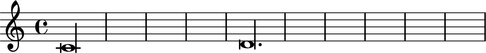
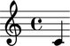
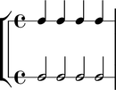
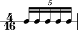

:tocdepth: 2

Durations
=========

Breves, longas and other long durations
---------------------------------------

A breve is a duration equal to two whole notes. Abjad supports breve-durated
notes, rests and chords with and without dots.

You can create breves with a LilyPond input string:

::

   >>> note_1 = Note(r"c'\breve")
   >>> note_2 = Note(r"d'\breve.")

Or with an explicit duration:

::

   >>> note_3 = Note("e'", Duration(2, 1))
   >>> note_4 = Note("f'", Duration(3, 1))

The written duration of a breve always returns an Abjad duration object:

::

   >>> notes = [note_1, note_2, note_3, note_4]
   >>> for note in notes:
   ...     note, note.written_duration
   ... 
   (Note("c'\\breve"), Duration(2, 1))
   (Note("d'\\breve."), Duration(3, 1))
   (Note("e'\\breve"), Duration(2, 1))
   (Note("f'\\breve."), Duration(3, 1))

LilyPond renders breves like this:

::

   >>> staff = Staff(notes)
   >>> show(staff)

Abjad also supports longas. A longa equals two breves:

::

   >>> note_1 = Note(r"c'\longa")
   >>> note_2 = Note("d'", Duration(6, 1))

::

   >>> notes = [note_1, note_2]
   >>> for note in notes:
   ...     note, note.written_duration
   ... 
   (Note("c'\\longa"), Duration(4, 1))
   (Note("d'\\longa."), Duration(6, 1))

::

   >>> staff = Staff(notes)
   >>> show(staff)

A maxima is a duration equal to two longas:

::

   >>> note_1 = Note(r"c'\maxima")
   >>> note_2 = Note("d'", Duration(12, 1))

::

   >>> notes = [note_1, note_2]
   >>> for note in notes:
   ...     note, note.written_duration
   ... 
   (Note("c'\\maxima"), Duration(8, 1))
   (Note("d'\\maxima."), Duration(12, 1))

Abjad supports maximas and LilyPond supplies a ``\maxima`` command. But you can
not use Abjad to render maxima-valued notes, rests and chords because LilyPond
supplies no glyphs for these durations.

The same is true for all durations greater than or equal to eight whole notes:
you can initialize and work with all such durations in Abjad but you will only
be able to use LilyPond to render as notation those values equal to less than
eight whole notes.

LilyPond multipliers
--------------------

LilyPond provides an asterisk `*` operator to scale the durations of notes,
rests and chords by arbitrarily positive rational values. LilyPond multipliers
are inivisible and generate no typographic output of their own. However, while
independent from the typographic output, LilyPond multipliers do factor into
calculations of duration.

Abjad implements LilyPond multpliers as the settable
``lilypond_duration_multiplier`` attribute implemented on notes, rests and
chords.

::

   >>> note = Note("c'4")
   >>> note.lilypond_duration_multiplier = Multiplier(1, 2)

::

   >>> f(note)
   c'4 * 1/2

::

   >>> note.written_duration
   Duration(1, 4)
   >>> note.lilypond_duration_multiplier
   Multiplier(1, 2)
   >>> inspect(note).get_duration()
   Duration(1, 8)

::

   >>> show(note)

LilyPond multipliers scale the durations of the half notes below to that of
quarter notes:

::

   >>> quarter_notes = 4 * Note("c'4")
   >>> half_note = Note("c'2")
   >>> half_note.lilypond_duration_multiplier = Multiplier(1, 2)
   >>> half_notes = 4 * half_note
   >>> top_staff = stafftools.RhythmicStaff(quarter_notes)
   >>> bottom_staff = stafftools.RhythmicStaff(half_notes)
   >>> staff_group = scoretools.StaffGroup([top_staff, bottom_staff])

::

   >>> show(staff_group)

Note that the LilyPond multiplication `*` operator differs from the Abjad
multiplication `*` operator. LilyPond multiplication scales duration of
LilyPond notes, rests and chords. Abjad multiplication copies Abjad containers
and leaves.

What's the difference between duration and written duration?
------------------------------------------------------------

Abjad uses the term "written duration" to refer to the face value of notes,
rests and chords prior to time-scaling effects of tuplets or measures with
unusual time signatures. Abjad's written duration corresponds to the informal
names most frequently used when talking about note duration.

Consider the measure below:

::

   >>> measure = Measure((5, 16), "c16 c c c c")
   >>> beam = spannertools.BeamSpanner()
   >>> beam.attach([measure])
   >>> staff = stafftools.RhythmicStaff([measure])

::

   >>> show(staff)

Every note in the measure equals one sixteenth of a whole note:

::

   >>> note = measure[0]
   >>> inspect(note).get_duration()
   Duration(1, 16)

But now consider this measure:

::

   >>> tuplet = Tuplet((4, 5), "c16 c c c c")
   >>> measure = Measure((4, 16), [tuplet])
   >>> beam = spannertools.BeamSpanner()
   >>> beam.attach([measure])
   >>> staff = stafftools.RhythmicStaff([measure])

::

   >>> show(staff)

The notes in this measure are equal to only one twentieth of a whole note:
Every note in this measures 

::

   >>> note = tuplet[0]
   >>> inspect(note).get_duration()
   Duration(1, 20)

The notes in this measure are "sixteenth notes" with a duration equal to a
value other than ``1/16``. Abjad formalizes this distinction in the difference
between the duration of these notes (``1/20``) and written duration of these
notes (``1/16``).

Written duration is a user-assignable value. Users can assign and
reassign the written duration of notes, rests and chords at initialization or
any time thereafter. But the (unqualified) duration of a note, rest or chord is
a derived property Abjad calculates based on the rhythmic context governing the
note, rest or chord.

What does it mean for a duration to be "assignable"?
----------------------------------------------------

Western notation makes it easy to notate notes, rests and chords with durations
like ``1/4`` and ``3/16``. But notating notes, rests and chords with durations
like ``1/3`` can only be done with recourse to tuplets or ties.

Abjad formalizes the difference between durations like ``1/4`` and ``1/5`` in
the concept of **assignability**: a duration ``n/d`` is assignable when and
only when numerator ``n`` is of the form ``k(2**u-j)`` and denominator ``d`` is
of the form ``2**v``.  In this definition ``u`` and ``v`` must be nonnegative
integers, ``k`` must be a positive integer, and ``j`` must be either ``0`` or
``1``.

Assignability is important because it explains why you can set the duration
of any note, rest or chord to ``1/4`` but never to ``1/5``.
