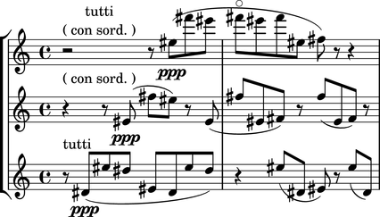
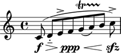
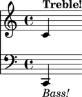
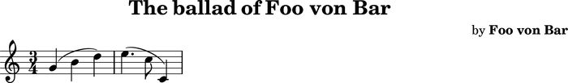
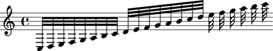
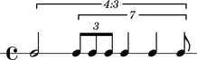
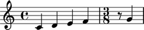

Parsing
=======

Abjad provides a growing number of language parsers. 
The most important of these is a sophisticate LilyPond parser.

LilyPond Parsing
----------------

``lilypondparsertools.LilyPondParser`` parses a large, although incomplete, subset of LilyPond's syntax:

::

   >>> parser = lilypondparsertools.LilyPondParser()

The LilyPond parser understands notes, chords, skips and rests, 
including default durations and the ``q`` chord-repeat construct:

::

   >>> string = r"{ c'\longa r4. <d' fs' bff'> g q8 s1 c''\breve. }"
   >>> result = parser(string)

::

   >>> f(result)
   {
       c'\longa
       r4.
       <d' fs' bff'>4.
       g4.
       <d' fs' bff'>8
       s1
       c''\breve.
   }

::

   >>> show(result)

The LilyPond parser understands most spanners, articulations and dynamics too:

::

   >>> string = r'''\new Staff {
   ...     c'8 \f \> (
   ...     d' -_ [
   ...     e' ^>
   ...     f' \ppp \<
   ...     g' \startTrillSpan \(
   ...     a' \)
   ...     b' ] \stopTrillSpan
   ...     c'' ) \accent \sfz
   ... }
   ... '''
   >>> result = parser(string)

::

   >>> f(result)
   \new Staff {
       c'8 \f \> (
       d'8 -\portato [
       e'8 ^\accent
       f'8 \ppp \<
       g'8 \( \startTrillSpan
       a'8 \)
       b'8 ] \stopTrillSpan
       c''8 -\accent \sfz )
   }

::

   >>> show(result)

The LilyPond parser understands contexts and markup:

::

   >>> string = r'''\new Score <<
   ...     \new Staff = "Treble Staff" {
   ...         \new Voice = "Treble Voice" {
   ...             c' ^\markup { \bold Treble! }
   ...         }
   ...     }
   ...     \new Staff = "Bass Staff" {
   ...         \new Voice = "Bass Voice" {
   ...             \clef bass
   ...             c, _\markup { \italic Bass! } 
   ...         }
   ...     }
   ... >>
   ... '''
   >>> result = parser(string)

::

   >>> f(result)
   \new Score <<
       \context Staff = "Treble Staff" {
           \context Voice = "Treble Voice" {
               c'4
                   ^ \markup {
                       \bold
                           Treble!
                       }
           }
       }
       \context Staff = "Bass Staff" {
           \context Voice = "Bass Voice" {
               \clef "bass"
               c,4
                   _ \markup {
                       \italic
                           Bass!
                       }
           }
       }
   >>

::

   >>> show(result)

The LilyPond parser even understands certain aspects of LilyPond file layouts, like header blocks:

::

   >>> string = r'''
   ... \header {
   ...     name = "Foo von Bar"
   ...     composer = \markup { by \bold \name }
   ...     title = \markup { The ballad of \name }
   ...     tagline = \markup { "" }
   ... }
   ... \score {
   ...     \new Staff {
   ...         \time 3/4
   ...         g' ( b' d'' )
   ...         e''4. ( c''8 c'4 )
   ...     }
   ... }
   ... '''
   >>> result = parser(string)

::

   >>> f(result)
   % Abjad revision 7627
   % 2012-10-08 15:16
   
   \version "2.17.3"
   \language "english"
   \include "/Users/trevorbaca/Documents/abjad/trunk/abjad/cfg/abjad.scm"
   
   \header {
       composer = \markup { by \bold "Foo von Bar" }
       name = #"Foo von Bar"
       tagline = \markup {  }
       title = \markup { The ballad of "Foo von Bar" }
   }
   
   \score {
       \new Staff {
           \time 3/4
           g'4 (
           b'4
           d''4 )
           e''4. (
           c''8
           c'4 )
       }
   }

::

   >>> show(result)

A small number of music functions are also supported, such as ``\relative``. Music functions which mutate 
the score during compilation, result in a normalized Abjad score structure.  That is, the resulting Abjad 
structure corresponds to the music as it appears on the page:

::

   >>> string = r'''\new Staff \relative c { c32 d e f g a b c d e f g a b c d e f g a b c }'''
   >>> result = parser(string)

::

   >>> f(result)
   \new Staff {
       c32
       d32
       e32
       f32
       g32
       a32
       b32
       c'32
       d'32
       e'32
       f'32
       g'32
       a'32
       b'32
       c''32
       d''32
       e''32
       f''32
       g''32
       a''32
       b''32
       c'''32
   }

::

   >>> show(result)

RhythmTree Parsing
------------------

``rhythmtreetools.RhythmTreeParser`` parses a microlanguage resembling Ircam's RTM-style LISP syntax, and 
generates a sequence of RhythmTree structures, which can be furthered manipulated by composers, before 
being converted into Abjad score object:

::

   >>> parser = rhythmtreetools.RhythmTreeParser()

::

   >>> string = '(1 (1 (2 (1 1 1)) 2))'
   >>> result = parser(string)
   >>> result[0]
   RhythmTreeContainer(
       children=(
           RhythmTreeLeaf(
               duration=1,
               is_pitched=True,
               ),
           RhythmTreeContainer(
               children=(
                   RhythmTreeLeaf(
                       duration=1,
                       is_pitched=True,
                       ),
                   RhythmTreeLeaf(
                       duration=1,
                       is_pitched=True,
                       ),
                   RhythmTreeLeaf(
                       duration=1,
                       is_pitched=True,
                       ),
               ),
               duration=2
               ),
           RhythmTreeLeaf(
               duration=2,
               is_pitched=True,
               ),
       ),
       duration=1
       )

::

   >>> tuplet = result[0]((1, 4))[0]
   >>> f(tuplet)
   \times 4/5 {
       c'16
       \times 2/3 {
           c'16
           c'16
           c'16
       }
       c'8
   }

::

   >>> staff = stafftools.RhythmicStaff([tuplet])

::

   >>> show(staff, docs=True)

"Reduced-Ly" Parsing
--------------------

``lilypondparsertools.ReducedLyParser`` parses the "reduced-ly" microlanguage, whose syntax combines a very 
small subset of LilyPond syntax, along with affordances for generating various types of Abjad containers, and 
speedups for rapidly notating notes and rests without needing to specify pitches.  It used mainly for creating
Abjad documentation:

::

   >>> parser = lilypondparsertools.ReducedLyParser()

::

   >>> string = "| 4/4 c' d' e' f' || 3/8 r8 g'4 |"
   >>> result = parser(string)

::

   >>> f(result)
   {
       {
           \time 4/4
           c'4
           d'4
           e'4
           f'4
       }
       {
           \time 3/8
           r8
           g'4
       }
   }

::

   >>> show(result)

