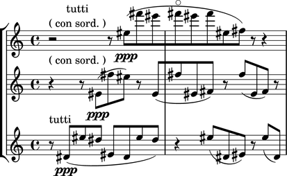

Parsing
=======

Abjad provides a growing number of language parsers, including a sophisticated LilyPond parser, 

LilyPond Parsing
----------------

``lilypondparsertools.LilyPondParser`` parses a large, although incomplete, subset of LilyPond's syntax:

::

   >>> from abjad.tools import lilypondparsertools
   >>> parser = lilypondparsertools.LilyPondParser()

RhythmTree Parsing
------------------

``rhythmtreetools.RhythmTreeParser`` parses a microlanguage resembling Ircam's RTM-style LISP syntax, and 
generates a sequence of RhythmTree structures, which can be furthered manipulated by composers, before 
being converted into Abjad score object:

::

   >>> from abjad.tools import rhythmtreetools
   >>> parser = rhythmtreetools.RhythmTreeParser()

::

   >>> string = '(1 (1 (2 (1 1 1)) 2))'
   >>> result = parser(string)
   >>> result[0]
   RhythmTreeContainer(
       children=(
           RhythmTreeLeaf(
               duration=1,
               is_pitched=True,
               ),
           RhythmTreeContainer(
               children=(
                   RhythmTreeLeaf(
                       duration=1,
                       is_pitched=True,
                       ),
                   RhythmTreeLeaf(
                       duration=1,
                       is_pitched=True,
                       ),
                   RhythmTreeLeaf(
                       duration=1,
                       is_pitched=True,
                       ),
               ),
               duration=2
               ),
           RhythmTreeLeaf(
               duration=2,
               is_pitched=True,
               ),
       ),
       duration=1
       )

::

   >>> tuplet = result[0]((1, 4))[0]
   >>> f(tuplet)
   \times 4/5 {
       c'16
       \times 2/3 {
           c'16
           c'16
           c'16
       }
       c'8
   }

::

   >>> show(tuplet)

"Reduced-Ly" Parsing
--------------------

``rhythmtreetools.ReducedAbjParser`` parses the "reduced-ly" microlanguage, whose syntax combines a very 
small subset of LilyPond syntax, along with affordances for generating various types of Abjad containers, and 
speedups for rapidly notating notes and rests without needing to specify pitches.  It used mainly for creating
Abjad documentation:

::

   >>> from abjad.tools import rhythmtreetools
   >>> parser = rhythmtreetools.ReducedAbjParser()

::

   >>> string = '| 4/4 c d e f || 3/8 r8 g4 |'
   >>> result = parser(string)

::

   >>> f(result)
   {
       {
           \time 4/4
           c4
           d4
           e4
           f4
       }
       {
           \time 3/8
           r8
           g4
       }
   }

::

   >>> show(result)

.. image:: images/index-2.png

