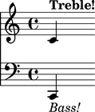

Parsing
=======

Abjad provides a growing number of language parsers, including a sophisticated LilyPond parser, 

LilyPond Parsing
----------------

``lilypondparsertools.LilyPondParser`` parses a large, although incomplete, subset of LilyPond's syntax:

::

   >>> from abjad.tools import lilypondparsertools
   >>> parser = lilypondparsertools.LilyPondParser()

It understands notes, chords, skips and rests, including default durations and the ``q`` chord-repeat construct:

::

   >>> string = r"{ c'\longa r4. <d' fs' bff'> g q8 s1 c''\breve. }"
   >>> result = parser(string)

::

   >>> f(result)
   {
       c'\longa
       r4.
       <d' fs' bff'>4.
       g4.
       <d' fs' bff'>8
       s1
       c''\breve.
   }

::

   >>> show(result)

.. image:: images/index-1.png

It understands most spanners, articulations and dynamics too:

::

   >>> string = r'''\new Staff {
   ...     c'8 \f \> (
   ...     d' -_ [
   ...     e' ^>
   ...     f' \ppp \<
   ...     g' \startTrillSpan \(
   ...     a' \)
   ...     b' ] \stopTrillSpan
   ...     c'' ) \accent \sfz
   ... }
   ... '''
   >>> result = parser(string)

::

   >>> f(result)
   \new Staff {
       c'8 \f \> (
       d'8 -\portato [
       e'8 ^\accent
       f'8 \ppp \<
       g'8 \( \startTrillSpan
       a'8 \)
       b'8 ] \stopTrillSpan
       c''8 -\accent \sfz )
   }

::

   >>> show(result)

.. image:: images/index-2.png

It understands contexts and markup:

::

   >>> string = r'''\new Score <<
   ...     \new Staff = "Treble Staff" {
   ...         \new Voice = "Treble Voice" {
   ...             c' ^\markup { \bold Treble! }
   ...         }
   ...     }
   ...     \new Staff = "Bass Staff" {
   ...         \new Voice = "Bass Voice" {
   ...             \clef bass
   ...             c, _\markup { \italic Bass! } 
   ...         }
   ...     }
   ... >>
   ... '''
   >>> result = parser(string)

::

   >>> f(result)
   Traceback (most recent call last):
     File "<stdin>", line 1, in <module>
     File "/Users/josiah/Documents/Projects/abjad/trunk/abjad/tools/iotools/f.py", line 19, in f
       print expr.lilypond_format
     File "/Users/josiah/Documents/Projects/abjad/trunk/abjad/tools/contexttools/Context/Context.py", line 215, in lilypond_format
       return self._format_component()
     File "/Users/josiah/Documents/Projects/abjad/trunk/abjad/tools/componenttools/Component/Component.py", line 189, in _format_component
       result.extend(self._format_contents_slot(format_contributions))
     File "/Users/josiah/Documents/Projects/abjad/trunk/abjad/tools/containertools/Container/Container.py", line 246, in _format_contents_slot
       result.append([('contents', '_contents'), self._format_content_pieces()])
     File "/Users/josiah/Documents/Projects/abjad/trunk/abjad/tools/containertools/Container/Container.py", line 211, in _format_content_pieces
       result.extend(m.lilypond_format.split('\n'))
     File "/Users/josiah/Documents/Projects/abjad/trunk/abjad/tools/contexttools/Context/Context.py", line 215, in lilypond_format
       return self._format_component()
     File "/Users/josiah/Documents/Projects/abjad/trunk/abjad/tools/componenttools/Component/Component.py", line 187, in _format_component
       result.extend(self._format_open_brackets_slot(format_contributions))
     File "/Users/josiah/Documents/Projects/abjad/trunk/abjad/tools/contexttools/Context/Context.py", line 129, in _format_open_brackets_slot
       contributions = [context._format_invocation() + ' %s' % brackets_open[0]]
     File "/Users/josiah/Documents/Projects/abjad/trunk/abjad/tools/contexttools/Context/Context.py", line 97, in _format_invocation
       return r'\context %s = %s' % (self.context_name, schemetools.format_scheme_value(self.name))
   NameError: global name 'schemetools' is not defined

::

   >>> show(result)

It even understands certain aspects of LilyPond file layouts, like header blocks:

::

   >>> string = r'''
   ... \header {
   ...     name = "Foo von Bar"
   ...     composer = \markup { by \bold \name }
   ...     title = \markup { The ballad of \name }
   ...     tagline = \markup { "" }
   ... }
   ... \score {
   ...     \new Staff {
   ...         \time 3/4
   ...         g' ( b' d'' )
   ...         e''4. ( c''8 c'4 )
   ...     }
   ... }
   ... '''
   >>> result = parser(string)

::

   >>> f(result)
   % Abjad revision 6987
   % 2012-08-31 22:05
   
   \version "2.14.2"
   \language "english"
   \include "/Users/josiah/Documents/Projects/abjad/trunk/abjad/cfg/abjad.scm"
   
   \header {
       composer = \markup { by \bold #"Foo von Bar" }
       name = #"Foo von Bar"
       tagline = \markup {  }
       title = \markup { The ballad of Foo von Bar }
   }
   
   \score {
       \new Staff {
           \time 3/4
           g'4 (
           b'4
           d''4 )
           e''4. (
           c''8
           c'4 )
       }
   }

::

   >>> show(result)

A small number of music functions are also supported, such as ``\relative``. Music functions which mutate 
the score during compilation, result in a "normalized" Abjad score structure.  That is, the resulting Abjad 
structure corresponds to the music as it appears on the page:

::

   >>> string = r'''\new Staff \relative c { c32 d e f g a b c d e f g a b c d e f g a b c }'''
   >>> result = parser(string)

::

   >>> f(result)
   \new Staff {
       c32
       d32
       e32
       f32
       g32
       a32
       b32
       c'32
       d'32
       e'32
       f'32
       g'32
       a'32
       b'32
       c''32
       d''32
       e''32
       f''32
       g''32
       a''32
       b''32
       c'''32
   }

::

   >>> show(result)

RhythmTree Parsing
------------------

``rhythmtreetools.RhythmTreeParser`` parses a microlanguage resembling Ircam's RTM-style LISP syntax, and 
generates a sequence of RhythmTree structures, which can be furthered manipulated by composers, before 
being converted into Abjad score object:

::

   >>> from abjad.tools import rhythmtreetools
   >>> parser = rhythmtreetools.RhythmTreeParser()

::

   >>> string = '(1 (1 (2 (1 1 1)) 2))'
   >>> result = parser(string)
   >>> result[0]
   RhythmTreeContainer(
       children=(
           RhythmTreeLeaf(
               duration=1,
               is_pitched=True,
               ),
           RhythmTreeContainer(
               children=(
                   RhythmTreeLeaf(
                       duration=1,
                       is_pitched=True,
                       ),
                   RhythmTreeLeaf(
                       duration=1,
                       is_pitched=True,
                       ),
                   RhythmTreeLeaf(
                       duration=1,
                       is_pitched=True,
                       ),
               ),
               duration=2
               ),
           RhythmTreeLeaf(
               duration=2,
               is_pitched=True,
               ),
       ),
       duration=1
       )

::

   >>> tuplet = result[0]((1, 4))[0]
   >>> f(tuplet)
   \times 4/5 {
       c'16
       \times 2/3 {
           c'16
           c'16
           c'16
       }
       c'8
   }

::

   >>> staff = stafftools.RhythmicStaff([tuplet])

::

   >>> show(staff, docs=True)

.. image:: images/index-6.png

"Reduced-Ly" Parsing
--------------------

``rhythmtreetools.ReducedAbjParser`` parses the "reduced-ly" microlanguage, whose syntax combines a very 
small subset of LilyPond syntax, along with affordances for generating various types of Abjad containers, and 
speedups for rapidly notating notes and rests without needing to specify pitches.  It used mainly for creating
Abjad documentation:

::

   >>> from abjad.tools import rhythmtreetools
   >>> parser = rhythmtreetools.ReducedAbjParser()

::

   >>> string = '| 4/4 c d e f || 3/8 r8 g4 |'
   >>> result = parser(string)

::

   >>> f(result)
   {
       {
           \time 4/4
           c4
           d4
           e4
           f4
       }
       {
           \time 3/8
           r8
           g4
       }
   }

::

   >>> show(result)

