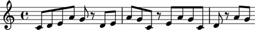

Changing notes to rests
=======================

A series of notes
-----------------

It is easy to make a repeating pattern of notes.

::

   >>> staff = Staff()
   >>> staff.extend([Note(i, (1,8)) for i in [0, 2, 4, 9, 7] * 4 ])
   >>> show(staff)

In the above example, a single list comprehension takes care of creating our notes.

Notes belonging to a staff can be iterated
------------------------------------------

We will create our repeated pattern again. Note that you can do this in one line:

::

   >>> staff = Staff([Note(i, (1,8)) for i in [0, 2, 4, 9, 7] * 4 ])

Now, iterate over the staff's contents, substituting an eighth rest for every fifth (count from zero!) Note element in the staff:

::

   >>> for i, note in enumerate(staff):
   ...         if (i%5) == 4:
   ...                 staff[i] = Rest((1,8))
   ... 
   >>> show(staff)

Notes can be used directly
--------------------------

In the previous example, we used an index (i) to keep track of where we are in the list of notes, and based our decision to flip on that index. We can also decide to flip a note to a rest based on the note iteself:

::

   >>> staff = Staff([Note(i, (1,8)) for i in [0, 2, 4, 9, 7] * 4 ])
   >>> for i, note in enumerate(staff):
   ...         if note.sounding_pitch == "d'":
   ...                 staff[i] = Rest((1,8))
   ... 
   >>> show(staff)

.. image:: images/index-3.png

All the d's are now rests.

=tms
